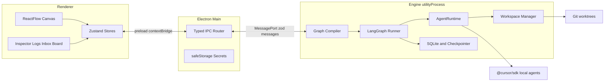

# Swarmy — Living Plan

This file is the source of truth for building Swarmy. Every phase agent reads it before writing code and updates it before finishing. If this file and a chat disagree, this file wins, except for the **User Notes** section, which records what the user changed on purpose.

Research that led here is in [docs/research](research). Where those PDFs disagree with the current [Cursor TypeScript SDK docs](https://cursor.com/docs/sdk/typescript), the SDK docs win.

## How to run a phase

1. Find the first phase below whose status is `[ ]`.
2. Open a **new** Cursor chat (do not continue an old one).
3. Paste that phase's **Prompt** block, unchanged.
4. The agent follows `.cursor/skills/start-phase/SKILL.md`, writes failing tests, then implements.
5. You run the **Manual test**. Tell the agent pass or fail.
6. On pass, the agent follows `.cursor/skills/finish-phase/SKILL.md`: updates this file, commits, and tags `phase-NN`.

Status marks: `[ ]` not started, `[~]` in progress, `[x]` done and tagged.

## Status

| Phase | Title | Status | Tag | Date |
| --- | --- | --- | --- | --- |
| 0 | Workspace and master plan | [x] | phase-00 | 2026-10-03 |
| 1 | Scaffold and test harness | [x] | phase-01 | 2026-10-03 |
| 2 | Typed IPC and engine process | [x] | phase-02 | 2026-10-03 |
| 3 | Cursor connection and SDK spike | [x] | phase-03 | 2026-10-03 |
| 4 | Workflow model and validation | [x] | phase-04 | 2026-10-03 |
| 5 | Canvas editor | [x] | phase-05 | 2026-10-03 |
| 6 | Node inspector and agent config | [ ] | | |
| 7 | Workflow persistence | [ ] | | |
| 8 | Agent runtime and single run | [ ] | | |
| 9 | Workspaces | [ ] | | |
| 10 | LangGraph orchestrator | [ ] | | |
| 11 | Run control, steering, resume | [ ] | | |
| 12 | Approval gates | [ ] | | |
| 13 | Diff review | [ ] | | |
| 14 | Guardrails | [ ] | | |
| 15 | Observability and budgets | [ ] | | |
| 16 | Time travel | [ ] | | |
| 17 | Shared task board | [ ] | | |
| 18 | Planner node | [ ] | | |
| 19 | Merge node | [ ] | | |
| 20 | Inputs and MCP | [ ] | | |
| 21 | Templates and export | [ ] | | |
| 22 | Triggers and notifications | [ ] | | |
| 23 | Packaging | [ ] | | |

## User Notes

Write changes and wishes here, in your own words. Phase agents must read this section before coding and must act on every row that is not `done`. When an agent addresses a note, it sets the status to `done` and adds one line under the note saying what it changed. Agents never delete a note.

| Date | Note | Status |
| --- | --- | --- |
| | | |

## Vision

Swarmy lets a person build the environment that runs their automations. A swarm might build an app, help a product owner, help a project manager, help QA, or run some other workflow the user invents. The app does not hard-code those jobs. It provides a canvas of configurable nodes, an engine that runs them, and controls so a human can stop, steer, approve, and rewind.

Windows is the only shipping target until a later decision says otherwise. Cloud Cursor agents, other model providers, macOS, and Linux are backlog, not v1.

### Non-goals for v1

- Hosting models locally. "Local" means the agent loop and files stay on this PC. Inference still goes through Cursor.
- A plugin marketplace. New node types are added in-repo through the registry (see the `add-node-type` skill, created in Phase 6).
- Multi-user accounts, sync, or a server.

## Architecture



Layout (created in Phase 1):

| Path | May import | Must not import |
| --- | --- | --- |
| `src/shared` | zod, plain TypeScript | Electron, React, `@cursor/sdk` |
| `src/engine` | `src/shared`, Node, LangGraph, SDK via `AgentRuntime` only | Electron, React |
| `src/main` | Electron, `src/shared` | React, `@cursor/sdk` directly |
| `src/preload` | Electron preload, `src/shared` types | Node APIs beyond preload, SDK |
| `src/renderer` | React, `src/shared` | Electron, Node, SDK |
| `tests/e2e` | Playwright | production secrets |

The engine runs inside an Electron `utilityProcess` so a stuck agent cannot freeze the window. Tests construct the same engine in-process. That is why engine code cannot import Electron.

## Decisions

Append new decisions. Do not rewrite old ones. If a decision is reversed, add a new entry that supersedes it and point at the old id.

### D1 — General-purpose swarm builder

Date: 2026-10-03. Status: accepted.

The product builds environments for whatever automation the user wants (coding, PO, PM, QA, and others). Node types are data in a registry, not a fixed catalog baked into the engine.

Why: the user said the automations depend on the user, and asked for "many more" coordination styles later.

### D2 — Visual canvas

Date: 2026-10-03. Status: accepted.

The main UI is a node graph using `@xyflow/react`, Zustand, Tailwind, shadcn/ui, and Monaco for diffs.

Why: the user chose the canvas. Agent nodes need real HTML controls (prompts, dropdowns), which is why React Flow beats a raw canvas library.

### D3 — Electron on Windows

Date: 2026-10-03. Status: accepted.

The shell is Electron, built with electron-vite and packaged with electron-builder (NSIS). Windows only for v1. Do not add macOS or Linux packaging until a decision says so.

Why: `@cursor/sdk` is a Node library. Electron runs it in-process. Tauri would need a Node sidecar.

### D4 — Local Cursor agents only

Date: 2026-10-03. Status: accepted.

v1 runs `@cursor/sdk` local agents (`local: { cwd }`). Cloud agents are backlog. Every SDK call goes through an `AgentRuntime` interface. Production code uses `CursorSdkRuntime`. Tests use `FakeRuntime`. Automated tests must not call the network.

Why: the user chose local-first. The interface keeps tests free and keeps a future cloud runtime from rewriting the engine.

### D5 — LangGraph.js owns orchestration

Date: 2026-10-03. Status: accepted.

The canvas graph compiles into a LangGraph.js `StateGraph`. Approval gates use `interrupt()`. A planner's dynamic workers use `Send`. Resume and time travel use the checkpointer. Do not also invent a second scheduler.

Why: the user chose LangGraph. Interrupts and checkpoints are the feature we would otherwise rebuild.

### D6 — SQLite via node:sqlite, until proven otherwise

Date: 2026-10-03. Status: accepted, pending the Phase 3 spike.

App data and the LangGraph checkpointer use SQLite. Prefer the built-in `node:sqlite` module so we do not compile a native addon or mismatch Electron's ABI. Phase 3 must prove `node:sqlite` works inside the Electron utility process. If it does not, supersede this decision and use `better-sqlite3` with Visual Studio Build Tools. The checkpointer must pass `@langchain/langgraph-checkpoint-validation` when it is introduced (Phase 10).

Why: native modules are the usual Electron-on-Windows failure. Avoid them until we must not.

### D7 — Three workspace modes

Date: 2026-10-03. Status: accepted.

- `repo`: one git worktree and branch per agent, under `%LOCALAPPDATA%\Swarmy\wt\` (short paths, away from the repo, to dodge `MAX_PATH`).
- `managed`: Swarmy creates a folder and runs `git init` itself, for automations that are not an existing repo.
- `folder`: use a plain folder. Only one writer at a time.

Teardown on Windows, in order: `taskkill /pid <pid> /T /F` for child trees the engine spawned, `process.chdir` away from the worktree, then delete with backoff (50ms, 150ms, 500ms, 2000ms). Never call `git worktree remove` while a child still has the directory as its cwd.

Why: parallel agents in one checkout corrupt the git index. Windows locks directories that POSIX would unlink.

### D8 — npm, Vitest, Playwright

Date: 2026-10-03. Status: accepted.

npm is the package manager. Vitest covers unit and component tests. Playwright drives the Electron app with `SWARMY_RUNTIME=fake`. There is no CI job that spends Cursor credits. Real SDK checks are manual steps inside the phase that needs them.

Why: npm is the least surprising choice with Electron on Windows. Paid tests must not run because an agent re-ran the suite.

### D9 — SDK contract the PDFs get wrong

Date: 2026-10-03. Status: accepted.

Implement against the SDK, not the research snippets.

- Stream with `for await (const event of run.stream())`, then always `await run.wait()`.
- A thrown `CursorSdkError` means the run never started. `result.status === "error"` means it started and failed. Handle them separately.
- Dispose every agent (`await using` or `await agent[Symbol.asyncDispose]()`).
- Guard `run.cancel()` with `run.supports("cancel")`.
- `run.steer(text)` exists on local runs. If the result is not `complete_delivered`, send a normal follow-up after `wait()`.
- Pass `local: { cwd }` explicitly even though local is the default.
- `systemPrompt`, `tools`, `disallowedTools`, and inline `mcpServers` are local-only and are not kept across `Agent.resume()`. Pass them again.
- `systemPrompt` can be rejected on the first `send()` if the account does not have that feature. The runtime must catch that and retry once with the instructions prefixed to the user prompt, and surface a warning.
- Log `agent.agentId` and `run.id` as soon as `send()` returns.
- Default `local.settingSources` is empty (inline config only). Project hooks and `.cursor/` rules load only when the run opts into `"project"`.

Why: the PDFs iterate `run` directly and skip `wait()`. That is not the current API.

### D10 — Secrets never enter workflow JSON

Date: 2026-10-03. Status: accepted.

The Cursor API key lives in Electron `safeStorage`, not in the workflow file, not in logs, not in exported `.swarm` archives. Workflows name required env vars; they do not store the values. Export strips any field whose name matches `apiKey`, `token`, `secret`, `password`, or `authorization` (case-insensitive).

Why: workflows are meant to be shared.

### D11 — One phase, one chat, tests first

Date: 2026-10-03. Status: accepted.

Each phase is a new chat. The agent writes the tests named in the phase, runs them, and shows the failure before writing production code. It does not start the next phase. It does not commit until the user confirms the manual test.

Why: the user will run out of context in a long chat, and wants each phase to be testable.

### D12 — Workflow handle data types

Date: 2026-10-03. Status: accepted.

An edge is valid only when its output handle and input handle carry the same data type. The types are `text`, `file`, `folder`, `diff`, and `mcp`. Phase 4 registers these handles:

- `textInput`: out `text`
- `fileInput`: out `file`
- `folderInput`: out `folder`
- `mcp`: out `mcp`
- `agent`: in `text`, `file`, `folder`, `mcp`; out `text`, `diff`
- `planner`: in `text`; out `text`
- `approval`: in `diff`; out `diff`
- `merge`: in `text`, `diff`; out `text`, `diff`

A valid graph yields parallel tiers: each node sits in the tier after its latest dependency. Nodes in one tier do not depend on each other. A cycle error names the nodes on the cycle path.

Why: the canvas and the engine share one document. Phase 5 refuses a `diff` output wired to a `file` input, and later phases must not invent a second handle vocabulary.

### D13 — Node docs stay next to the code

Date: 2026-10-03. Status: accepted.

What a node is for, how to use it on the canvas, and which handles connect live in [docs/nodes](nodes). `README.md` there is the index. `handles.md` is the connection schema. Each node type has its own page. The format is markdown so a phase agent updates it in the same change as the registry. Do not add an HTML doc site.

A phase that adds a node type, changes a handle, or changes what the user can do with a node updates those pages before the phase is finished. That update is in scope even when the phase section does not repeat it. Write only what that phase ships. Behavior that belongs to a later phase stays marked with that phase number.

Why: the canvas is usable before the swarm runs, and the handle rules are easy to forget. The user asked for docs they can look at, including schemas, and for the plan to keep them current.

## Conventions

- Language: TypeScript, `strict`, no `any`. Validate every IPC payload and every workflow file with zod.
- Tests live next to source as `*.test.ts`. End-to-end tests live in `tests/e2e`.
- Interactive elements that a test or a user flow depends on get a stable `data-testid` in kebab-case (`engine-status`, `workflow-canvas`).
- Commands after Phase 1: `npm run dev`, `npm run test`, `npm run test:e2e`, `npm run typecheck`, `npm run lint`, `npm run verify`.
- `npm run verify` is typecheck, lint, unit, then e2e. A phase is not done if verify fails.
- Commits happen only after the user confirms the manual test. Subject: `phase-NN: <what a reviewer sees>`. Tag: `phase-NN`.
- Shell is PowerShell. Do not add bash-only scripts. Git hooks and guard scripts that run on the user's machine are PowerShell.
- Do not edit `docs/research/**`.
- Do not add dependencies "for later". Add a dependency in the phase that first imports it.
- Node docs live in `docs/nodes/` (decision D13). Update the index, `handles.md`, and the node page when a phase adds a type, changes a handle, or changes what the user can do with a node.

## Risks

| Id | Risk | When we face it | What to do |
| --- | --- | --- | --- |
| R1 | `node:sqlite` missing or broken inside Electron | Phase 3 | Supersede D6, switch to `better-sqlite3`, install VS Build Tools |
| R2 | `systemPrompt` disabled on this account | Phase 3 | Use the D9 fallback (prefix the prompt) and record the result in this phase's notes |
| R3 | Project hooks ignored because `settingSources` defaults to empty | Phase 14 | Pass `settingSources: ["project"]` for runs that need generated `hooks.json`, and test that a denied command does not run |
| R4 | LangGraph step mode runs one node at a time, so a slow branch delays an unrelated branch | Phase 10 | Use the runner's superstep / parallel nodes within a tier. Test two independent branches both start before either finishes |
| R5 | `@cursor/sdk` ships per-platform binaries that break inside `asar` | Phase 23 | `asarUnpack` those packages. Confirm a packaged install can still spawn a local agent |
| R6 | Windows locks a worktree so `git worktree remove` fails | Phase 9 | Follow the D7 teardown order. Test it by holding a file open, then tearing down |

## Backlog

Not phased. Do not build these unless a new decision says so.

- Cursor Cloud agents (`cloud: { repos }`), including no-repo cloud agents.
- macOS and Linux installers.
- Model providers other than Cursor.
- A plugin SDK so third parties can ship node types.

---

## Phase 0 — Workspace and master plan

**Goal.** Make a new chat able to start Phase 1 without rediscovering the architecture.

**In scope.** This file, Cursor rules, `start-phase` and `finish-phase` skills, git hygiene, Node.js >= 22.13, `core.longpaths`.

**Out of scope.** Application code, dependencies, Electron.

**Tests.** None. There is no app yet.

**Manual test.**

1. `node -v` prints 22.13 or newer.
2. `docs/PLAN.md` contains Phase 1's prompt.
3. `.cursor/rules/` has the eight rule files named in the Phase 0 completion notes.
4. `.cursor/skills/start-phase/SKILL.md` and `.cursor/skills/finish-phase/SKILL.md` exist.

**Prompt.** Not used. Phase 0 is this setup chat.

**Completion notes.**

- Node.js 24.19.0 (LTS) and npm 11.17.0 installed with winget. `@cursor/sdk` needs Node 22.13+, so this satisfies it. Git was already installed (2.55.0). `core.longpaths=true` is set on this repo.
- Added repo hygiene: `.gitignore`, `.gitattributes` (LF, CRLF for PowerShell), `.editorconfig`, and a README that explains how to start a phase.
- Added eight Cursor rules in `.cursor/rules/` (`00` through `03` always on, `10`, `20`, `30`, `40` scoped) and two skills: `start-phase`, `finish-phase`.
- No application code and no npm dependencies. Phase 1 creates those.
- No deviations.

---

## Phase 1 — Scaffold and test harness

**Goal.** A Swarmy window opens, and one command runs every check. Later phases only add to this skeleton.

**Why.** Nothing else is testable until `dev` and `verify` exist.

**In scope.**

- electron-vite, React, TypeScript strict, Tailwind, Vitest (node + jsdom), React Testing Library, Playwright for Electron, ESLint.
- Folders: `src/shared`, `src/engine`, `src/main`, `src/preload`, `src/renderer`, `tests/e2e`.
- Scripts: `dev`, `build`, `test`, `test:e2e`, `typecheck`, `lint`, `verify`.
- A window titled `Swarmy`.
- One pure shared helper, `appInfo()`, returning `{ name: "Swarmy" }`, with a unit test.
- Playwright launches the app with `SWARMY_RUNTIME=fake` and asserts the window title.

**Out of scope.** Canvas, IPC protocol, SDK, persistence, shadcn components beyond what Tailwind setup needs.

**Tests to write first (they must fail).**

1. `src/shared/app-info.test.ts` — `appInfo().name` is `"Swarmy"`.
2. `tests/e2e/window.spec.ts` — the Electron window title is `Swarmy`.

**Acceptance.** `npm run verify` exits 0. `npm run dev` opens the window.

**Manual test.**

1. `npm run dev`. A window titled Swarmy appears. Close it.
2. `npm run verify` exits 0.

**Prompt.**

```text
You are implementing Swarmy Phase 1 — Scaffold and test harness.

Follow .cursor/skills/start-phase/SKILL.md, then implement only Phase 1 in docs/PLAN.md.
Write the tests listed in that phase and show them failing before you write the implementation.
When the work is done, follow .cursor/skills/finish-phase/SKILL.md. Do not commit until I confirm the manual test.
```

**Completion notes.**

- A window titled Swarmy opens from `appInfo()` in `src/shared`. The same helper sets the BrowserWindow title and the renderer heading. Tailwind styles that screen. Preload is a stub until Phase 2; the production build warns about an empty preload chunk until the bridge exists.
- Scripts: `dev`, `build`, `test`, `test:e2e`, `typecheck`, `lint`, `verify`. `npm run verify` exited 0 (typecheck, lint, unit, Playwright). Playwright launches the built app with `SWARMY_RUNTIME=fake` and checks that value plus the window title.
- Vitest has a node project and a jsdom project. The jsdom project renders `App` with React Testing Library, in addition to the two tests named in this phase.
- Folders: `src/shared`, `src/engine` (empty), `src/main`, `src/preload`, `src/renderer`, `tests/e2e`. No canvas, IPC protocol, SDK, or persistence.
- Window preferences: `contextIsolation: true`, `nodeIntegration: false`, `sandbox: false`. Sandbox stays off because that is how electron-vite's preload bundle loads.
- Toolchain, recorded so a later phase does not bump past it by accident: TypeScript 5.9.3, because typescript-eslint 8.71 accepts TypeScript below 6.1. Vite 7, because electron-vite 5 peers Vite 5–7 and the current Vite major is 8. npm 11 will not run esbuild's postinstall unless `allowScripts` in `package.json` allows it.
- No deviations that change a later phase.

---

## Phase 2 — Typed IPC and engine process

**Goal.** The window shows that the engine process is alive, and it reconnects if that process dies.

**Why.** Every later feature is a message between the UI and the engine. The boundary has to exist before features pile into the renderer.

**In scope.**

- Zod schemas in `src/shared` for messages: `engine.hello`, `engine.ready`, `engine.ping`, `engine.pong`.
- Engine entry that speaks that protocol over a `MessagePort` and does not import Electron.
- Main process spawns it with `utilityProcess.fork`, restarts it on unexpected exit.
- Preload exposes `window.swarmy` through `contextBridge`. `contextIsolation: true`, `nodeIntegration: false`.
- Status bar `data-testid="engine-status"` with text `Engine connected` or `Engine reconnecting`.
- Unit tests for the protocol parser and for a reconnect counter. Playwright test that the status becomes `Engine connected`.

**Out of scope.** Workflows, SDK, killing the process from a public button. A dev-only way to crash the engine is allowed so the manual test can see reconnect.

**Tests to write first.**

1. Parser rejects an unknown message type and accepts `engine.ping`.
2. Given a fake port, the engine answers `engine.ping` with `engine.pong`.
3. Playwright: status text is `Engine connected`.

**Acceptance.** Verify passes. The status bar recovers after a crash without restarting the app.

**Manual test.**

1. `npm run dev`. The status bar reads `Engine connected`.
2. Trigger the dev-only engine crash. The bar reads `Engine reconnecting`, then `Engine connected` again.

**Prompt.**

```text
You are implementing Swarmy Phase 2 — Typed IPC and engine process.

Follow .cursor/skills/start-phase/SKILL.md, then implement only Phase 2 in docs/PLAN.md.
Write the tests listed in that phase and show them failing before you write the implementation.
When the work is done, follow .cursor/skills/finish-phase/SKILL.md. Do not commit until I confirm the manual test.
```

**Completion notes.**

- The window shows `Engine connected` when the utility process answers `engine.hello` with `engine.ready`, and `Engine reconnecting` for about a second after an unexpected exit before a new process is forked. Quit does not restart it.
- Zod schemas in `src/shared` cover `engine.hello`, `engine.ready`, `engine.ping` (with an id), and `engine.pong`. An unknown type throws. The renderer channel `engine:status` is the enum `connected` | `reconnecting`. Preload exposes `window.swarmy` through `contextBridge` and keeps the latest status so the bar does not miss a message that arrived before React subscribed.
- The engine entry is `src/engine`. It speaks that protocol over the utility-process `MessagePort` and does not import Electron. Tests call `attachEngine` with a fake port. Main forks the built `engine.js` with `utilityProcess.fork`.
- Dev-only crash, unpackaged builds only: Ctrl+Shift+F9, or Alt → Dev → Crash engine. `npm run dev` prints the shortcut. There is no public crash button. A local check of that menu item saw `Engine reconnecting`, then `Engine connected`, without restarting the app.
- `npm run verify` exited 0 (typecheck, lint, unit, Playwright). Playwright checks that the status becomes `Engine connected`.
- Added `zod` in this phase, the first one that imports it.
- No deviations that change a later phase.

---

## Phase 3 — Cursor connection and SDK spike

**Goal.** Prove, on this PC, that the real SDK and `node:sqlite` work inside Electron. Save an API key encrypted, list models, run one hello agent in a temp folder.

**Why.** Decisions D6 and D9 are bets. This phase is where they either hold or get superseded, before we build the canvas on top of them.

**In scope.**

- Settings UI: API key field, Save, Test connection. Key stored with `safeStorage`. Never written to a workflow or to a log.
- Test connection calls `Cursor.me()` and `Cursor.models.list()` through `CursorSdkRuntime` and shows the account label plus model ids.
- Hello run: `Agent.create` with `local: { cwd }` set to an empty temp directory, one prompt, stream, `wait()`, dispose. Show the final text in the UI.
- Spike: from the engine process, open a `node:sqlite` database, create a table, insert a row, read it back. Automated test uses a temp file.
- Record results in this phase's completion notes: node:sqlite works or not, `systemPrompt` accepted or not.

**Out of scope.** Canvas, worktrees, LangGraph, cloud agents.

**Tests to write first.**

1. `FakeRuntime` returns a scripted model list and a scripted hello result, with no network.
2. The settings form never puts the API key into the workflow state object.
3. `node:sqlite` round-trip in a temp file (skip the test with a clear message if the module is missing; do not silently pass).

**Acceptance.** Verify passes. The manual hello run returns text. Completion notes state the R1 and R2 outcomes. If `node:sqlite` failed, D6 is superseded in the Decisions log.

**Manual test.**

1. `npm run dev`. Paste your Cursor API key, Save, Test connection. Your account and at least one model id appear.
2. Run hello. A short reply appears, and no files outside the temp directory changed.
3. Quit and reopen. The key is still saved and is not visible as plaintext in the UI.

**Prompt.**

```text
You are implementing Swarmy Phase 3 — Cursor connection and SDK spike.

Follow .cursor/skills/start-phase/SKILL.md, then implement only Phase 3 in docs/PLAN.md.
Write the tests listed in that phase and show them failing before you write the implementation.
The real SDK is for the manual test only. Automated tests use FakeRuntime.
Record whether node:sqlite works in Electron and whether systemPrompt is accepted on this account.
If node:sqlite does not work, supersede decision D6 instead of leaving a broken default.
When the work is done, follow .cursor/skills/finish-phase/SKILL.md. Do not commit until I confirm the manual test.
```

**Completion notes.**

- Settings has an API key field, Save, Test connection, and Run hello. The app name is set to `Swarmy` before ready, and the key is encrypted with `safeStorage` into `%APPDATA%\Swarmy\cursor-api-key.bin`. It is not written into the workflow state object, and error text sent to the window has the key redacted. After a restart the field stays empty and the window says `Key saved`.
- Test connection calls `Cursor.me()` and `Cursor.models.list()` through `CursorSdkRuntime`. Automated tests use `FakeRuntime` and do not call the network. `SWARMY_RUNTIME=fake` selects that runtime. `@cursor/sdk` 1.0.35 is a dependency and stays external in the engine bundle (`require("@cursor/sdk")`).
- Run hello creates an empty temp directory, runs one local agent with `local: { cwd }` pointed at it, streams, waits, and disposes. The agent store is a `JsonlLocalAgentStore` inside that directory, and `tools` is `[]`, so the probe does not use the SDK's default home-directory store or built-in file tools. The window shows the reply, the temp path, and either `systemPrompt accepted` or `systemPrompt rejected`.
- R1: `node:sqlite` works. A utility-process spike on Electron 44.5.1 (Node 24.21.0) inserted and read back `swarmy`. The built engine process logs `node:sqlite in the engine process: ok (swarmy)`. D6 stands.
- R2: `systemPrompt` is not accepted on this account. The rejection arrives as a finished run (`result.status === "error"`, `[invalid_argument] unknown option '--system-prompt'`). The runtime disposes that agent and retries once with the instructions prefixed to the prompt. The manual hello showed `systemPrompt rejected` and the reply `Connection probe OK — I'm here and responding; no files were changed.`
- No decision was superseded. Phase 8 extends this runtime; it does not start over.

---

## Phase 4 — Workflow model and validation

**Goal.** A workflow is a validated document: nodes, handles, edges, and a registry of node types. Invalid graphs fail with a readable error.

**Why.** The canvas and the engine must share one schema, or they will drift.

**In scope.**

- Zod schemas: workflow, node, edge, handle, position, viewport.
- Node types registered now: `agent`, `approval`, `fileInput`, `folderInput`, `textInput`, `mcp`, `planner`, `merge`. Each declares input and output handle types.
- Validation: unknown type, dangling edge, handle type mismatch, duplicate ids, cycle (report the cycle). Acyclic graphs produce an ordered list of parallel tiers.
- `npm run validate-workflow -- <file>` prints ok or the errors.
- `examples/valid-line.json` passes. `examples/cycle.json` and `examples/bad-handle.json` fail.

**Out of scope.** Drawing the graph. Executing it. Persistence.

**Tests to write first.**

1. The valid example has two tiers when two agents depend on one source? Use a diamond: one source, two parallel agents, one sink. Expect three tiers and the two middle ids in the same tier.
2. The cycle example throws an error that names both nodes in the cycle.
3. An edge from a `diff` output to a `file` input fails type check.

**Acceptance.** `npm run validate-workflow -- examples/valid-line.json` exits 0 and the two bad examples exit non-zero. Verify passes.

**Manual test.**

1. Run the three commands above.
2. Open `examples/valid-line.json` and confirm you can read it without the code.

**Prompt.**

```text
You are implementing Swarmy Phase 4 — Workflow model and validation.

Follow .cursor/skills/start-phase/SKILL.md, then implement only Phase 4 in docs/PLAN.md.
Write the tests listed in that phase and show them failing before you write the implementation.
When the work is done, follow .cursor/skills/finish-phase/SKILL.md. Do not commit until I confirm the manual test.
```

**Completion notes.**

- A workflow document lives in `src/shared`: zod schemas for the workflow, node, edge, handle, position, and viewport. Node `data` is `{ label }` only. Phase 6 adds agent fields to `workflowNodeSchema`.
- The registry lists `agent`, `approval`, `fileInput`, `folderInput`, `textInput`, `mcp`, `planner`, and `merge`, with the handles in decision D12. Validation reports an unknown type, a dangling edge (missing node or handle), a handle type mismatch, and a duplicate id. A cycle names every node on the path (`Cycle: alpha → beta → alpha`). An acyclic graph returns parallel tiers.
- `examples/valid-line.json` is a diamond, which is what this phase's tier test asks for: `brief`, then `writer` and `reviewer` together, then `combine`. `examples/cycle.json` and `examples/bad-handle.json` fail.
- `npm run validate-workflow -- <file>` prints `ok` or the errors. Node runs the TypeScript CLI directly, so this phase adds no dependency.
- No deviations that change a later phase.

---

## Phase 5 — Canvas editor

**Goal.** You can build the graph from Phase 4 with the mouse: palette, drag, connect, pan, zoom, minimap.

**Why.** This is the product surface. Everything after it hangs off a graph you can see.

**In scope.**

- `@xyflow/react` canvas, dotted background, snap grid, minimap, controls.
- Palette lists the registered node types. Dropping one creates a node at the cursor.
- Connections call the Phase 4 validator. Illegal connections do not stick. A short message says why.
- Agent nodes show their label and a status pill (`idle` for now).
- Zustand store holds the workflow document. Selecting a node sets `data-testid="selected-node"`.

**Out of scope.** Inspector fields beyond the label, running agents, saving to disk.

**Tests to write first.**

1. Store: adding an agent node appends a node whose type is registered.
2. Store: connecting a `diff` output to a `file` input leaves the edge list unchanged and records an error string.
3. Playwright: open the app, add two agent nodes, connect a compatible pair, see two nodes and one edge.

**Acceptance.** Verify passes. The manual flow creates a diamond and refuses a bad connection.

**Manual test.**

1. `npm run dev`. Drag four nodes into a diamond (one source, two middle, one sink) and connect them.
2. Try to connect mismatched handles. The edge is not created and a reason is visible.
3. Pan and zoom. The minimap follows.

**Prompt.**

```text
You are implementing Swarmy Phase 5 — Canvas editor.

Follow .cursor/skills/start-phase/SKILL.md, then implement only Phase 5 in docs/PLAN.md.
Write the tests listed in that phase and show them failing before you write the implementation.
When the work is done, follow .cursor/skills/finish-phase/SKILL.md. Do not commit until I confirm the manual test.
```

**Completion notes.**

- The window is a canvas. `@xyflow/react` draws a dotted background, a 16px snap grid, a minimap, and zoom controls. The palette lists every registered node type. Dropping one adds that node at the cursor. Agent nodes show their label and an `idle` status pill. Selecting a node sets `data-testid="selected-node"`.
- The Zustand store holds the workflow document. A new edge is checked with `connectError`, which runs the Phase 4 validator. A mismatched connection is not added, and the validator's reason is shown on the canvas.
- Added `@xyflow/react` and `zustand` in this phase, the first one that imports them. Cursor connection stays under a disclosure so the graph can use the window. Backspace does not delete nodes; deletion is not in this phase.
- Node guide is [docs/nodes](nodes): an index, the handle schema, and one page per type. Decision D13 says later phases keep those pages current. Phase 6's add-node-type skill now includes that page.
- No other deviations that change a later phase.

---

## Phase 6 — Node inspector and agent config

**Goal.** Selecting an agent edits its model, prompts, template variables, tool allow/deny list, and workspace mode. Also leave a skill so later agents add node types the same way.

**Why.** A swarm you cannot configure is a demo.

**In scope.**

- Inspector panel bound to the selected node.
- Agent fields: label, model id (text; the live catalog arrives later), system prompt, task prompt, template variables (`{{name}}` tokens listed, not yet filled from upstream), `tools` allow list, `disallowedTools`, workspace mode (`repo` | `managed` | `folder`).
- Edits update the Zustand document and pass the Phase 4 schema.
- Write `.cursor/skills/add-node-type/SKILL.md` describing how to register a type: schema, handles, palette card, inspector section, a test, and a page under `docs/nodes/` (decision D13).

**Out of scope.** Executing the config. Fetching `Cursor.models.list()` into the dropdown (Phase 3 already lists models in settings; a dropdown can wait until Phase 8 if it is not trivial).

**Tests to write first.**

1. Editing the system prompt on the selected agent changes only that node.
2. An empty `tools` array is kept (it means no built-in tools), and `undefined` means the default toolset. Do not coerce one into the other.
3. Playwright: select a node, type a prompt, reload is not required, the canvas card shows the new label.

**Acceptance.** Verify passes. The new skill file exists.

**Manual test.**

1. Add an agent, select it, set a label, a system prompt, and workspace mode `repo`.
2. Add a second agent and confirm the first agent's prompt did not leak across.

**Prompt.**

```text
You are implementing Swarmy Phase 6 — Node inspector and agent config.

Follow .cursor/skills/start-phase/SKILL.md, then implement only Phase 6 in docs/PLAN.md.
Write the tests listed in that phase and show them failing before you write the implementation.
Also add the add-node-type skill described in that phase.
When the work is done, follow .cursor/skills/finish-phase/SKILL.md. Do not commit until I confirm the manual test.
```

**Completion notes.**

- _Empty until the phase agent finishes._

---

## Phase 7 — Workflow persistence

**Goal.** Workflows survive a restart. Create, rename, autosave, reopen, delete.

**Why.** A canvas that forgets on quit is not usable for the later phases' manual tests.

**In scope.**

- SQLite file under `%APPDATA%\Swarmy\swarmy.db` (in dev, a path you can point at with `SWARMY_DATA_DIR`).
- Table `workflows` with id, name, graph JSON, created_at, updated_at.
- Autosave shortly after an edit. Workflow list in the UI. New, rename, delete.
- Use `node:sqlite` unless D6 was superseded.

**Out of scope.** Run history, export, sync.

**Tests to write first.**

1. Save then load returns the same graph, including handle ids.
2. A second save updates `updated_at` and does not duplicate the row.
3. Delete removes the row and leaves other workflows.

**Acceptance.** Verify passes, using a temp `SWARMY_DATA_DIR`.

**Manual test.**

1. Create a workflow, add two connected agents, quit the app.
2. Reopen. The workflow and both agents are there.
3. Delete it. It is gone after another restart.

**Prompt.**

```text
You are implementing Swarmy Phase 7 — Workflow persistence.

Follow .cursor/skills/start-phase/SKILL.md, then implement only Phase 7 in docs/PLAN.md.
Write the tests listed in that phase and show them failing before you write the implementation.
When the work is done, follow .cursor/skills/finish-phase/SKILL.md. Do not commit until I confirm the manual test.
```

**Completion notes.**

- _Empty until the phase agent finishes._

---

## Phase 8 — Agent runtime and single run

**Goal.** Run one agent node for real, watch its log, and cancel it. The UI talks only to `AgentRuntime`.

**Why.** This is the first closed loop from a node on the canvas to a Cursor agent, before the graph runner exists.

**In scope.**

- `AgentRuntime` interface in `src/engine`: create, send, stream events, wait, cancel, steer, dispose. Events are our own type, mapped from `SDKMessage`, not the SDK type leaked into `src/shared`.
- `FakeRuntime` for tests, scripted per prompt.
- `CursorSdkRuntime` implementing D9 (explicit `local.cwd`, stream then wait, dispose, separate startup errors from run errors, systemPrompt fallback).
- A Run button on an agent node, a log panel (`data-testid="run-log"`), a Cancel button.
- The run uses a temp directory. It does not create worktrees yet.

**Out of scope.** Multi-node orchestration, steering UI (the method exists on the interface; the text box is Phase 11), budgets.

**Tests to write first.**

1. FakeRuntime streams two assistant chunks and then a finished result, and dispose is called.
2. When the fake run reports `status: "error"`, the log shows the error and the node status is `failed`.
3. Cancel before the fake finishes yields status `cancelled`.
4. Playwright, with `SWARMY_RUNTIME=fake`: Run on one agent, the log shows the scripted text, the node pill reads `completed`.

**Acceptance.** Verify passes with the fake runtime. The manual test uses the real SDK.

**Manual test.**

1. Put a real prompt on one agent ("Reply with the single word pong."). Run it.
2. The log fills in, then the node reads completed, and the reply is visible.
3. Run a longer prompt and press Cancel. The node reads cancelled within a few seconds.

**Prompt.**

```text
You are implementing Swarmy Phase 8 — Agent runtime and single run.

Follow .cursor/skills/start-phase/SKILL.md, then implement only Phase 8 in docs/PLAN.md.
Write the tests listed in that phase and show them failing before you write the implementation.
Automated tests must use FakeRuntime and must not call @cursor/sdk.
When the work is done, follow .cursor/skills/finish-phase/SKILL.md. Do not commit until I confirm the manual test.
```

**Completion notes.**

- _Empty until the phase agent finishes._

---

## Phase 9 — Workspaces

**Goal.** Each agent run gets the workspace mode from its node, and Swarmy can delete that workspace on Windows without leaving a locked folder behind.

**Why.** Parallel agents in one checkout corrupt git. This has to be solid before the orchestrator runs two agents at once.

**In scope.**

- `WorkspaceManager` implementing D7 (`repo`, `managed`, `folder`).
- Worktrees under `%LOCALAPPDATA%\Swarmy\wt\<id>` with branch `swarm/<id>`.
- `repo` mode requires the workflow to name a git repository path.
- Teardown follows the D7 order. Track child pids the manager itself spawned.
- Wire single-agent runs (Phase 8) to the workspace from the node instead of a temp dir.

**Out of scope.** Merging branches (Phase 19). Running two agents at once (Phase 10).

**Tests to write first.**

1. In a temp git repo, `repo` mode creates a worktree whose `git status` is clean and whose branch name starts with `swarm/`.
2. Two provisions get two different directories.
3. Teardown removes the worktree and `git worktree list` no longer shows it.
4. If a child process is holding the directory, teardown still removes it (spawn a sleeper, then tear down).

**Acceptance.** Verify passes. The sleeper test passes on Windows.

**Manual test.**

1. Point a workflow at a scratch git clone. Run one agent in `repo` mode.
2. While it runs, the worktree path shown in the UI exists and is not the clone's main folder.
3. After the run, teardown leaves `git worktree list` clean.

**Prompt.**

```text
You are implementing Swarmy Phase 9 — Workspaces.

Follow .cursor/skills/start-phase/SKILL.md, then implement only Phase 9 in docs/PLAN.md.
Write the tests listed in that phase and show them failing before you write the implementation.
Follow decision D7 for paths and Windows teardown. Do not shell out to bash.
When the work is done, follow .cursor/skills/finish-phase/SKILL.md. Do not commit until I confirm the manual test.
```

**Completion notes.**

- _Empty until the phase agent finishes._

---

## Phase 10 — LangGraph orchestrator

**Goal.** Pressing Run on the workflow executes the whole graph: independent branches in parallel, downstream nodes waiting for upstream handoffs.

**Why.** This is the swarm. Phases 1–9 are the parts it needs.

**In scope.**

- Compile a validated workflow into a LangGraph `StateGraph`. One graph node per canvas node.
- Nodes in the same tier run in parallel (risk R4). A failing node fails its downstream branch and does not fail an unrelated branch.
- Agent nodes call `AgentRuntime` with the workspace from Phase 9. The prompt includes a structured-handoff instruction. Prefer a `submit_handoff` custom tool (`local.customTools`) whose payload is `{ summary, files, blockers }`. If the tool is not called, fall back to the final assistant text and mark the handoff `unstructured`.
- Stream status to the renderer: `queued`, `running`, `completed`, `failed`, `cancelled`. Running edges animate; failed edges turn red.
- Checkpointer on SQLite (D6). It must pass `@langchain/langgraph-checkpoint-validation`.

**Out of scope.** Approval interrupt UI (Phase 12), planner `Send` (Phase 18), merge (Phase 19), steering (Phase 11).

**Tests to write first.**

1. A diamond of four fake agents: the two middle runs overlap in time (both started before either finishes).
2. The sink prompt contains the upstream handoff summary and does not contain a fake "chain of thought" field.
3. One middle agent failing marks the sink `failed` and the other middle agent `completed`.
4. A cycle is rejected before any agent starts.
5. Playwright with FakeRuntime: run the diamond, all four pills reach a terminal state.

**Acceptance.** Verify passes. The checkpointer validation suite passes.

**Manual test.**

1. Build a diamond of four agents on a scratch repo, each with a small real prompt that only writes a file named after the node.
2. Run. The two middle nodes are active at the same time. Each file appears in its own worktree, not in the main checkout.
3. The sink's log quotes the upstream summaries.

**Prompt.**

```text
You are implementing Swarmy Phase 10 — LangGraph orchestrator.

Follow .cursor/skills/start-phase/SKILL.md, then implement only Phase 10 in docs/PLAN.md.
Write the tests listed in that phase and show them failing before you write the implementation.
Use LangGraph for scheduling. Do not add a second scheduler. Automated tests use FakeRuntime.
When the work is done, follow .cursor/skills/finish-phase/SKILL.md. Do not commit until I confirm the manual test.
```

**Completion notes.**

- _Empty until the phase agent finishes._

---

## Phase 11 — Run control, steering, resume

**Goal.** Cancel one agent or the whole run, type guidance into a running agent, and continue a run after restarting the app.

**Why.** A swarm you cannot stop or correct will waste a run, and a crash should not throw away a finished prefix of the graph.

**In scope.**

- Cancel one node (`run.cancel()` when supported) and cancel the run (cancel all active runs, stop scheduling).
- A steering box sends `run.steer`. Show whether it was delivered or sent as a follow-up (D9).
- On startup, if a run is unfinished in the checkpointer, offer Resume. Resuming calls `Agent.resume` and passes `systemPrompt`, tools, and `mcpServers` again (they are not persisted by the SDK).

**Out of scope.** Rewinding to an earlier checkpoint (Phase 16). Editing diffs (Phase 13).

**Tests to write first.**

1. Cancelling the run does not start a downstream node that was still queued.
2. A steer result of `revert_to_followup` causes one follow-up `send` after the run finishes, and `complete_delivered` does not.
3. A checkpoint saved mid-diamond resumes at the unfinished node and does not re-run a node that already completed.

**Acceptance.** Verify passes.

**Manual test.**

1. Start a two-agent line with real prompts. Cancel the first. The second never starts.
2. Start one agent, steer it ("Answer in one sentence."), and see the delivery result in the log.
3. Start a run, quit the app mid-run, reopen, Resume. Completed nodes stay completed.

**Prompt.**

```text
You are implementing Swarmy Phase 11 — Run control, steering, and resume.

Follow .cursor/skills/start-phase/SKILL.md, then implement only Phase 11 in docs/PLAN.md.
Write the tests listed in that phase and show them failing before you write the implementation.
When the work is done, follow .cursor/skills/finish-phase/SKILL.md. Do not commit until I confirm the manual test.
```

**Completion notes.**

- _Empty until the phase agent finishes._

---

## Phase 12 — Approval gates

**Goal.** An approval node pauses the run until you approve or reject it with feedback. Reject sends the upstream agent around again with your note.

**Why.** This is the human checkpoint between "the agent finished" and "its output is allowed to flow downstream".

**In scope.**

- `approval` nodes compile to a LangGraph node that calls `interrupt()`.
- Inbox panel (`data-testid="approval-inbox"`) lists waiting interrupts. Approve, or reject with a text reason.
- Reject routes back to the upstream agent with the reason in the prompt, up to a max of 3 cycles, then fails the node with a clear error.
- The run survives an app restart while it is waiting (the interrupt stays pending).

**Out of scope.** Monaco diff editing (Phase 13). Notifications (Phase 22).

**Tests to write first.**

1. A fake agent followed by an approval does not start the sink until approve is sent.
2. Reject with `"try again"` causes exactly one more agent run whose prompt contains `try again`, then a new interrupt.
3. A fourth reject fails the branch instead of looping forever.

**Acceptance.** Verify passes.

**Manual test.**

1. Agent → approval → agent. Run. The inbox shows one waiting item and the second agent has not started.
2. Reject with a note. The first agent runs again. Approve. The second agent runs.
3. Quit while the inbox is waiting. Reopen. The item is still there.

**Prompt.**

```text
You are implementing Swarmy Phase 12 — Approval gates.

Follow .cursor/skills/start-phase/SKILL.md, then implement only Phase 12 in docs/PLAN.md.
Write the tests listed in that phase and show them failing before you write the implementation.
Use LangGraph interrupt for the pause. Do not busy-wait.
When the work is done, follow .cursor/skills/finish-phase/SKILL.md. Do not commit until I confirm the manual test.
```

**Completion notes.**

- _Empty until the phase agent finishes._

---

## Phase 13 — Diff review

**Goal.** When an agent changed files, the approval inbox can show a side-by-side diff, and your edits to the right-hand side are what get approved.

**Why.** Correcting a small mistake yourself is cheaper and safer than sending the agent around again.

**In scope.**

- Collect a file list and unified diff from the agent's worktree (git diff against the worktree base).
- Monaco DiffEditor, side by side, modified side editable.
- Approve commits your edited contents into the worktree (a normal git commit on the agent's branch) and resumes the graph with those paths.
- Reject still uses the Phase 12 path and ignores half-edited buffer contents unless you approve.

**Out of scope.** Merging into the main branch (Phase 19).

**Tests to write first.**

1. A fixture worktree with one changed file produces a diff that names the file.
2. Approving with a modified buffer writes that text into the worktree file before resume.
3. Reject leaves the worktree file as the agent wrote it.

**Acceptance.** Verify passes.

**Manual test.**

1. Run an agent that edits a README in a scratch repo, followed by an approval.
2. In the diff, change one word, approve.
3. The worktree file contains your word. The sink agent, if any, sees that text.

**Prompt.**

```text
You are implementing Swarmy Phase 13 — Diff review.

Follow .cursor/skills/start-phase/SKILL.md, then implement only Phase 13 in docs/PLAN.md.
Write the tests listed in that phase and show them failing before you write the implementation.
When the work is done, follow .cursor/skills/finish-phase/SKILL.md. Do not commit until I confirm the manual test.
```

**Completion notes.**

- _Empty until the phase agent finishes._

---

## Phase 14 — Guardrails

**Goal.** An agent can be limited to certain tools and folders, and a generated hook refuses dangerous shell commands even if the model asks for them.

**Why.** Headless SDK runs approve tool calls automatically. The safety boundary has to be in the workspace, not in the prompt.

**In scope.**

- Pass the node's `tools` and `disallowedTools` through to `Agent.create` (and again on resume).
- Workspace write scope: the runtime tells the agent its allowed relative paths, and a `preToolUse` hook denies writes outside them.
- Generate `.cursor/hooks.json` plus a PowerShell script in the workspace. `failClosed: true`. The script denies `git push --force`, `git push --force-with-lease`, and `Remove-Item -Recurse` on the workspace root. It allows `git status`.
- Toggles on the agent node for `sandboxOptions.enabled` and `autoReview`, passed through to the SDK.
- Set `settingSources: ["project"]` so the generated hooks actually load (risk R3). Add a test that proves a denied command is refused. If the SDK only runs hooks during a real agent turn, test the PowerShell script directly and document that the live hook path is a manual test.

**Out of scope.** A general policy editor for the whole company. Team admin denylists. Cloud agents.

**Tests to write first.**

1. Building an agent config with `disallowedTools: ["shell"]` produces SDK options with that array, and does not drop it.
2. The generated PowerShell script, given a payload with `git push --force`, prints a deny decision and exits non-zero. Given `git status`, it allows.
3. A write path outside the scope is denied by the same script; a path inside is allowed.

**Acceptance.** Verify passes, including the script tests on Windows.

**Manual test.**

1. Enable the hook on an agent in a scratch repo. Ask it to run `git push --force`. The log shows the command was denied, and no push happened.
2. Ask it to run `git status`. That command runs.

**Prompt.**

```text
You are implementing Swarmy Phase 14 — Guardrails.

Follow .cursor/skills/start-phase/SKILL.md, then implement only Phase 14 in docs/PLAN.md.
Write the tests listed in that phase and show them failing before you write the implementation.
Hooks are PowerShell, fail closed, and must actually load (decision D9, risk R3).
When the work is done, follow .cursor/skills/finish-phase/SKILL.md. Do not commit until I confirm the manual test.
```

**Completion notes.**

- _Empty until the phase agent finishes._

---

## Phase 15 — Observability and budgets

**Goal.** See past runs, their transcripts, token counts, and dollar cost, and stop a run that crosses a budget you set.

**Why.** Swarms spend money. You need a number before you need a surprise.

**In scope.**

- Persist each run: status, started/ended, per-node transcript summary, token usage from `run.usage`.
- After a real run, call `agent.getUsage()` and store `chargedCents` when present. Cost can arrive late; show "cost pending" rather than zero when `cost` is absent.
- Run history panel. Opening a past run shows the log you saw live.
- Optional workflow budget in USD. When the summed known cost exceeds it, cancel the run and mark it `budget_exceeded`.

**Out of scope.** Charts beyond a simple totals line. Team billing admin.

**Tests to write first.**

1. A fake run with usage `{ totalTokens: 10 }` stores 10 on the node row.
2. Missing cost is stored as pending, not 0.
3. A budget of 1 cent, with a reported cost of 2 cents, cancels the remaining nodes.

**Acceptance.** Verify passes.

**Manual test.**

1. Run one real agent. History shows the transcript and a token total.
2. If cost is still pending, wait and refresh. Either a dollar amount or a still-pending label is fine; a fake `$0.00` is not.
3. Set a budget of `$0.01` and run a two-agent line. The run stops with a budget message.

**Prompt.**

```text
You are implementing Swarmy Phase 15 — Observability and budgets.

Follow .cursor/skills/start-phase/SKILL.md, then implement only Phase 15 in docs/PLAN.md.
Write the tests listed in that phase and show them failing before you write the implementation.
Do not invent a zero cost when the SDK has not reported one.
When the work is done, follow .cursor/skills/finish-phase/SKILL.md. Do not commit until I confirm the manual test.
```

**Completion notes.**

- _Empty until the phase agent finishes._

---

## Phase 16 — Time travel

**Goal.** Pick an earlier checkpoint, fork the run from there, and reset that agent's worktree to the commit recorded at that checkpoint.

**Why.** Sending "try a different approach" on top of a wrong turn keeps the wrong turn in context. Rewinding drops it.

**In scope.**

- List checkpoints for a run (node id, time, label).
- Fork from a selected checkpoint with LangGraph's time-travel API. Nodes after that point return to `idle` on the fork. The original run is kept.
- Each checkpoint stores the worktree commit SHA when the node completed. Fork checks out that SHA in the worktree.
- UI: a timeline on the selected run, and a Fork button.

**Out of scope.** Editing history in place. Merging forks (Phase 19 can merge a fork's branch if you point it at a merge node).

**Tests to write first.**

1. Three completed fake nodes produce three checkpoints in order.
2. Forking at the second checkpoint yields a new run id whose next scheduled node is the third, and the second node is not re-run.
3. The worktree HEAD after fork equals the SHA stored on that checkpoint.

**Acceptance.** Verify passes.

**Manual test.**

1. Run three agents that each commit a file in their worktree.
2. Fork at the first checkpoint. The later files are gone from that worktree. Resume runs only the later agents.

**Prompt.**

```text
You are implementing Swarmy Phase 16 — Time travel.

Follow .cursor/skills/start-phase/SKILL.md, then implement only Phase 16 in docs/PLAN.md.
Write the tests listed in that phase and show them failing before you write the implementation.
Fork. Do not destroy the original run.
When the work is done, follow .cursor/skills/finish-phase/SKILL.md. Do not commit until I confirm the manual test.
```

**Completion notes.**

- _Empty until the phase agent finishes._

---

## Phase 17 — Shared task board

**Goal.** Agents in one run can post and read a task board without stuffing each other's transcripts into the prompt. You can see the same board.

**Why.** Handoffs (Phase 10) are for edges you drew. A board is for "who is doing what" when several agents work in parallel.

**In scope.**

- SQLite table scoped to the run: task id, owner, status, summary.
- Custom tools `update_task` and `inspect_board`, attached to every agent in the run.
- A Board panel that live-updates from engine events.
- The tools are the only writer. Agents do not get a raw SQL tool.

**Out of scope.** A planner that creates the tasks (Phase 18). Cross-run boards.

**Tests to write first.**

1. `update_task` then `inspect_board` returns the row, scoped so another run id does not see it.
2. Two parallel fake agents both write, and the board contains both rows (no lost update).
3. Playwright with FakeRuntime: a scripted tool call makes the row appear in the panel.

**Acceptance.** Verify passes.

**Manual test.**

1. Run two parallel real agents and tell each to post a task with its node name.
2. The Board panel shows both rows while the run is in progress.

**Prompt.**

```text
You are implementing Swarmy Phase 17 — Shared task board.

Follow .cursor/skills/start-phase/SKILL.md, then implement only Phase 17 in docs/PLAN.md.
Write the tests listed in that phase and show them failing before you write the implementation.
Expose the board only through the two custom tools named in the phase.
When the work is done, follow .cursor/skills/finish-phase/SKILL.md. Do not commit until I confirm the manual test.
```

**Completion notes.**

- _Empty until the phase agent finishes._

---

## Phase 18 — Planner node

**Goal.** A planner agent splits a goal into tasks, and the engine spawns one worker agent per task, even though those workers were not drawn one-by-one on the canvas.

**Why.** You asked for a planner that auto-splits work, not only for graphs you wire by hand.

**In scope.**

- `planner` node. Its prompt asks for a plan only. It cannot write files (`tools` limited to read-only plus the `submit_plan` custom tool).
- `submit_plan` payload: `{ tasks: [{ id, title, prompt }] }`, at most 8 tasks. Invalid payloads are rejected and the planner is told once.
- LangGraph `Send` starts one worker per task. Workers use the `managed` workspace mode unless the planner node says otherwise. Each worker's prompt is the task prompt plus the plan summary.
- The canvas shows spawned workers as child rows under the planner, not as permanent nodes in the saved workflow.

**Out of scope.** A general "agent that edits the canvas" feature. Nested planners.

**Tests to write first.**

1. A fake planner that calls `submit_plan` with two tasks starts exactly two workers and not a third.
2. A plan with 9 tasks is rejected and does not start workers.
3. Workers do not start if `submit_plan` was never called; the planner node fails with a clear error.

**Acceptance.** Verify passes.

**Manual test.**

1. Add a planner with the goal "List two independent one-line text files to create". Run it against the real SDK.
2. Two worker rows appear and each produces its file in its own workspace.

**Prompt.**

```text
You are implementing Swarmy Phase 18 — Planner node.

Follow .cursor/skills/start-phase/SKILL.md, then implement only Phase 18 in docs/PLAN.md.
Write the tests listed in that phase and show them failing before you write the implementation.
Use LangGraph Send for dynamic workers. Cap the plan at 8 tasks.
When the work is done, follow .cursor/skills/finish-phase/SKILL.md. Do not commit until I confirm the manual test.
```

**Completion notes.**

- _Empty until the phase agent finishes._

---

## Phase 19 — Merge node

**Goal.** A merge node takes upstream agent branches and merges them, one at a time, into a target branch. Conflicts stop for review instead of being guessed.

**Why.** Isolated worktrees are wasted if their work cannot come back together safely.

**In scope.**

- `merge` node with a target branch field (default `main`).
- Merge upstream branches sequentially. Detect conflict markers including the four-marker `diff3` / `zdiff3` form (`<<<<<<<`, `|||||||`, `=======`, `>>>>>>>`).
- On a conflict, raise the Phase 12 approval interrupt with the conflicted files. Do not auto-resolve.
- A clean merge fast-forwards or creates a merge commit and passes the resulting SHA downstream.

**Out of scope.** Pushing to a remote. Opening pull requests.

**Tests to write first.**

1. Two worktrees that edit different files merge cleanly, and both edits are in the target.
2. Two worktrees that edit the same line produce a conflict and zero merges past that point.
3. A fixture file that contains a `|||||||` ancestor marker is treated as conflicted.

**Acceptance.** Verify passes.

**Manual test.**

1. Run two agents that edit different files, then a merge node. The target branch contains both files.
2. Run two agents that edit the same line. The inbox shows a conflict and the target branch does not contain a marker.

**Prompt.**

```text
You are implementing Swarmy Phase 19 — Merge node.

Follow .cursor/skills/start-phase/SKILL.md, then implement only Phase 19 in docs/PLAN.md.
Write the tests listed in that phase and show them failing before you write the implementation.
Never auto-resolve a conflict. Treat diff3 ancestor markers as conflicts.
When the work is done, follow .cursor/skills/finish-phase/SKILL.md. Do not commit until I confirm the manual test.
```

**Completion notes.**

- _Empty until the phase agent finishes._

---

## Phase 20 — Inputs and MCP

**Goal.** Feed a swarm with dropped files, a folder, or text, and attach an MCP server to an agent with a button that proves the server responds.

**Why.** Not every swarm starts from a git repo. External tools should be MCP servers, not one-off drivers inside Swarmy.

**In scope.**

- `fileInput`, `folderInput`, and `textInput` nodes. Files dropped on a file node are copied into the run's input directory. Downstream prompts receive a bounded excerpt (max 20 KB per file) plus the path, not the whole file unbounded.
- `folderInput` sets the agent workspace `folder` mode path.
- `mcp` node: stdio (command, args) or HTTP (url, headers). Connecting it to an agent adds that server on `Agent.create` and on resume.
- Test connection lists the server's tools and shows them. Do not persist header values in the workflow document (D10); store them with `safeStorage` and keep only a secret id in the graph.

**Out of scope.** OAuth browser login for MCP. Writing a general MCP client UI beyond listing tools.

**Tests to write first.**

1. A 1 MB dropped file contributes at most 20 KB of excerpt to the downstream prompt, and the prompt contains the file path.
2. Exporting the workflow JSON after an MCP header is saved does not contain the header value.
3. A fake MCP "list tools" result renders the tool names in the node.

**Acceptance.** Verify passes.

**Manual test.**

1. Drop a small text file onto a file node wired to an agent. Run. The agent's log shows it read the contents.
2. Add an MCP node for a local stdio server you already trust, test the connection, and see its tool names. Run the agent and confirm the log shows a tool call from that server.

**Prompt.**

```text
You are implementing Swarmy Phase 20 — Inputs and MCP.

Follow .cursor/skills/start-phase/SKILL.md, then implement only Phase 20 in docs/PLAN.md.
Write the tests listed in that phase and show them failing before you write the implementation.
Secrets stay out of the workflow JSON (decision D10). Bound file excerpts.
When the work is done, follow .cursor/skills/finish-phase/SKILL.md. Do not commit until I confirm the manual test.
```

**Completion notes.**

- _Empty until the phase agent finishes._

---

## Phase 21 — Templates and export

**Goal.** Start from a template instead of a blank canvas, and share a workflow as a `.swarm` file that contains no secrets.

**Why.** Rebuilding Architect / Coder / Reviewer by hand every time hides whether the product actually fits PO, PM, and QA work.

**In scope.**

- Built-in templates: Architect, Coder, Reviewer, QA, Product Owner, Project Manager, Researcher. Each is a small valid workflow using existing node types, with prompts that state the role and the handoff contract.
- Template picker on new workflow.
- Export a `.swarm` zip: workflow JSON, template prompts, no secrets (D10), plus `requiredEnvVars`.
- Import validates with the Phase 4 validator, refuses cycles, and asks for any missing secrets already known to the app (it does not invent values).

**Out of scope.** A template community. Importing from other products.

**Tests to write first.**

1. Every built-in template passes the Phase 4 validator.
2. A workflow that somehow contains an `apiKey` field exports JSON without that field.
3. Importing `examples/cycle.json` packaged as `.swarm` fails and does not create a workflow row.

**Acceptance.** Verify passes.

**Manual test.**

1. Create a workflow from the QA template. The canvas is pre-filled and Run is available.
2. Export it. Unzip the `.swarm` file and confirm no key or token is inside.
3. Import that file as a second workflow.

**Prompt.**

```text
You are implementing Swarmy Phase 21 — Templates and export.

Follow .cursor/skills/start-phase/SKILL.md, then implement only Phase 21 in docs/PLAN.md.
Write the tests listed in that phase and show them failing before you write the implementation.
Every template must pass the workflow validator. Export must strip secrets.
When the work is done, follow .cursor/skills/finish-phase/SKILL.md. Do not commit until I confirm the manual test.
```

**Completion notes.**

- _Empty until the phase agent finishes._

---

## Phase 22 — Triggers and notifications

**Goal.** A workflow can start on a schedule or when a file appears in a folder, and Windows notifies you when a run is waiting for approval.

**Why.** A swarm that only runs while you are staring at it is not an automation.

**In scope.**

- Trigger config on a workflow: manual (default), interval (minimum 1 minute), or watch a directory for new files.
- Triggers fire only while the app is running. Say that in the UI. Do not register a Windows service.
- When a run hits an approval interrupt, show an Electron `Notification`. Clicking it focuses the inbox.
- A trigger does not start a second run if one is already active for that workflow.

**Out of scope.** Cron syntax beyond a minute interval. Email. Background running after quit.

**Tests to write first.**

1. A watch trigger starts a run when a file is added to a temp directory, and not when an unrelated directory changes.
2. A second file while the run is active does not start another run; it is recorded as skipped.
3. An interrupt produces exactly one notification payload.

**Acceptance.** Verify passes.

**Manual test.**

1. Set a workflow to watch a folder. Drop a file in. The run starts.
2. Use a workflow with an approval node. When it pauses, a Windows notification appears. Clicking it shows the inbox.

**Prompt.**

```text
You are implementing Swarmy Phase 22 — Triggers and notifications.

Follow .cursor/skills/start-phase/SKILL.md, then implement only Phase 22 in docs/PLAN.md.
Write the tests listed in that phase and show them failing before you write the implementation.
Do not install a Windows service. Do not start overlapping runs of the same workflow.
When the work is done, follow .cursor/skills/finish-phase/SKILL.md. Do not commit until I confirm the manual test.
```

**Completion notes.**

- _Empty until the phase agent finishes._

---

## Phase 23 — Packaging

**Goal.** A Windows installer builds, installs, and still runs a local agent. First launch walks you through the API key.

**Why.** Until it installs, it is a repo, not an app.

**In scope.**

- electron-builder NSIS target, x64, Windows only.
- App manifest `longPathAware`.
- `asarUnpack` for `@cursor/sdk` platform binaries (risk R5).
- First-run screen: data directory, API key, Test connection, then the canvas.
- A packaged smoke script that launches the installed app with `SWARMY_RUNTIME=fake` and checks the window title. The real-agent check stays manual.

**Out of scope.** Code signing certificates (document the unsigned SmartScreen warning). macOS and Linux targets. Auto-update.

**Tests to write first.**

1. The builder config unpacks the SDK platform package (assert on the generated config object, not by running the installer in unit tests).
2. The first-run screen is what Playwright sees when no key is stored; with a stored key it is skipped.
3. Playwright against the unpackaged production build (`npm run build && npm run test:e2e`) still shows `Swarmy`.

**Acceptance.** `npm run dist` produces an `.exe` installer. Verify passes.

**Manual test.**

1. Run the installer on this PC. Launch Swarmy from the Start menu.
2. Complete first-run with your API key. Test connection succeeds.
3. Run one hello agent from a template. It completes.
4. Quit. The worktrees from that run are gone or listed as removed.

**Prompt.**

```text
You are implementing Swarmy Phase 23 — Packaging.

Follow .cursor/skills/start-phase/SKILL.md, then implement only Phase 23 in docs/PLAN.md.
Write the tests listed in that phase and show them failing before you write the implementation.
Windows NSIS only. Unpack the Cursor SDK binaries so a packaged app can still spawn a local agent.
When the work is done, follow .cursor/skills/finish-phase/SKILL.md. Do not commit until I confirm the manual test.
```

**Completion notes.**

- _Empty until the phase agent finishes._
