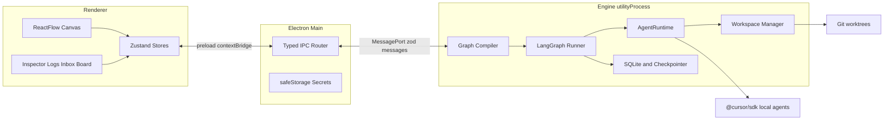

# Swarmy — Living Plan

This file is the source of truth for building Swarmy. Every phase agent reads it before writing code and updates it before finishing. If this file and a chat disagree, this file wins, except for the **User Notes** section, which records what the user changed on purpose.

Research that led here is in [docs/research](research). Where those PDFs disagree with the current [Cursor TypeScript SDK docs](https://cursor.com/docs/sdk/typescript), the SDK docs win.

## How to run a phase

1. Find the first phase below whose status is `[ ]`. Skip Phase 15.5 until Phase 15 is `[x]`. Skip Phase 15.6 until Phase 15.5 is `[x]`. Skip Phase 17.5 until Phase 17 is `[x]`. Skip Phase 19.5 until Phase 19 is `[x]`.
2. Open a **new** Cursor chat (do not continue an old one).
3. Paste that phase's **Prompt** block, unchanged.
4. The agent follows `.cursor/skills/start-phase/SKILL.md`, writes failing tests, then implements.
5. You run the **Manual test**. Tell the agent pass or fail.
6. On pass, the agent follows `.cursor/skills/finish-phase/SKILL.md`: updates this file, commits, and tags `phase-NN`.

Status marks: `[ ]` not started, `[~]` in progress, `[x]` done and tagged.

## Status

| Phase | Title | Status | Tag | Date |
| --- | --- | --- | --- | --- |
| 0 | Workspace and master plan | [x] | phase-00 | 2026-10-03 |
| 1 | Scaffold and test harness | [x] | phase-01 | 2026-10-03 |
| 2 | Typed IPC and engine process | [x] | phase-02 | 2026-10-03 |
| 3 | Cursor connection and SDK spike | [x] | phase-03 | 2026-10-03 |
| 4 | Workflow model and validation | [x] | phase-04 | 2026-10-03 |
| 5 | Canvas editor | [x] | phase-05 | 2026-10-03 |
| 6 | Node inspector and agent config | [x] | phase-06 | 2026-10-03 |
| 7 | Workflow persistence | [x] | phase-07 | 2026-10-03 |
| 8 | Agent runtime and single run | [x] | phase-08 | 2026-10-03 |
| 9 | Workspaces | [x] | phase-09 | 2026-10-03 |
| 10 | LangGraph orchestrator | [x] | phase-10 | 2026-10-03 |
| 11 | Run control, steering, resume | [x] | phase-11 | 2026-10-04 |
| 12 | Approval gates | [x] | phase-12 | 2026-10-04 |
| 13 | Diff review | [x] | phase-13 | 2026-10-04 |
| 14 | Guardrails | [x] | phase-14 | 2026-10-04 |
| 15 | Observability and budgets | [x] | phase-15 | 2026-10-04 |
| 15.5 | Delete a node | [x] | phase-15.5 | 2026-10-04 |
| 15.6 | Resize and collapse panels | [x] | phase-15.6 | 2026-10-04 |
| 16 | Time travel | [x] | phase-16 | 2026-10-04 |
| 17 | Shared task board | [x] | phase-17 | 2026-10-04 |
| 17.5 | Token use | [x] | phase-17.5 | 2026-10-04 |
| 18 | Planner node | [x] | phase-18 | 2026-10-04 |
| 19 | Merge node | [x] | phase-19 | 2026-10-04 |
| 19.5 | Review layout | [x] | phase-19.5 | 2026-10-04 |
| 20 | Inputs and MCP | [x] | phase-20 | 2026-10-04 |
| 21 | Templates and export | [x] | phase-21 | 2026-10-04 |
| 22 | Triggers and notifications | [x] | phase-22 | 2026-10-04 |
| 23 | Packaging | [ ] | | |

## User Notes

Write changes and wishes here, in your own words. Phase agents must read this section before coding and must act on every row that is not `done`. When an agent addresses a note, it sets the status to `done` and adds one line under the note saying what it changed. Agents never delete a note.

| Date | Note | Status |
| --- | --- | --- |
| 2026-10-04 | Always make the manual test detailed enough that I can go through the app step by step without worrying I missed something. | done |
| 2026-10-04 | Use C:\prod\scratch-repo for every test that needs a git repo. | done |
| 2026-10-04 | I need a way to delete a node I added. A button on the node, or the Delete key. Do this after Phase 15, before Phase 16. | done |
| 2026-10-04 | I can't resize any panel or section, or collapse it. The screen gets cluttered when I keep adding agents, and a laptop is hard to navigate. Do this after Phase 15.5, before Phase 16. | done |
| 2026-10-04 | The space under the canvas is too small to read a diff, and resizing it while a run is waiting does not help. Before Phase 20, give the board, inbox, and history their own room. | done |

Board, Inbox, History, and Run log are tabs under the canvas. One is open at a time and fills that area. A waiting approval opens the Inbox and grows a short area to at least half the space under the header. One collapse control on the tab row folds the area.

Phase 12's manual test is now that walkthrough. The same rule is in Conventions, so later phases write their manual tests the same way.

Phase 13 initialized `C:\prod\scratch-repo` with a committed `README.md` that contains `scratch`, and its manual test uses that path. The same path is in Conventions, so later phases use it for real agent runs that need a repository.

Node deletion is Phase 15.5. Phase 15 does not build it. Phase 5 left the Delete key off on purpose; 15.5 turns it back on, with a button on the card. Every card has **Delete** (`data-testid="delete-node"`). Delete and Backspace remove the selected node when focus is outside a text field, and they leave the workflow in place.

Panel layout shipped in Phase 15.6. The palette, inspector, and the stack under the canvas can be resized, and Nodes, Inspector, Inbox, Run history, and Run log can each collapse to a heading. Widths, the bottom-stack height, and which sections are collapsed are stored in local storage on this PC. They are not stored in the workflow file.

## Vision

Swarmy lets a person build the environment that runs their automations. A swarm might build an app, help a product owner, help a project manager, help QA, or run some other workflow the user invents. The app does not hard-code those jobs. It provides a canvas of configurable nodes, an engine that runs them, and controls so a human can stop, steer, approve, and rewind.

Windows is the only shipping target until a later decision says otherwise. Cloud Cursor agents, other model providers, macOS, and Linux are backlog, not v1.

### Non-goals for v1

- Hosting models locally. "Local" means the agent loop and files stay on this PC. Inference still goes through Cursor.
- A plugin marketplace. New node types are added in-repo through the registry (see the `add-node-type` skill, created in Phase 6).
- Multi-user accounts, sync, or a server.

## Architecture



Layout (created in Phase 1):

| Path | May import | Must not import |
| --- | --- | --- |
| `src/shared` | zod, plain TypeScript | Electron, React, `@cursor/sdk` |
| `src/engine` | `src/shared`, Node, LangGraph, SDK via `AgentRuntime` only | Electron, React |
| `src/main` | Electron, `src/shared` | React, `@cursor/sdk` directly |
| `src/preload` | Electron preload, `src/shared` types | Node APIs beyond preload, SDK |
| `src/renderer` | React, `src/shared` | Electron, Node, SDK |
| `tests/e2e` | Playwright | production secrets |

The engine runs inside an Electron `utilityProcess` so a stuck agent cannot freeze the window. Tests construct the same engine in-process. That is why engine code cannot import Electron.

## Decisions

Append new decisions. Do not rewrite old ones. If a decision is reversed, add a new entry that supersedes it and point at the old id.

### D1 — General-purpose swarm builder

Date: 2026-10-03. Status: accepted.

The product builds environments for whatever automation the user wants (coding, PO, PM, QA, and others). Node types are data in a registry, not a fixed catalog baked into the engine.

Why: the user said the automations depend on the user, and asked for "many more" coordination styles later.

### D2 — Visual canvas

Date: 2026-10-03. Status: accepted.

The main UI is a node graph using `@xyflow/react`, Zustand, Tailwind, shadcn/ui, and Monaco for diffs.

Why: the user chose the canvas. Agent nodes need real HTML controls (prompts, dropdowns), which is why React Flow beats a raw canvas library.

### D3 — Electron on Windows

Date: 2026-10-03. Status: accepted.

The shell is Electron, built with electron-vite and packaged with electron-builder (NSIS). Windows only for v1. Do not add macOS or Linux packaging until a decision says so.

Why: `@cursor/sdk` is a Node library. Electron runs it in-process. Tauri would need a Node sidecar.

### D4 — Local Cursor agents only

Date: 2026-10-03. Status: accepted.

v1 runs `@cursor/sdk` local agents (`local: { cwd }`). Cloud agents are backlog. Every SDK call goes through an `AgentRuntime` interface. Production code uses `CursorSdkRuntime`. Tests use `FakeRuntime`. Automated tests must not call the network.

Why: the user chose local-first. The interface keeps tests free and keeps a future cloud runtime from rewriting the engine.

### D5 — LangGraph.js owns orchestration

Date: 2026-10-03. Status: accepted.

The canvas graph compiles into a LangGraph.js `StateGraph`. Approval gates use `interrupt()`. A planner's dynamic workers use `Send`. Resume and time travel use the checkpointer. Do not also invent a second scheduler.

Why: the user chose LangGraph. Interrupts and checkpoints are the feature we would otherwise rebuild.

### D6 — SQLite via node:sqlite, until proven otherwise

Date: 2026-10-03. Status: accepted, pending the Phase 3 spike.

App data and the LangGraph checkpointer use SQLite. Prefer the built-in `node:sqlite` module so we do not compile a native addon or mismatch Electron's ABI. Phase 3 must prove `node:sqlite` works inside the Electron utility process. If it does not, supersede this decision and use `better-sqlite3` with Visual Studio Build Tools. The checkpointer must pass `@langchain/langgraph-checkpoint-validation` when it is introduced (Phase 10).

Why: native modules are the usual Electron-on-Windows failure. Avoid them until we must not.

### D7 — Three workspace modes

Date: 2026-10-03. Status: accepted.

- `repo`: one git worktree and branch per agent, under `%LOCALAPPDATA%\Swarmy\wt\` (short paths, away from the repo, to dodge `MAX_PATH`).
- `managed`: Swarmy creates a folder and runs `git init` itself, for automations that are not an existing repo.
- `folder`: use a plain folder. Only one writer at a time.

Teardown on Windows, in order: `taskkill /pid <pid> /T /F` for child trees the engine spawned, `process.chdir` away from the worktree, then delete with backoff (50ms, 150ms, 500ms, 2000ms). Never call `git worktree remove` while a child still has the directory as its cwd.

Why: parallel agents in one checkout corrupt the git index. Windows locks directories that POSIX would unlink.

### D8 — npm, Vitest, Playwright

Date: 2026-10-03. Status: accepted.

npm is the package manager. Vitest covers unit and component tests. Playwright drives the Electron app with `SWARMY_RUNTIME=fake`. There is no CI job that spends Cursor credits. Real SDK checks are manual steps inside the phase that needs them.

Why: npm is the least surprising choice with Electron on Windows. Paid tests must not run because an agent re-ran the suite.

### D9 — SDK contract the PDFs get wrong

Date: 2026-10-03. Status: accepted.

Implement against the SDK, not the research snippets.

- Stream with `for await (const event of run.stream())`, then always `await run.wait()`.
- A thrown `CursorSdkError` means the run never started. `result.status === "error"` means it started and failed. Handle them separately.
- Dispose every agent (`await using` or `await agent[Symbol.asyncDispose]()`).
- Guard `run.cancel()` with `run.supports("cancel")`.
- `run.steer(text)` exists on local runs. If the result is not `complete_delivered`, send a normal follow-up after `wait()`.
- Pass `local: { cwd }` explicitly even though local is the default.
- `systemPrompt`, `tools`, `disallowedTools`, and inline `mcpServers` are local-only and are not kept across `Agent.resume()`. Pass them again.
- `systemPrompt` can be rejected on the first `send()` if the account does not have that feature. The runtime must catch that and retry once with the instructions prefixed to the user prompt, and surface a warning.
- Log `agent.agentId` and `run.id` as soon as `send()` returns.
- Default `local.settingSources` is empty (inline config only). Project hooks and `.cursor/` rules load only when the run opts into `"project"`.

Why: the PDFs iterate `run` directly and skip `wait()`. That is not the current API.

### D10 — Secrets never enter workflow JSON

Date: 2026-10-03. Status: accepted.

The Cursor API key lives in Electron `safeStorage`, not in the workflow file, not in logs, not in exported `.swarm` archives. Workflows name required env vars; they do not store the values. Export strips any field whose name matches `apiKey`, `token`, `secret`, `password`, or `authorization` (case-insensitive).

Why: workflows are meant to be shared.

### D11 — One phase, one chat, tests first

Date: 2026-10-03. Status: accepted.

Each phase is a new chat. The agent writes the tests named in the phase, runs them, and shows the failure before writing production code. It does not start the next phase. It does not commit until the user confirms the manual test.

Why: the user will run out of context in a long chat, and wants each phase to be testable.

### D12 — Workflow handle data types

Date: 2026-10-03. Status: accepted.

An edge is valid only when its output handle and input handle carry the same data type. The types are `text`, `file`, `folder`, `diff`, and `mcp`. Phase 4 registers these handles:

- `textInput`: out `text`
- `fileInput`: out `file`
- `folderInput`: out `folder`
- `mcp`: out `mcp`
- `agent`: in `text`, `file`, `folder`, `mcp`; out `text`, `diff`
- `planner`: in `text`; out `text`
- `approval`: in `diff`; out `diff`
- `merge`: in `text`, `diff`; out `text`, `diff`

A valid graph yields parallel tiers: each node sits in the tier after its latest dependency. Nodes in one tier do not depend on each other. A cycle error names the nodes on the cycle path.

Why: the canvas and the engine share one document. Phase 5 refuses a `diff` output wired to a `file` input, and later phases must not invent a second handle vocabulary.

### D13 — Node docs stay next to the code

Date: 2026-10-03. Status: accepted.

What a node is for, how to use it on the canvas, and which handles connect live in [docs/nodes](nodes). `README.md` there is the index. `handles.md` is the connection schema. Each node type has its own page. The format is markdown so a phase agent updates it in the same change as the registry. Do not add an HTML doc site.

A phase that adds a node type, changes a handle, or changes what the user can do with a node updates those pages before the phase is finished. That update is in scope even when the phase section does not repeat it. Write only what that phase ships. Behavior that belongs to a later phase stays marked with that phase number.

Why: the canvas is usable before the swarm runs, and the handle rules are easy to forget. The user asked for docs they can look at, including schemas, and for the plan to keep them current.

### D14 — Agent accepts a diff

Date: 2026-10-04. Status: accepted. Supersedes the agent input list in D12.

An agent has a `diff` input, same data type as its `diff` output. An approval's `diff` output can connect to the next agent. D12 did not give the agent a `diff` input, so Agent → approval → agent could not be saved. The type list is unchanged: `text`, `file`, `folder`, `diff`, and `mcp`.

Why: Phase 12's manual test is an agent, then an approval, then another agent. The approval passes the upstream diff along.

### D15 — A set budget waits for cost, and cents are not rounded away

Date: 2026-10-04. Status: accepted.

When a workflow has a budget, the next agent does not start while the previous agent's dollar cost is still missing. The run is `budget_exceeded` and the screen says `Stopped for the budget: the cost is still pending.` The missing cost is not stored as 0. A reported `chargedCents` of 0 is a real zero and stays under the budget.

The comparison is `spentCents > budgetUsd * 100`, without rounding to whole cents. `$0.001` is 0.1 cents.

Why: a manual run with budget `0.001` finished both agents while the cost line still said `cost pending`. Pending spend was treated as 0, and `Math.round(0.001 * 100)` is 0, so the check was `0 > 0`.

### D16 — The workflow cap is tokens, not dollars

Date: 2026-10-04. Status: accepted. Supersedes the pending-cost stop in D15.

The toolbar cap is **Token budget**, a positive integer. After each agent, Swarmy adds the `totalTokens` values the SDK reported. If that sum is over the cap, later nodes are cancelled and the run is `budget_exceeded`. The screen says `Budget exceeded.`

A missing token count is not stored as 0 and does not cancel later nodes. Dollar cost is still stored and shown when `getUsage()` returns `cost`. Until then the history line stays `cost pending`. A missing cost does not cancel the run. `budgetUsd` on an already saved workflow is dropped when the file is read.

Why: the manual test stopped the second agent with `Stopped for the budget: the cost is still pending.` The SDK had reported token usage and had not sent `cost`. Waiting on dollars cancelled the swarm. Tokens are the number that actually arrives.

### D17 — The splitter follows the pointer, and collapse gives the space back

Date: 2026-10-04. Status: accepted.

The handle on the top of the stack under the canvas moves with the pointer. Dragging it down makes the canvas taller and that stack shorter. Dragging it up makes the stack taller, and it stops while the header and a strip of the canvas are still visible.

Collapsed **Nodes** and **Inspector** are a narrow icon rail. The heading text is not left behind. Collapsing **Inbox**, **Run history**, or **Run log** removes that section's share of the stack. The stack does not keep the empty area. The **Run history** collapse control is on the right of its row, same as **Inbox** and **Run log**.

Why: the first layout grew the stack when the handle moved down, so the handle ran away from the pointer. It could cover the header. A collapsed side panel still showed its title, and a collapsed section under the canvas left the old gap in place. The history control sat beside the title.

### D18 — A chain shares one worktree so a fork can drop later commits

Date: 2026-10-04. Status: accepted.

Agents that run one after another, joined by a single edge, reuse the upstream agent's git worktree and commit on that branch. Parallel agents still get their own worktrees (D7). A workflow run leaves those worktrees on disk so a later fork can check one out. A card **Run** still removes its worktree when that one agent finishes.

Fork checks out the commit recorded for the selected checkpoint on a new branch. The original branch stays at its tip. The original run stays in history.

Why: rewinding has to remove the later files from the worktree you were looking at. Separate worktrees never held those later commits, so a checkout there would not change what you see.

### D19 — One view under the canvas at a time

Date: 2026-10-04. Status: accepted. Supersedes the per-section collapse in D17. The splitter, the side panels, and the icon rails in D17 stay.

Board, Inbox, History, and Run log are tabs. One is open and fills the area under the canvas. The default is Run log. A waiting approval opens the Inbox. If the area is shorter than half the space between the header and the footer, it grows to that height. It does not shrink on its own. Switching away while that same approval is still waiting does not pull the view back.

One collapse control on the right of the tab row folds the area to that row. Clicking a tab opens it again. The four per-section collapse controls under the canvas are gone. Palette and inspector resize are unchanged.

The selected view, whether the area is collapsed, and the area's height are stored in `swarmy.panel-layout` on this PC. A saved layout from Phase 15.6 still loads. Its per-section collapse flags are ignored. Nothing is stored in the workflow file.

Why: the diff editor was fixed at 240px inside a 280px stack that also held the board, the inbox, history, and the log. Dragging the handle did not give the review more lines.

## Conventions

- Language: TypeScript, `strict`, no `any`. Validate every IPC payload and every workflow file with zod.
- Tests live next to source as `*.test.ts`. End-to-end tests live in `tests/e2e`.
- Interactive elements that a test or a user flow depends on get a stable `data-testid` in kebab-case (`engine-status`, `workflow-canvas`).
- Commands after Phase 1: `npm run dev`, `npm run test`, `npm run test:e2e`, `npm run typecheck`, `npm run lint`, `npm run verify`.
- `npm run verify` is typecheck, lint, unit, then e2e. A phase is not done if verify fails.
- Commits happen only after the user confirms the manual test. Subject: `phase-NN: <what a reviewer sees>`. Tag: `phase-NN`.
- Shell is PowerShell. Do not add bash-only scripts. Git hooks and guard scripts that run on the user's machine are PowerShell.
- Do not edit `docs/research/**`.
- Do not add dependencies "for later". Add a dependency in the phase that first imports it.
- Node docs live in `docs/nodes/` (decision D13). Update the index, `handles.md`, and the node page when a phase adds a type, changes a handle, or changes what the user can do with a node.
- A manual test is a step-by-step walkthrough of the app. Name each click, which handle to drag, and what should be on screen before the next step. A person should be able to follow it without guessing.
- Real agent runs and manual tests that need a git repository use `C:\prod\scratch-repo`. Do not create a new scratch repo for each phase. Automated tests keep their own temporary repositories.

## Risks

| Id | Risk | When we face it | What to do |
| --- | --- | --- | --- |
| R1 | `node:sqlite` missing or broken inside Electron | Phase 3 | Supersede D6, switch to `better-sqlite3`, install VS Build Tools |
| R2 | `systemPrompt` disabled on this account | Phase 3 | Use the D9 fallback (prefix the prompt) and record the result in this phase's notes |
| R3 | Project hooks ignored because `settingSources` defaults to empty | Phase 14 | Pass `settingSources: ["project"]` for runs that need generated `hooks.json`, and test that a denied command does not run |
| R4 | LangGraph step mode runs one node at a time, so a slow branch delays an unrelated branch | Phase 10 | Use the runner's superstep / parallel nodes within a tier. Test two independent branches both start before either finishes |
| R5 | `@cursor/sdk` ships per-platform binaries that break inside `asar` | Phase 23 | `asarUnpack` those packages. Confirm a packaged install can still spawn a local agent |
| R6 | Windows locks a worktree so `git worktree remove` fails | Phase 9 | Follow the D7 teardown order. Test it by holding a file open, then tearing down |

## Backlog

Not phased. Do not build these unless a new decision says so.

- Cursor Cloud agents (`cloud: { repos }`), including no-repo cloud agents.
- macOS and Linux installers.
- Model providers other than Cursor.
- A plugin SDK so third parties can ship node types.

---

## Phase 0 — Workspace and master plan

**Goal.** Make a new chat able to start Phase 1 without rediscovering the architecture.

**In scope.** This file, Cursor rules, `start-phase` and `finish-phase` skills, git hygiene, Node.js >= 22.13, `core.longpaths`.

**Out of scope.** Application code, dependencies, Electron.

**Tests.** None. There is no app yet.

**Manual test.**

1. `node -v` prints 22.13 or newer.
2. `docs/PLAN.md` contains Phase 1's prompt.
3. `.cursor/rules/` has the eight rule files named in the Phase 0 completion notes.
4. `.cursor/skills/start-phase/SKILL.md` and `.cursor/skills/finish-phase/SKILL.md` exist.

**Prompt.** Not used. Phase 0 is this setup chat.

**Completion notes.**

- Node.js 24.19.0 (LTS) and npm 11.17.0 installed with winget. `@cursor/sdk` needs Node 22.13+, so this satisfies it. Git was already installed (2.55.0). `core.longpaths=true` is set on this repo.
- Added repo hygiene: `.gitignore`, `.gitattributes` (LF, CRLF for PowerShell), `.editorconfig`, and a README that explains how to start a phase.
- Added eight Cursor rules in `.cursor/rules/` (`00` through `03` always on, `10`, `20`, `30`, `40` scoped) and two skills: `start-phase`, `finish-phase`.
- No application code and no npm dependencies. Phase 1 creates those.
- No deviations.

---

## Phase 1 — Scaffold and test harness

**Goal.** A Swarmy window opens, and one command runs every check. Later phases only add to this skeleton.

**Why.** Nothing else is testable until `dev` and `verify` exist.

**In scope.**

- electron-vite, React, TypeScript strict, Tailwind, Vitest (node + jsdom), React Testing Library, Playwright for Electron, ESLint.
- Folders: `src/shared`, `src/engine`, `src/main`, `src/preload`, `src/renderer`, `tests/e2e`.
- Scripts: `dev`, `build`, `test`, `test:e2e`, `typecheck`, `lint`, `verify`.
- A window titled `Swarmy`.
- One pure shared helper, `appInfo()`, returning `{ name: "Swarmy" }`, with a unit test.
- Playwright launches the app with `SWARMY_RUNTIME=fake` and asserts the window title.

**Out of scope.** Canvas, IPC protocol, SDK, persistence, shadcn components beyond what Tailwind setup needs.

**Tests to write first (they must fail).**

1. `src/shared/app-info.test.ts` — `appInfo().name` is `"Swarmy"`.
2. `tests/e2e/window.spec.ts` — the Electron window title is `Swarmy`.

**Acceptance.** `npm run verify` exits 0. `npm run dev` opens the window.

**Manual test.**

1. `npm run dev`. A window titled Swarmy appears. Close it.
2. `npm run verify` exits 0.

**Prompt.**

```text
You are implementing Swarmy Phase 1 — Scaffold and test harness.

Follow .cursor/skills/start-phase/SKILL.md, then implement only Phase 1 in docs/PLAN.md.
Write the tests listed in that phase and show them failing before you write the implementation.
When the work is done, follow .cursor/skills/finish-phase/SKILL.md. Do not commit until I confirm the manual test.
```

**Completion notes.**

- A window titled Swarmy opens from `appInfo()` in `src/shared`. The same helper sets the BrowserWindow title and the renderer heading. Tailwind styles that screen. Preload is a stub until Phase 2; the production build warns about an empty preload chunk until the bridge exists.
- Scripts: `dev`, `build`, `test`, `test:e2e`, `typecheck`, `lint`, `verify`. `npm run verify` exited 0 (typecheck, lint, unit, Playwright). Playwright launches the built app with `SWARMY_RUNTIME=fake` and checks that value plus the window title.
- Vitest has a node project and a jsdom project. The jsdom project renders `App` with React Testing Library, in addition to the two tests named in this phase.
- Folders: `src/shared`, `src/engine` (empty), `src/main`, `src/preload`, `src/renderer`, `tests/e2e`. No canvas, IPC protocol, SDK, or persistence.
- Window preferences: `contextIsolation: true`, `nodeIntegration: false`, `sandbox: false`. Sandbox stays off because that is how electron-vite's preload bundle loads.
- Toolchain, recorded so a later phase does not bump past it by accident: TypeScript 5.9.3, because typescript-eslint 8.71 accepts TypeScript below 6.1. Vite 7, because electron-vite 5 peers Vite 5–7 and the current Vite major is 8. npm 11 will not run esbuild's postinstall unless `allowScripts` in `package.json` allows it.
- No deviations that change a later phase.

---

## Phase 2 — Typed IPC and engine process

**Goal.** The window shows that the engine process is alive, and it reconnects if that process dies.

**Why.** Every later feature is a message between the UI and the engine. The boundary has to exist before features pile into the renderer.

**In scope.**

- Zod schemas in `src/shared` for messages: `engine.hello`, `engine.ready`, `engine.ping`, `engine.pong`.
- Engine entry that speaks that protocol over a `MessagePort` and does not import Electron.
- Main process spawns it with `utilityProcess.fork`, restarts it on unexpected exit.
- Preload exposes `window.swarmy` through `contextBridge`. `contextIsolation: true`, `nodeIntegration: false`.
- Status bar `data-testid="engine-status"` with text `Engine connected` or `Engine reconnecting`.
- Unit tests for the protocol parser and for a reconnect counter. Playwright test that the status becomes `Engine connected`.

**Out of scope.** Workflows, SDK, killing the process from a public button. A dev-only way to crash the engine is allowed so the manual test can see reconnect.

**Tests to write first.**

1. Parser rejects an unknown message type and accepts `engine.ping`.
2. Given a fake port, the engine answers `engine.ping` with `engine.pong`.
3. Playwright: status text is `Engine connected`.

**Acceptance.** Verify passes. The status bar recovers after a crash without restarting the app.

**Manual test.**

1. `npm run dev`. The status bar reads `Engine connected`.
2. Trigger the dev-only engine crash. The bar reads `Engine reconnecting`, then `Engine connected` again.

**Prompt.**

```text
You are implementing Swarmy Phase 2 — Typed IPC and engine process.

Follow .cursor/skills/start-phase/SKILL.md, then implement only Phase 2 in docs/PLAN.md.
Write the tests listed in that phase and show them failing before you write the implementation.
When the work is done, follow .cursor/skills/finish-phase/SKILL.md. Do not commit until I confirm the manual test.
```

**Completion notes.**

- The window shows `Engine connected` when the utility process answers `engine.hello` with `engine.ready`, and `Engine reconnecting` for about a second after an unexpected exit before a new process is forked. Quit does not restart it.
- Zod schemas in `src/shared` cover `engine.hello`, `engine.ready`, `engine.ping` (with an id), and `engine.pong`. An unknown type throws. The renderer channel `engine:status` is the enum `connected` | `reconnecting`. Preload exposes `window.swarmy` through `contextBridge` and keeps the latest status so the bar does not miss a message that arrived before React subscribed.
- The engine entry is `src/engine`. It speaks that protocol over the utility-process `MessagePort` and does not import Electron. Tests call `attachEngine` with a fake port. Main forks the built `engine.js` with `utilityProcess.fork`.
- Dev-only crash, unpackaged builds only: Ctrl+Shift+F9, or Alt → Dev → Crash engine. `npm run dev` prints the shortcut. There is no public crash button. A local check of that menu item saw `Engine reconnecting`, then `Engine connected`, without restarting the app.
- `npm run verify` exited 0 (typecheck, lint, unit, Playwright). Playwright checks that the status becomes `Engine connected`.
- Added `zod` in this phase, the first one that imports it.
- No deviations that change a later phase.

---

## Phase 3 — Cursor connection and SDK spike

**Goal.** Prove, on this PC, that the real SDK and `node:sqlite` work inside Electron. Save an API key encrypted, list models, run one hello agent in a temp folder.

**Why.** Decisions D6 and D9 are bets. This phase is where they either hold or get superseded, before we build the canvas on top of them.

**In scope.**

- Settings UI: API key field, Save, Test connection. Key stored with `safeStorage`. Never written to a workflow or to a log.
- Test connection calls `Cursor.me()` and `Cursor.models.list()` through `CursorSdkRuntime` and shows the account label plus model ids.
- Hello run: `Agent.create` with `local: { cwd }` set to an empty temp directory, one prompt, stream, `wait()`, dispose. Show the final text in the UI.
- Spike: from the engine process, open a `node:sqlite` database, create a table, insert a row, read it back. Automated test uses a temp file.
- Record results in this phase's completion notes: node:sqlite works or not, `systemPrompt` accepted or not.

**Out of scope.** Canvas, worktrees, LangGraph, cloud agents.

**Tests to write first.**

1. `FakeRuntime` returns a scripted model list and a scripted hello result, with no network.
2. The settings form never puts the API key into the workflow state object.
3. `node:sqlite` round-trip in a temp file (skip the test with a clear message if the module is missing; do not silently pass).

**Acceptance.** Verify passes. The manual hello run returns text. Completion notes state the R1 and R2 outcomes. If `node:sqlite` failed, D6 is superseded in the Decisions log.

**Manual test.**

1. `npm run dev`. Paste your Cursor API key, Save, Test connection. Your account and at least one model id appear.
2. Run hello. A short reply appears, and no files outside the temp directory changed.
3. Quit and reopen. The key is still saved and is not visible as plaintext in the UI.

**Prompt.**

```text
You are implementing Swarmy Phase 3 — Cursor connection and SDK spike.

Follow .cursor/skills/start-phase/SKILL.md, then implement only Phase 3 in docs/PLAN.md.
Write the tests listed in that phase and show them failing before you write the implementation.
The real SDK is for the manual test only. Automated tests use FakeRuntime.
Record whether node:sqlite works in Electron and whether systemPrompt is accepted on this account.
If node:sqlite does not work, supersede decision D6 instead of leaving a broken default.
When the work is done, follow .cursor/skills/finish-phase/SKILL.md. Do not commit until I confirm the manual test.
```

**Completion notes.**

- Settings has an API key field, Save, Test connection, and Run hello. The app name is set to `Swarmy` before ready, and the key is encrypted with `safeStorage` into `%APPDATA%\Swarmy\cursor-api-key.bin`. It is not written into the workflow state object, and error text sent to the window has the key redacted. After a restart the field stays empty and the window says `Key saved`.
- Test connection calls `Cursor.me()` and `Cursor.models.list()` through `CursorSdkRuntime`. Automated tests use `FakeRuntime` and do not call the network. `SWARMY_RUNTIME=fake` selects that runtime. `@cursor/sdk` 1.0.35 is a dependency and stays external in the engine bundle (`require("@cursor/sdk")`).
- Run hello creates an empty temp directory, runs one local agent with `local: { cwd }` pointed at it, streams, waits, and disposes. The agent store is a `JsonlLocalAgentStore` inside that directory, and `tools` is `[]`, so the probe does not use the SDK's default home-directory store or built-in file tools. The window shows the reply, the temp path, and either `systemPrompt accepted` or `systemPrompt rejected`.
- R1: `node:sqlite` works. A utility-process spike on Electron 44.5.1 (Node 24.21.0) inserted and read back `swarmy`. The built engine process logs `node:sqlite in the engine process: ok (swarmy)`. D6 stands.
- R2: `systemPrompt` is not accepted on this account. The rejection arrives as a finished run (`result.status === "error"`, `[invalid_argument] unknown option '--system-prompt'`). The runtime disposes that agent and retries once with the instructions prefixed to the prompt. The manual hello showed `systemPrompt rejected` and the reply `Connection probe OK — I'm here and responding; no files were changed.`
- No decision was superseded. Phase 8 extends this runtime; it does not start over.

---

## Phase 4 — Workflow model and validation

**Goal.** A workflow is a validated document: nodes, handles, edges, and a registry of node types. Invalid graphs fail with a readable error.

**Why.** The canvas and the engine must share one schema, or they will drift.

**In scope.**

- Zod schemas: workflow, node, edge, handle, position, viewport.
- Node types registered now: `agent`, `approval`, `fileInput`, `folderInput`, `textInput`, `mcp`, `planner`, `merge`. Each declares input and output handle types.
- Validation: unknown type, dangling edge, handle type mismatch, duplicate ids, cycle (report the cycle). Acyclic graphs produce an ordered list of parallel tiers.
- `npm run validate-workflow -- <file>` prints ok or the errors.
- `examples/valid-line.json` passes. `examples/cycle.json` and `examples/bad-handle.json` fail.

**Out of scope.** Drawing the graph. Executing it. Persistence.

**Tests to write first.**

1. The valid example has two tiers when two agents depend on one source? Use a diamond: one source, two parallel agents, one sink. Expect three tiers and the two middle ids in the same tier.
2. The cycle example throws an error that names both nodes in the cycle.
3. An edge from a `diff` output to a `file` input fails type check.

**Acceptance.** `npm run validate-workflow -- examples/valid-line.json` exits 0 and the two bad examples exit non-zero. Verify passes.

**Manual test.**

1. Run the three commands above.
2. Open `examples/valid-line.json` and confirm you can read it without the code.

**Prompt.**

```text
You are implementing Swarmy Phase 4 — Workflow model and validation.

Follow .cursor/skills/start-phase/SKILL.md, then implement only Phase 4 in docs/PLAN.md.
Write the tests listed in that phase and show them failing before you write the implementation.
When the work is done, follow .cursor/skills/finish-phase/SKILL.md. Do not commit until I confirm the manual test.
```

**Completion notes.**

- A workflow document lives in `src/shared`: zod schemas for the workflow, node, edge, handle, position, and viewport. Node `data` is `{ label }` only. Phase 6 adds agent fields to `workflowNodeSchema`.
- The registry lists `agent`, `approval`, `fileInput`, `folderInput`, `textInput`, `mcp`, `planner`, and `merge`, with the handles in decision D12. Validation reports an unknown type, a dangling edge (missing node or handle), a handle type mismatch, and a duplicate id. A cycle names every node on the path (`Cycle: alpha → beta → alpha`). An acyclic graph returns parallel tiers.
- `examples/valid-line.json` is a diamond, which is what this phase's tier test asks for: `brief`, then `writer` and `reviewer` together, then `combine`. `examples/cycle.json` and `examples/bad-handle.json` fail.
- `npm run validate-workflow -- <file>` prints `ok` or the errors. Node runs the TypeScript CLI directly, so this phase adds no dependency.
- No deviations that change a later phase.

---

## Phase 5 — Canvas editor

**Goal.** You can build the graph from Phase 4 with the mouse: palette, drag, connect, pan, zoom, minimap.

**Why.** This is the product surface. Everything after it hangs off a graph you can see.

**In scope.**

- `@xyflow/react` canvas, dotted background, snap grid, minimap, controls.
- Palette lists the registered node types. Dropping one creates a node at the cursor.
- Connections call the Phase 4 validator. Illegal connections do not stick. A short message says why.
- Agent nodes show their label and a status pill (`idle` for now).
- Zustand store holds the workflow document. Selecting a node sets `data-testid="selected-node"`.

**Out of scope.** Inspector fields beyond the label, running agents, saving to disk.

**Tests to write first.**

1. Store: adding an agent node appends a node whose type is registered.
2. Store: connecting a `diff` output to a `file` input leaves the edge list unchanged and records an error string.
3. Playwright: open the app, add two agent nodes, connect a compatible pair, see two nodes and one edge.

**Acceptance.** Verify passes. The manual flow creates a diamond and refuses a bad connection.

**Manual test.**

1. `npm run dev`. Drag four nodes into a diamond (one source, two middle, one sink) and connect them.
2. Try to connect mismatched handles. The edge is not created and a reason is visible.
3. Pan and zoom. The minimap follows.

**Prompt.**

```text
You are implementing Swarmy Phase 5 — Canvas editor.

Follow .cursor/skills/start-phase/SKILL.md, then implement only Phase 5 in docs/PLAN.md.
Write the tests listed in that phase and show them failing before you write the implementation.
When the work is done, follow .cursor/skills/finish-phase/SKILL.md. Do not commit until I confirm the manual test.
```

**Completion notes.**

- The window is a canvas. `@xyflow/react` draws a dotted background, a 16px snap grid, a minimap, and zoom controls. The palette lists every registered node type. Dropping one adds that node at the cursor. Agent nodes show their label and an `idle` status pill. Selecting a node sets `data-testid="selected-node"`.
- The Zustand store holds the workflow document. A new edge is checked with `connectError`, which runs the Phase 4 validator. A mismatched connection is not added, and the validator's reason is shown on the canvas.
- Added `@xyflow/react` and `zustand` in this phase, the first one that imports them. Cursor connection stays under a disclosure so the graph can use the window. Backspace does not delete nodes; deletion is not in this phase.
- Node guide is [docs/nodes](nodes): an index, the handle schema, and one page per type. Decision D13 says later phases keep those pages current. Phase 6's add-node-type skill now includes that page.
- No other deviations that change a later phase.

---

## Phase 6 — Node inspector and agent config

**Goal.** Selecting an agent edits its model, prompts, template variables, tool allow/deny list, and workspace mode. Also leave a skill so later agents add node types the same way.

**Why.** A swarm you cannot configure is a demo.

**In scope.**

- Inspector panel bound to the selected node.
- Agent fields: label, model id (text; the live catalog arrives later), system prompt, task prompt, template variables (`{{name}}` tokens listed, not yet filled from upstream), `tools` allow list, `disallowedTools`, workspace mode (`repo` | `managed` | `folder`).
- Edits update the Zustand document and pass the Phase 4 schema.
- Write `.cursor/skills/add-node-type/SKILL.md` describing how to register a type: schema, handles, palette card, inspector section, a test, and a page under `docs/nodes/` (decision D13).

**Out of scope.** Executing the config. Fetching `Cursor.models.list()` into the dropdown (Phase 3 already lists models in settings; a dropdown can wait until Phase 8 if it is not trivial).

**Tests to write first.**

1. Editing the system prompt on the selected agent changes only that node.
2. An empty `tools` array is kept (it means no built-in tools), and `undefined` means the default toolset. Do not coerce one into the other.
3. Playwright: select a node, type a prompt, reload is not required, the canvas card shows the new label.

**Acceptance.** Verify passes. The new skill file exists.

**Manual test.**

1. Add an agent, select it, set a label, a system prompt, and workspace mode `repo`.
2. Add a second agent and confirm the first agent's prompt did not leak across.

**Prompt.**

```text
You are implementing Swarmy Phase 6 — Node inspector and agent config.

Follow .cursor/skills/start-phase/SKILL.md, then implement only Phase 6 in docs/PLAN.md.
Write the tests listed in that phase and show them failing before you write the implementation.
Also add the add-node-type skill described in that phase.
When the work is done, follow .cursor/skills/finish-phase/SKILL.md. Do not commit until I confirm the manual test.
```

**Completion notes.**

- Selecting a node opens an inspector. On an agent it edits the label, a model id (plain text), the system prompt, the task prompt, every `{{name}}` token in those prompts, the tool allow list, the deny list, and workspace mode (`repo`, `managed`, or `folder`). The token list is not filled from upstream nodes. The model field is not a live catalog.
- Edits update the Zustand document and still parse with `workflowSchema`. An agent node is its own schema branch. Other nodes still store only `label`. `tools: []` stays an empty allow list. Leaving `tools` out stays omitted, which means the default toolset. `disallowedTools` follows the same rule.
- `.cursor/skills/add-node-type/SKILL.md` describes how to register a type: schema, handles, palette card, inspector section, a test, and a page under `docs/nodes/`.
- Node docs updated for the inspector (decision D13): `docs/nodes/agent.md`, the index, and `handles.md`.
- Node type is now a discriminated union, so an unknown type fails schema parse. `validateWorkflow` still reports `Unknown node type "..." on node ...`. No later phase prompt changed.
- `npm run verify` exited 0. No deviations that change a later phase. Running the config, and filling the model dropdown from `Cursor.models.list()`, stay in later phases.

---

## Phase 7 — Workflow persistence

**Goal.** Workflows survive a restart. Create, rename, autosave, reopen, delete.

**Why.** A canvas that forgets on quit is not usable for the later phases' manual tests.

**In scope.**

- SQLite file under `%APPDATA%\Swarmy\swarmy.db` (in dev, a path you can point at with `SWARMY_DATA_DIR`).
- Table `workflows` with id, name, graph JSON, created_at, updated_at.
- Autosave shortly after an edit. Workflow list in the UI. New, rename, delete.
- Use `node:sqlite` unless D6 was superseded.

**Out of scope.** Run history, export, sync.

**Tests to write first.**

1. Save then load returns the same graph, including handle ids.
2. A second save updates `updated_at` and does not duplicate the row.
3. Delete removes the row and leaves other workflows.

**Acceptance.** Verify passes, using a temp `SWARMY_DATA_DIR`.

**Manual test.**

1. Create a workflow, add two connected agents, quit the app.
2. Reopen. The workflow and both agents are there.
3. Delete it. It is gone after another restart.

**Prompt.**

```text
You are implementing Swarmy Phase 7 — Workflow persistence.

Follow .cursor/skills/start-phase/SKILL.md, then implement only Phase 7 in docs/PLAN.md.
Write the tests listed in that phase and show them failing before you write the implementation.
When the work is done, follow .cursor/skills/finish-phase/SKILL.md. Do not commit until I confirm the manual test.
```

**Completion notes.**

- Workflows persist in `swarmy.db` under `SWARMY_DATA_DIR`, or `%APPDATA%\Swarmy` when that variable is unset. The `workflows` table stores id, name, graph JSON, `created_at`, and `updated_at`. The engine opens it with `node:sqlite`. D6 stands.
- Save is an upsert. Load returns the same graph, including handle ids. A second save changes `updated_at` and keeps one row. Delete removes that row and leaves the others.
- The window lists workflows and can create, rename, and delete the current one. Edits autosave about 400ms after the last change. Closing the window writes a save that is still waiting.
- End-to-end launches set `SWARMY_DATA_DIR` to a temp directory. `npm run verify` exited 0.
- Node docs are unchanged. This phase does not add a node type, change a handle, or change what a node does on the canvas.
- No deviations that change a later phase. Phase 10 can add the checkpointer to this same database file.

---

## Phase 8 — Agent runtime and single run

**Goal.** Run one agent node for real, watch its log, and cancel it. The UI talks only to `AgentRuntime`.

**Why.** This is the first closed loop from a node on the canvas to a Cursor agent, before the graph runner exists.

**In scope.**

- `AgentRuntime` interface in `src/engine`: create, send, stream events, wait, cancel, steer, dispose. Events are our own type, mapped from `SDKMessage`, not the SDK type leaked into `src/shared`.
- `FakeRuntime` for tests, scripted per prompt.
- `CursorSdkRuntime` implementing D9 (explicit `local.cwd`, stream then wait, dispose, separate startup errors from run errors, systemPrompt fallback).
- A Run button on an agent node, a log panel (`data-testid="run-log"`), a Cancel button.
- The run uses a temp directory. It does not create worktrees yet.

**Out of scope.** Multi-node orchestration, steering UI (the method exists on the interface; the text box is Phase 11), budgets.

**Tests to write first.**

1. FakeRuntime streams two assistant chunks and then a finished result, and dispose is called.
2. When the fake run reports `status: "error"`, the log shows the error and the node status is `failed`.
3. Cancel before the fake finishes yields status `cancelled`.
4. Playwright, with `SWARMY_RUNTIME=fake`: Run on one agent, the log shows the scripted text, the node pill reads `completed`.

**Acceptance.** Verify passes with the fake runtime. The manual test uses the real SDK.

**Manual test.**

1. Put a real prompt on one agent ("Reply with the single word pong."). Run it.
2. The log fills in, then the node reads completed, and the reply is visible.
3. Run a longer prompt and press Cancel. The node reads cancelled within a few seconds.

**Prompt.**

```text
You are implementing Swarmy Phase 8 — Agent runtime and single run.

Follow .cursor/skills/start-phase/SKILL.md, then implement only Phase 8 in docs/PLAN.md.
Write the tests listed in that phase and show them failing before you write the implementation.
Automated tests must use FakeRuntime and must not call @cursor/sdk.
When the work is done, follow .cursor/skills/finish-phase/SKILL.md. Do not commit until I confirm the manual test.
```

**Completion notes.**

- One agent can run from its card. **Run** and **Cancel** sit on the agent node. The log panel is `data-testid="run-log"`. The status pill reads `idle`, `running`, `completed`, `failed`, or `cancelled`. The renderer never imports `@cursor/sdk`. It sends a typed run message; the engine calls `AgentRuntime`.
- `AgentRuntime` now has `create`, and the agent it returns has `send`, `stream`, `wait`, `cancel`, `steer`, and `dispose`. Stream events are Swarmy types (`assistant`, `tool`, `warning`). `CursorSdkRuntime` maps `SDKMessage` into those types. `src/shared` does not import the SDK.
- `FakeRuntime` is scripted per prompt. `SWARMY_RUNTIME=fake` replies with `fake-agent-reply` for any prompt. Automated tests use that runtime and do not call the network.
- `CursorSdkRuntime` follows D9: explicit `local.cwd` in a temp directory, `settingSources: []`, stream then `wait`, dispose, `run.supports("cancel")` before cancel, and `steer` returning `complete_delivered` or `revert_to_followup`. A thrown SDK error is a startup failure (`Run did not start`). `result.status === "error"` is a run failure and the log shows that message. If `systemPrompt` is rejected, the runtime disposes that agent and retries once with the instructions prefixed to the prompt, same as the Phase 3 hello path.
- The run does not create a worktree. Phase 9 still replaces this temp directory with the node's workspace. The model field stays plain text. An empty model id uses the same pick as hello (`composer-2.5`, or the first listed model). No later phase prompt changed.
- Node docs updated (decision D13): `docs/nodes/agent.md`, the index, and `handles.md`. Run status is not stored in the workflow file.
- `npm run verify` exited 0. No decision was added.

---

## Phase 9 — Workspaces

**Goal.** Each agent run gets the workspace mode from its node, and Swarmy can delete that workspace on Windows without leaving a locked folder behind.

**Why.** Parallel agents in one checkout corrupt git. This has to be solid before the orchestrator runs two agents at once.

**In scope.**

- `WorkspaceManager` implementing D7 (`repo`, `managed`, `folder`).
- Worktrees under `%LOCALAPPDATA%\Swarmy\wt\<id>` with branch `swarm/<id>`.
- `repo` mode requires the workflow to name a git repository path.
- Teardown follows the D7 order. Track child pids the manager itself spawned.
- Wire single-agent runs (Phase 8) to the workspace from the node instead of a temp dir.

**Out of scope.** Merging branches (Phase 19). Running two agents at once (Phase 10).

**Tests to write first.**

1. In a temp git repo, `repo` mode creates a worktree whose `git status` is clean and whose branch name starts with `swarm/`.
2. Two provisions get two different directories.
3. Teardown removes the worktree and `git worktree list` no longer shows it.
4. If a child process is holding the directory, teardown still removes it (spawn a sleeper, then tear down).

**Acceptance.** Verify passes. The sleeper test passes on Windows.

**Manual test.**

1. Point a workflow at a scratch git clone. Run one agent in `repo` mode.
2. While it runs, the worktree path shown in the UI exists and is not the clone's main folder.
3. After the run, teardown leaves `git worktree list` clean.

**Prompt.**

```text
You are implementing Swarmy Phase 9 — Workspaces.

Follow .cursor/skills/start-phase/SKILL.md, then implement only Phase 9 in docs/PLAN.md.
Write the tests listed in that phase and show them failing before you write the implementation.
Follow decision D7 for paths and Windows teardown. Do not shell out to bash.
When the work is done, follow .cursor/skills/finish-phase/SKILL.md. Do not commit until I confirm the manual test.
```

**Completion notes.**

- `WorkspaceManager` implements D7. `repo` adds a worktree at `%LOCALAPPDATA%\Swarmy\wt\<id>` on branch `swarm/<id>`. The workflow's `repositoryPath` is required. `managed` creates `%LOCALAPPDATA%\Swarmy\managed\<id>` and runs `git init`. `folder` uses the agent's `folderPath` and allows one writer. `SWARMY_WORKSPACES_DIR` overrides the root. Tests use that override so they do not write the real AppData folder.
- An agent with no workspace mode runs as `managed`. The connection hello probe still uses a temp directory.
- Teardown order is taskkill `/T /F` for child pids the manager is tracking (including git processes it spawned), `chdir` away from the workspace, then delete with backoff 50ms, 150ms, 500ms, 2000ms. `repo` uses `git worktree remove --force` before the directory delete. `folder` is not deleted. The sleeper test passed on Windows: a Node process holding the worktree was killed and `git worktree list` no longer showed it.
- The `swarm/<id>` branch stays in the clone after the worktree is removed, so Phase 19 can still merge it.
- A single-agent run uses that workspace instead of a temp directory. The run log shows the path while the run is in progress. The renderer still does not import `@cursor/sdk`.
- Node docs updated (decision D13): `docs/nodes/agent.md`, the index, and `handles.md`. No new decision. No later phase prompt changed.
- `npm run verify` exited 0.

---

## Phase 10 — LangGraph orchestrator

**Goal.** Pressing Run on the workflow executes the whole graph: independent branches in parallel, downstream nodes waiting for upstream handoffs.

**Why.** This is the swarm. Phases 1–9 are the parts it needs.

**In scope.**

- Compile a validated workflow into a LangGraph `StateGraph`. One graph node per canvas node.
- Nodes in the same tier run in parallel (risk R4). A failing node fails its downstream branch and does not fail an unrelated branch.
- Agent nodes call `AgentRuntime` with the workspace from Phase 9. The prompt includes a structured-handoff instruction. Prefer a `submit_handoff` custom tool (`local.customTools`) whose payload is `{ summary, files, blockers }`. If the tool is not called, fall back to the final assistant text and mark the handoff `unstructured`.
- Stream status to the renderer: `queued`, `running`, `completed`, `failed`, `cancelled`. Running edges animate; failed edges turn red.
- Checkpointer on SQLite (D6). It must pass `@langchain/langgraph-checkpoint-validation`.

**Out of scope.** Approval interrupt UI (Phase 12), planner `Send` (Phase 18), merge (Phase 19), steering (Phase 11).

**Tests to write first.**

1. A diamond of four fake agents: the two middle runs overlap in time (both started before either finishes).
2. The sink prompt contains the upstream handoff summary and does not contain a fake "chain of thought" field.
3. One middle agent failing marks the sink `failed` and the other middle agent `completed`.
4. A cycle is rejected before any agent starts.
5. Playwright with FakeRuntime: run the diamond, all four pills reach a terminal state.

**Acceptance.** Verify passes. The checkpointer validation suite passes.

**Manual test.**

1. Build a diamond of four agents on a scratch repo, each with a small real prompt that only writes a file named after the node.
2. Run. The two middle nodes are active at the same time. Each file appears in its own worktree, not in the main checkout.
3. The sink's log quotes the upstream summaries.

**Prompt.**

```text
You are implementing Swarmy Phase 10 — LangGraph orchestrator.

Follow .cursor/skills/start-phase/SKILL.md, then implement only Phase 10 in docs/PLAN.md.
Write the tests listed in that phase and show them failing before you write the implementation.
Use LangGraph for scheduling. Do not add a second scheduler. Automated tests use FakeRuntime.
When the work is done, follow .cursor/skills/finish-phase/SKILL.md. Do not commit until I confirm the manual test.
```

**Completion notes.**

- **Run** in the workflow toolbar compiles the canvas into one LangGraph `StateGraph` node per canvas node and runs it. Independent branches run in the same superstep, so the two middle nodes of a diamond both start before either finishes. A node with more than one upstream edge uses LangGraph `defer` so it waits for those branches. There is no second scheduler.
- A failing node records `failed` and does not throw, so an unrelated branch still completes. Downstream nodes that depend on the failure are marked `failed` and their agents do not start. A cycle is rejected by the existing validator before any agent is created.
- Agent nodes call `AgentRuntime` in the workspace from Phase 9. The prompt tells the agent to call `submit_handoff` with `summary`, `files`, and `blockers`. Extra fields, including a chain of thought, are dropped. If the tool is not called, the final assistant text is the handoff and it is marked unstructured. The next agent's prompt and log include those summaries. If the node's tool list is set and omits `mcp`, the run adds `mcp` so the custom tool is offered.
- The renderer streams `queued`, `running`, `completed`, `failed`, and `cancelled`. Running edges animate. Failed edges turn red. The card **Run** still starts one agent. **Cancel** during a workflow run is Phase 11.
- Nodes that are not agents complete immediately and do not call the runtime. Phase 12, Phase 18, and Phase 19 still own approval interrupts, planner `Send`, and merge.
- Checkpoints are rows in the same `swarmy.db` file as workflows, written with `node:sqlite`. Each workflow run uses a new checkpoint thread id. `@langchain/langgraph-checkpoint-validation` passed 721 tests. The channel-delta case is skipped under the name `@langchain/langgraph-checkpoint-sqlite`, the same skip as the official SQLite saver, because this saver stores full channel values.
- End-to-end launches resize the window to 1440×1000. At 960px the canvas was too narrow for the second agent, so the existing connect test could not drop an edge. The product window size is unchanged.
- Node docs updated (decision D13): `docs/nodes/agent.md`, the index, and `handles.md`. No new decision. No later phase prompt changed.
- `npm run verify` exited 0.

---

## Phase 11 — Run control, steering, resume

**Goal.** Cancel one agent or the whole run, type guidance into a running agent, and continue a run after restarting the app.

**Why.** A swarm you cannot stop or correct will waste a run, and a crash should not throw away a finished prefix of the graph.

**In scope.**

- Cancel one node (`run.cancel()` when supported) and cancel the run (cancel all active runs, stop scheduling).
- A steering box sends `run.steer`. Show whether it was delivered or sent as a follow-up (D9).
- On startup, if a run is unfinished in the checkpointer, offer Resume. Resuming calls `Agent.resume` and passes `systemPrompt`, tools, and `mcpServers` again (they are not persisted by the SDK).

**Out of scope.** Rewinding to an earlier checkpoint (Phase 16). Editing diffs (Phase 13).

**Tests to write first.**

1. Cancelling the run does not start a downstream node that was still queued.
2. A steer result of `revert_to_followup` causes one follow-up `send` after the run finishes, and `complete_delivered` does not.
3. A checkpoint saved mid-diamond resumes at the unfinished node and does not re-run a node that already completed.

**Acceptance.** Verify passes.

**Manual test.**

1. Start a two-agent line with real prompts. Cancel the first. The second never starts.
2. Start one agent, steer it ("Answer in one sentence."), and see the delivery result in the log.
3. Start a run, quit the app mid-run, reopen, Resume. Completed nodes stay completed.

**Prompt.**

```text
You are implementing Swarmy Phase 11 — Run control, steering, and resume.

Follow .cursor/skills/start-phase/SKILL.md, then implement only Phase 11 in docs/PLAN.md.
Write the tests listed in that phase and show them failing before you write the implementation.
When the work is done, follow .cursor/skills/finish-phase/SKILL.md. Do not commit until I confirm the manual test.
```

**Completion notes.**

- **Cancel run** stops every active agent and does not start a node that was still queued. **Cancel** on a card stops that one agent during a workflow run. Downstream nodes that were waiting on it do not start. An unrelated branch still finishes.
- The run log has a **Steer** box while the selected agent is running. `complete_delivered` is logged as `Steering delivered` on its own line and does not send again. Text already streamed stays; the steer changes what the agent writes after that line. `revert_to_followup` sends that text once after the current turn finishes, and the log says `Steering sent as a follow-up`.
- A workflow run records its thread in `workflow_runs` in `swarmy.db`. Quitting mid-run leaves the row `running`. Reopen and press **Resume**. LangGraph continues that checkpoint. Nodes that already completed are not run again. An agent that had already been created is continued with `Agent.resume`, and `systemPrompt`, `tools`, and `mcpServers` are passed again. MCP servers are an empty map until Phase 20 fills it. There is no rewind to an earlier checkpoint.
- Workspaces for a workflow node use a stable id from the thread and the node, and an existing repo worktree or managed folder is reused, so a resumed agent can find its store.
- Node docs updated (decision D13): `docs/nodes/agent.md`, the index, and `handles.md`. No new decision. No later phase prompt changed.
- `npm run verify` exited 0.

---

## Phase 12 — Approval gates

**Goal.** An approval node pauses the run until you approve or reject it with feedback. Reject sends the upstream agent around again with your note.

**Why.** This is the human checkpoint between "the agent finished" and "its output is allowed to flow downstream".

**In scope.**

- `approval` nodes compile to a LangGraph node that calls `interrupt()`.
- Inbox panel (`data-testid="approval-inbox"`) lists waiting interrupts. Approve, or reject with a text reason.
- Reject routes back to the upstream agent with the reason in the prompt, up to a max of 3 cycles, then fails the node with a clear error.
- The run survives an app restart while it is waiting (the interrupt stays pending).

**Out of scope.** Monaco diff editing (Phase 13). Notifications (Phase 22).

**Tests to write first.**

1. A fake agent followed by an approval does not start the sink until approve is sent.
2. Reject with `"try again"` causes exactly one more agent run whose prompt contains `try again`, then a new interrupt.
3. A fourth reject fails the branch instead of looping forever.

**Acceptance.** Verify passes.

**Manual test.**

This uses a real Cursor agent. Leave both agents on workspace mode **Not set**. The run then uses a managed folder, so you do not pick a git repo.

1. In the repo, run `npm run dev`. Wait until the footer reads **Engine connected**.
2. Open **Cursor connection** at the bottom. If it says **Key saved**, leave it. If it says **No key saved**, paste the API key, click **Save**, and wait until it says **Key saved**.
3. In the toolbar, click **New**. In **Name**, type `Approval gate` and press Enter. The **Workflows** dropdown should show that name.
4. From the **Nodes** list, drag **Agent** onto the canvas, then **Approval** to its right, then **Agent** again further right. The cards read **Agent**, **Approval**, and **Agent 2**.
5. Connect the red **Diff** dots only. Blue, amber, green, and violet dots are the wrong type.
   - On **Agent**, drag the red **Diff** dot on the right to the red **Diff** dot on the left of **Approval**.
   - On **Approval**, drag the red **Diff** dot on the right to the red **Diff** dot on the left of **Agent 2**. That left-hand red dot is the last input on the agent card.
   - You should see two edges. If a red message appears at the top of the canvas, that wire did not stick. Drag from the red dot again.
6. Click **Agent**. In the inspector, set **Task prompt** to `Reply with exactly: done. Do not create or edit files.` Leave **Workspace mode** on **Not set**.
7. Click **Agent 2**. Set **Task prompt** to `Reply with exactly: continued. Do not create or edit files.` Leave **Workspace mode** on **Not set**.
8. Click **Run** in the toolbar. Do not click **Run** on a card.
9. While the first agent works, its pill reads **running** and **Agent 2** stays **queued**. When the first agent finishes, the **Approval** pill reads **waiting**. **Agent 2** is still **queued**, not **running**. The **Inbox** under the canvas shows one item titled **Approval**, and the summary is the first agent's reply. **Reject** stays disabled until the reason box has text. **Resume** is not shown.
10. In that inbox item, type `try again` in **Reason for rejecting**, then click **Reject**. The item leaves the inbox. **Agent** runs again. Click **Agent** and the run log includes the line `The approval was rejected: try again`. **Agent 2** still has not started.
11. When that second pass finishes, the inbox shows one **Approval** item again and the **Approval** pill reads **waiting**. **Agent 2** is still **queued**.
12. Click **Approve**. **Agent 2** goes **running**, then **completed**. **Approval** reads **completed**. The inbox reads **No approvals waiting.**
13. Click **Run** again. Wait until the inbox shows one **Approval** item and **Agent 2** is still **queued**. Do not approve or reject.
14. Close the Swarmy window. If the app is not still running, from the repo run `npm run dev` again. Wait until the footer reads **Engine connected**.
15. If the canvas is not `Approval gate`, choose it in the **Workflows** dropdown. The **Inbox** shows one **Approval** item again. **Resume** is not shown. Agent pills may read **idle**. That is expected: only the waiting approval is restored. **Agent 2** must not be **running**.
16. Click **Approve**. **Agent 2** runs and then reads **completed**. The inbox reads **No approvals waiting.**

**Prompt.**

```text
You are implementing Swarmy Phase 12 — Approval gates.

Follow .cursor/skills/start-phase/SKILL.md, then implement only Phase 12 in docs/PLAN.md.
Write the tests listed in that phase and show them failing before you write the implementation.
Use LangGraph interrupt for the pause. Do not busy-wait.
When the work is done, follow .cursor/skills/finish-phase/SKILL.md. Do not commit until I confirm the manual test.
```

**Completion notes.**

- An approval node calls LangGraph `interrupt()` and the run waits on that promise. It does not poll. **Approve** resumes with `Command` and the downstream node starts. **Reject** needs a reason. That text is added to the upstream agent's next prompt, the agent runs again, and the inbox asks once more.
- Three rejections send the agent around again. The fourth fails the approval. The log says `Approval stopped after 3 reject cycles.` The downstream node does not start.
- The **Inbox** (`approval-inbox`) lists each waiting interrupt. The approval card pill reads `waiting`. Quit while it is waiting and the checkpoint still holds the interrupt. Reopen and the same item is there. **Resume** stays hidden while an approval is waiting. Approve or reject from the inbox.
- Decision D14: an agent now has a `diff` input, so Agent → approval → agent is a valid graph. That supersedes the agent input list in D12. Node docs updated (decision D13): `docs/nodes/approval.md`, `docs/nodes/agent.md`, the index, and `handles.md`.
- Follow-up for Phase 13: the agent workspace is still removed when the agent node finishes, which is before the approval is decided. The diff review needs that worktree to still be there.
- No later phase prompt changed. `npm run verify` exited 0.
- The manual test above is the step-by-step walkthrough from the 2026-10-04 user note.

---

## Phase 13 — Diff review

**Goal.** When an agent changed files, the approval inbox can show a side-by-side diff, and your edits to the right-hand side are what get approved.

**Why.** Correcting a small mistake yourself is cheaper and safer than sending the agent around again.

**In scope.**

- Collect a file list and unified diff from the agent's worktree (git diff against the worktree base).
- Monaco DiffEditor, side by side, modified side editable.
- Approve commits your edited contents into the worktree (a normal git commit on the agent's branch) and resumes the graph with those paths.
- Reject still uses the Phase 12 path and ignores half-edited buffer contents unless you approve.

**Out of scope.** Merging into the main branch (Phase 19).

**Tests to write first.**

1. A fixture worktree with one changed file produces a diff that names the file.
2. Approving with a modified buffer writes that text into the worktree file before resume.
3. Reject leaves the worktree file as the agent wrote it.

**Acceptance.** Verify passes.

**Manual test.**

This uses a real Cursor agent. The repository is `C:\prod\scratch-repo`. It already has one commit, and `README.md` contains the word `scratch`.

1. In the Swarmy repo, run `npm run dev`. Wait until the footer reads **Engine connected**.
2. Open **Cursor connection** at the bottom. If it says **Key saved**, leave it. If it says **No key saved**, paste the API key, click **Save**, and wait until it says **Key saved**.
3. In the toolbar, click **New**. In **Name**, type `Diff review` and press Enter. The **Workflows** dropdown should show that name.
4. From the **Nodes** list, drag **Agent** onto the canvas, then **Approval** to its right, then **Agent** again further right. The cards read **Agent**, **Approval**, and **Agent 2**.
5. Connect the red **Diff** dots only. Blue, amber, green, and violet dots are the wrong type.
   - On **Agent**, drag the red **Diff** dot on the right to the red **Diff** dot on the left of **Approval**.
   - On **Approval**, drag the red **Diff** dot on the right to the red **Diff** dot on the left of **Agent 2**. That left-hand red dot is the last input on the agent card.
   - You should see two edges. If a red message appears at the top of the canvas, that wire did not stick. Drag from the red dot again.
6. Click **Agent**. In the inspector, set **Workspace mode** to `repo`. A **Repository** field appears. Paste `C:\prod\scratch-repo`. Set **Task prompt** to `In README.md, replace the word scratch with the word agent. Do not change any other file.`
7. Click **Agent 2**. Leave **Workspace mode** on **Not set**. Set **Task prompt** to `Reply with the exact README text you were given. Do not edit files.`
8. Click **Run** in the toolbar. Do not click **Run** on a card.
9. While the first agent works, its pill reads **running** and **Agent 2** stays **queued**. When it finishes, the **Approval** pill reads **waiting**. **Agent 2** is still **queued**. The **Inbox** shows one item titled **Approval**. It lists a file **README.md** and a side-by-side diff. The left side contains `scratch`. The right side contains `agent`. A **Worktree** path is under the summary. Copy that path. **Reject** stays disabled until the reason box has text.
10. Click in the right-hand editor and change `agent` to `reviewed`. Leave the left side as it is.
11. Click **Approve**. **Agent 2** goes **running**, then **completed**. The inbox reads **No approvals waiting.**
12. Open the **Worktree** path you copied. `README.md` there contains `reviewed`. In that folder, `git log -1 --oneline` mentions `Approve reviewed diff`.
13. Click **Agent 2**. The run log includes `reviewed`.

**Prompt.**

```text
You are implementing Swarmy Phase 13 — Diff review.

Follow .cursor/skills/start-phase/SKILL.md, then implement only Phase 13 in docs/PLAN.md.
Write the tests listed in that phase and show them failing before you write the implementation.
When the work is done, follow .cursor/skills/finish-phase/SKILL.md. Do not commit until I confirm the manual test.
```

**Completion notes.**

- A waiting approval collects `git diff` against the worktree base, including untracked files. The inbox lists those files and shows a Monaco diff, side by side. The right-hand side is editable.
- **Approve** writes that text into the upstream worktree, commits it on the agent's branch (`Approve reviewed diff`), and resumes. The next agent's prompt includes the paths and the approved text. **Reject** still uses the Phase 12 path and does not write the edited buffer.
- An agent worktree that feeds an approval is kept when the agent node finishes, so the review still has a folder to diff and commit. It stays on disk after the run. The inbox shows that path as **Worktree**. Other agents are still deleted when their node finishes.
- Node docs updated (decision D13): `docs/nodes/approval.md`, `docs/nodes/agent.md`, the index, and `handles.md`. No new decision. No later phase prompt changed.
- The manual test uses `C:\prod\scratch-repo`, recorded in User Notes and Conventions.
- Follow-up: nothing in a later phase deletes those kept approval worktrees.
- The first manual run blanked the window when the inbox loaded the diff. The editor assigned `MonacoEnvironment` as a bare name, which throws inside a renderer module, and React then unmounted the app. Closing that window quit the process, so the in-flight `workflow:run` handler reported `Engine is shutting down`. The editor now sets `globalThis.MonacoEnvironment`. If the diff still fails to load, the inbox shows that error and the rest of the window stays up.
- The agent's private `agent-store` folder is left out of the review and out of the approve commit.
- `npm run verify` exited 0.

---

## Phase 14 — Guardrails

**Goal.** An agent can be limited to certain tools and folders, and a generated hook refuses dangerous shell commands even if the model asks for them.

**Why.** Headless SDK runs approve tool calls automatically. The safety boundary has to be in the workspace, not in the prompt.

**In scope.**

- Pass the node's `tools` and `disallowedTools` through to `Agent.create` (and again on resume).
- Workspace write scope: the runtime tells the agent its allowed relative paths, and a `preToolUse` hook denies writes outside them.
- Generate `.cursor/hooks.json` plus a PowerShell script in the workspace. `failClosed: true`. The script denies `git push --force`, `git push --force-with-lease`, and `Remove-Item -Recurse` on the workspace root. It allows `git status`.
- Toggles on the agent node for `sandboxOptions.enabled` and `autoReview`, passed through to the SDK.
- Set `settingSources: ["project"]` so the generated hooks actually load (risk R3). Add a test that proves a denied command is refused. If the SDK only runs hooks during a real agent turn, test the PowerShell script directly and document that the live hook path is a manual test.

**Out of scope.** A general policy editor for the whole company. Team admin denylists. Cloud agents.

**Tests to write first.**

1. Building an agent config with `disallowedTools: ["shell"]` produces SDK options with that array, and does not drop it.
2. The generated PowerShell script, given a payload with `git push --force`, prints a deny decision and exits non-zero. Given `git status`, it allows.
3. A write path outside the scope is denied by the same script; a path inside is allowed.

**Acceptance.** Verify passes, including the script tests on Windows.

**Manual test.**

This uses a real Cursor agent. The repository is `C:\prod\scratch-repo`. Leave **Sandbox** and **Auto-review** unchecked, and leave **Disallowed tools** on **Default**, so the agent still has a shell. The hook is what blocks the push.

1. In the Swarmy repo, run `npm run dev`. Wait until the footer reads **Engine connected**.
2. Open **Cursor connection** at the bottom. If it says **Key saved**, leave it. If it says **No key saved**, paste the API key, click **Save**, and wait until it says **Key saved**.
3. In the toolbar, click **New**. In **Name**, type `Guardrails` and press Enter. The **Workflows** dropdown should show that name.
4. From the **Nodes** list, drag **Agent** onto the canvas. The card reads **Agent**.
5. Click the **Agent** card. In the inspector, set **Workspace mode** to `repo`. A **Repository** field appears. Paste `C:\prod\scratch-repo`.
6. Check **Guardrails**. A **Write paths** box appears. Leave it empty. Leave **Sandbox** and **Auto-review** unchecked. Leave **Disallowed tools** on **Default**.
7. Set **Task prompt** to `Run this command and no other commands: git push --force. If it is denied, your reply must include the exact words Denied by Swarmy guardrails. Do not edit any files.`
8. On the **Agent** card, click **Run**. Do not click **Run** in the toolbar.
9. The pill reads **running**, then **completed** or **failed**. The **Run log** includes `Guardrails hook installed.` It also includes `Denied by Swarmy guardrails`. It does not show a successful push. In a terminal, `git -C C:\prod\scratch-repo status` does not show a push in progress.
10. Click **Agent** again. Replace **Task prompt** with `Run this command and no other commands: git status. Your reply must include the first line of that command's output. Do not push. Do not edit any files.`
11. On the **Agent** card, click **Run** again.
12. The pill reaches **completed**. The **Run log** includes `Guardrails hook installed.` and the first line of `git status` (a branch name). The command was not denied.

**Prompt.**

```text
You are implementing Swarmy Phase 14 — Guardrails.

Follow .cursor/skills/start-phase/SKILL.md, then implement only Phase 14 in docs/PLAN.md.
Write the tests listed in that phase and show them failing before you write the implementation.
Hooks are PowerShell, fail closed, and must actually load (decision D9, risk R3).
When the work is done, follow .cursor/skills/finish-phase/SKILL.md. Do not commit until I confirm the manual test.
```

**Completion notes.**

- An agent config with `disallowedTools` keeps that array on the options passed to `Agent.create` and again on `Agent.resume`. The same path passes `tools`, `sandboxOptions.enabled`, and `autoReview`.
- **Guardrails** on the agent writes `.cursor/hooks.json` and `.cursor/hooks/swarmy-guard.ps1` into the workspace before the run. Both `preToolUse` and `beforeShellExecution` call that script with `failClosed: true`. The run sets `settingSources: ["project"]` so the hook loads (risk R3). Resume passes those options again. The log line is `Guardrails hook installed.`
- The script denies `git push --force`, `git push --force-with-lease`, and `Remove-Item -Recurse` on the workspace root. It allows `git status`. A write outside the write paths is denied; a path inside is allowed. An empty write-path list allows the workspace and still denies paths that leave it. Writes under `.cursor` are denied. Bad or empty input denies and exits non-zero.
- The agent prompt names the allowed relative paths. The SDK runs hooks only during a real agent turn, so the automated test runs the PowerShell script directly. The live hook path is the manual test above. That run denied `git push --force` (the log included `Denied by Swarmy guardrails` and the command was not executed) and `git status` completed.
- Hook files are listed in the worktree's `info/exclude`, so they stay out of the diff review.
- Node docs updated (decision D13): `docs/nodes/agent.md`, the index, and `handles.md`. No new decision. No later phase prompt changed.
- The manual test above is the step-by-step walkthrough, and it uses `C:\prod\scratch-repo`.
- `npm run verify` exited 0.

---

## Phase 15 — Observability and budgets

**Goal.** See past runs, their transcripts, token counts, and dollar cost, and stop a run that crosses a budget you set.

**Why.** Swarms spend money. You need a number before you need a surprise.

**In scope.**

- Persist each run: status, started/ended, per-node transcript summary, token usage from `run.usage`.
- After a real run, call `agent.getUsage()` and store `chargedCents` when present. Cost can arrive late; show "cost pending" rather than zero when `cost` is absent.
- Run history panel. Opening a past run shows the log you saw live.
- Optional workflow token budget. When the summed reported token usage exceeds it, cancel the run and mark it `budget_exceeded`. Dollar cost is still shown, and a missing cost stays `cost pending` (decision D16).

**Out of scope.** Charts beyond a simple totals line. Team billing admin.

**Tests to write first.**

1. A fake run with usage `{ totalTokens: 10 }` stores 10 on the node row.
2. Missing cost is stored as pending, not 0.
3. A token budget of 5, with a reported usage of 8 tokens and no dollar cost, cancels the remaining nodes. A missing cost does not cancel the next node when the token total is still under the budget.

**Acceptance.** Verify passes.

**Manual test.**

This uses a real Cursor agent. The repository is `C:\prod\scratch-repo`. Leave **Token budget** empty for the first run. The hook from Phase 14 is not part of this test, so leave **Guardrails** unchecked.

1. In the Swarmy repo, run `npm run dev`. Wait until the footer reads **Engine connected**.
2. Open **Cursor connection** at the bottom. If it says **Key saved**, leave it. If it says **No key saved**, paste the API key, click **Save**, and wait until it says **Key saved**.
3. In the toolbar, click **New**. In **Name**, type `Observability` and press Tab. The **Workflows** dropdown should show that name. **Token budget** is empty and its placeholder is `none`.
4. From the **Nodes** list, drag **Agent** onto the canvas. The card reads **Agent**.
5. Click the **Agent** card. In the inspector, set **Workspace mode** to `repo`. A **Repository** field appears. Paste `C:\prod\scratch-repo`. Set **Task prompt** to `Reply with the single word alpha. Do not edit any files.`
6. Leave **Token budget** empty. In the toolbar, click **Run**. Do not click **Run** on the card.
7. The pill reads **queued**, then **running**, then **completed**. The **Run log** includes `alpha`. It does not say `Budget exceeded.`
8. Open the **Run history** dropdown under the canvas. Choose the first run under **Open a past run** (the newest). The log includes `alpha`. The token line is a count such as `12 tokens`, or it reads `tokens unavailable` if Cursor did not report usage. It does not read `0 tokens` unless Cursor reported zero. The cost line reads `cost pending` or a dollar amount such as `$0.02`. It does not read `$0.00` while the cost is still unreported.
9. Click **Refresh cost**. Wait until the cost line updates. `cost pending` may stay, or it may become a dollar amount. Refresh must not replace `cost pending` with `$0.00` on its own.
10. From the **Nodes** list, drag a second **Agent** onto the canvas. The card reads **Agent 2**.
11. Connect the blue **Text** dots only. On **Agent**, drag the blue **Text** dot on the right to the blue **Text** dot on the left of **Agent 2**. You should see one edge. If a red message appears at the top of the canvas, that wire did not stick. Drag from the blue dot again.
12. Click **Agent 2**. Leave **Workspace mode** unset. Set **Task prompt** to `Reply with the single word beta. Do not edit any files.`
13. Click the **Token budget** box, type `1000`, and press Tab. The box keeps `1000`.
14. In the toolbar, click **Run** again.
15. **Agent** goes **running**, then **completed**. **Agent 2** goes **cancelled** and does not stay **running**. The amber line above the run log is `Budget exceeded.` The **Run log** for **Agent 2** does not include `beta`. It does not say `Stopped for the budget: the cost is still pending.`
16. Open that run in **Run history**. The token line is a count above `1000`. The cost line is a dollar amount or `cost pending`. It does not read `$0.00` while the cost is still unreported. The log for **Agent 2** does not include `beta`.

**Prompt.**

```text
You are implementing Swarmy Phase 15 — Observability and budgets.

Follow .cursor/skills/start-phase/SKILL.md, then implement only Phase 15 in docs/PLAN.md.
Write the tests listed in that phase and show them failing before you write the implementation.
Do not invent a zero cost when the SDK has not reported one.
When the work is done, follow .cursor/skills/finish-phase/SKILL.md. Do not commit until I confirm the manual test.
```

**Completion notes.**

- Each workflow run stores status, started and ended times, and a row per node: the log shown live, `totalTokens` from `run.usage` when the SDK reported it, and `chargedCents` from `agent.getUsage()` when that cost object is present. A missing cost is stored as pending. A missing token count is left unset. Neither is written as zero.
- **History** lists past runs. Opening one shows that log, the token total, and either a dollar amount or `cost pending`. **Refresh cost** calls `Agent.getUsage` again and fills in `chargedCents` only when the SDK returns a cost.
- **Token budget** is optional on the workflow. After each agent, reported `totalTokens` values are added. If the sum is over the budget, later nodes are cancelled, the run status is `budget_exceeded`, and the screen says `Budget exceeded.` A missing token count is not treated as zero and does not cancel later nodes. Dollar cost is still stored when `getUsage()` returns it, and stays `cost pending` otherwise. A missing cost does not cancel the run. A saved `budgetUsd` is dropped on load. Decision D16.
- Node docs updated (decision D13): `docs/nodes/agent.md`, the index, and a note in `handles.md` that handles did not change. No later phase prompt changed.
- The manual test above is the step-by-step walkthrough, and it uses `C:\prod\scratch-repo`. The confirmed run showed `40018 tokens`, `cost pending`, and `Budget exceeded.`, and the second agent did not run.
- `npm run verify` exited 0.

---

## Phase 15.5 — Delete a node

**Start after.** Phase 15 is tagged `phase-15`. If that tag is missing, stop. Do not implement this phase inside Phase 15.

**Goal.** Remove one node from the canvas, and the wires attached to it, without deleting the workflow.

**Why.** Phase 5 set `deleteKeyCode` to null, so Backspace and Delete do nothing. There is no remove control on a card. A node added by mistake stays until you throw away the whole workflow.

**In scope.**

- A **Delete** button on every node card, with `data-testid="delete-node"`. It removes that node.
- Delete and Backspace remove the selected node when focus is on the canvas. They do nothing when focus is in a text field, including the inspector prompts, the write-paths box, the steering box, and the approval reason.
- Edges whose source or target is that node are removed with it. The other nodes stay. The selection clears. Autosave stores the graph without that node.
- The button is disabled, and the keys do nothing, while that node is `running` or a workflow run is in progress.

**Out of scope.** Undo. Deleting a whole workflow (the toolbar **Delete** already does that). Deleting a run from history (Phase 15).

**Tag.** `phase-15.5`. Do not renumber Phase 16.

**Tests to write first.**

1. Removing a node drops it and every edge that used it. The other nodes remain.
2. Delete and Backspace, while the task prompt is focused, leave the node in place.
3. The card's **Delete** button removes that node.

**Acceptance.** Verify passes.

**Manual test.**

1. In the Swarmy repo, run `npm run dev`. Wait until the footer reads **Engine connected**.
2. In the toolbar, click **New**. In **Name**, type `Delete node` and press Enter. The **Workflows** dropdown should show that name.
3. From the **Nodes** list, drag **Text** onto the canvas, then **Agent** to its right. The cards read **Text** and **Agent**.
4. Connect them. On **Text**, drag the blue **Text** dot on the right to the blue **Text** dot on the left of **Agent**. You should see one edge.
5. Click **Agent**. In the inspector, click in **Task prompt** and type `hello`. Press Delete, then Backspace. The **Agent** card is still on the canvas. The word in **Task prompt** changes. The edge is still there.
6. Click the canvas background so the prompt is no longer focused. Click **Agent** again. Press Delete. The **Agent** card and the edge are gone. **Text** is still there. The inspector says **Select a node.**
7. Drag **Agent** onto the canvas again. On that card, click **Delete**. The new **Agent** card is gone. **Text** remains.
8. Quit the app and run `npm run dev` again. Open **Delete node** from **Workflows**. The canvas still has **Text** and does not have those agents.

**Prompt.**

```text
You are implementing Swarmy Phase 15.5 — Delete a node.

Follow .cursor/skills/start-phase/SKILL.md, then implement only Phase 15.5 in docs/PLAN.md.
Start only after Phase 15 is tagged phase-15. If it is not, stop.
Write the tests listed in that phase and show them failing before you write the implementation.
Delete removes one node and its edges. It does not delete the workflow, and it does not fire while a text field is focused.
Tag the commit phase-15.5. Do not renumber Phase 16.
When the work is done, follow .cursor/skills/finish-phase/SKILL.md. Do not commit until I confirm the manual test.
```

**Completion notes.**

- **Delete** on every node card removes that node, clears the selection when it was the selected node, and drops every edge whose source or target is that node. The other nodes and the workflow stay. Autosave already stores any workflow change, so the saved graph no longer has that node.
- Delete and Backspace are on again (`deleteKeyCode` is Backspace and Delete). They remove the selected node when focus is on the canvas. They do nothing in a text field: inspector prompts, the write-paths box, the steering box, the approval reason, and any other input, textarea, select, or contenteditable. The button is disabled, and the keys do nothing, while that node is `running` or a workflow run is in progress.
- Node docs updated (decision D13): the index, `handles.md` (handles did not change), and each node page. No new decision. Phase 16 was not renumbered. Phase 15.6 was already in the plan and was left as written.
- `npm run verify` exited 0.

---

## Phase 15.6 — Resize and collapse panels

**Start after.** Phase 15.5 is tagged `phase-15.5`. If that tag is missing, stop. Do not implement this phase inside Phase 15.5.

**Goal.** On a small screen, shrink or hide the side panels and the sections under the canvas so the graph stays usable as more agents are added.

**Why.** The **Nodes** palette is a fixed 240px, the **Inspector** is a fixed 320px, and **Inbox**, **Run history**, and **Run log** stack under the canvas at fixed heights. Only **Cursor connection** can fold. Nothing else can be resized.

**In scope.**

- A collapse control on **Nodes**, **Inspector**, **Inbox**, **Run history**, and **Run log**. **Nodes** and **Inspector** collapse to an icon rail (decision D17). The sections under the canvas collapse to a heading, and that share of the stack goes back to the canvas. **Cursor connection** already folds; leave that control as it is.
- A drag handle on the right edge of **Nodes**, the left edge of **Inspector**, and the top edge of the stack under the canvas. The handle follows the pointer (decision D17). Dragging the bottom handle down makes the canvas taller. Dragging it up makes the stack taller, and it stops before the header. A panel cannot be dragged down to nothing; collapsing is how it disappears.
- The canvas fills the space a collapsed or narrowed panel gives up.
- Widths, the bottom-stack height, and which sections are collapsed are remembered on this PC. They are not stored in the workflow file.
- Stable `data-testid` values: `collapse-palette`, `collapse-inspector`, `collapse-inbox`, `collapse-history`, `collapse-run-log`, `resize-palette`, `resize-inspector`, `resize-bottom`.

**Out of scope.** Floating panels, a second monitor layout, a different layout per workflow, and any change to what those panels contain. Do not renumber Phase 16.

**Tag.** `phase-15.6`.

**Tests to write first.**

1. Collapsing **Nodes** hides the palette buttons, and the same control shows them again.
2. Dragging the inspector handle stores a new width, and that width is still there after the layout state is reloaded.
3. Collapsing **Run log** hides the log text and leaves the **Run log** heading.

**Acceptance.** Verify passes.

**Manual test.**

1. In the Swarmy repo, run `npm run dev`. Wait until the footer reads **Engine connected**.
2. From the **Nodes** list, drag **Agent** onto the canvas three times. The cards read **Agent**, **Agent 2**, and **Agent 3**. The canvas is the area between **Nodes** and **Inspector**.
3. On the **Nodes** heading, click the collapse control. The node buttons disappear. A narrow rail with a nodes icon remains. The word **Nodes** is not left on that rail. The canvas grows to the left.
4. Click that icon. The node buttons and the **Nodes** heading are back.
5. Drag the handle on the right edge of **Nodes** to the left until the list is narrower, then to the right until it is wider. The canvas width changes with it. The list does not disappear.
6. Click **Agent**. The inspector shows its fields. Drag the handle on the left edge of **Inspector** so the inspector is narrower. The task prompt field is still readable. The canvas grows into the space.
7. On the **Inspector** heading, click the collapse control. The fields disappear. A narrow rail with an inspector icon remains. The word **Inspector** is not left on that rail. The canvas grows to the right.
8. Click that icon. The fields for **Agent** are back.
9. Under the canvas, **Inbox**, **History**, and **Run log** are visible. The collapse control on **History** is on the right, in line with the controls on **Inbox** and **Run log**. Drag the handle along the top of that stack downward. The handle moves down with the pointer. The canvas gets taller and the stack gets shorter. Drag it upward. The stack gets taller and the canvas gets shorter. It stops while the **Swarmy** header and some canvas are still visible. The stack does not vanish.
10. On **Run log**, click the collapse control. The log text is hidden. The **Run log** heading stays, and its collapse control stays on the right. The empty area that held the log closes. The canvas grows. **Inbox** and **History** stay open.
11. On **History** and **Inbox**, click each collapse control. Only their headings remain, with the collapse control on the right of each row. There is no tall empty band under the canvas. The canvas is most of the window.
12. Open **Cursor connection**. It still expands and collapses as before.
13. Quit the app and run `npm run dev` again. **Nodes** and **Inspector** are the widths you dragged. **Inbox**, **Run history**, and **Run log** are still collapsed. The three agent cards are still on the canvas.

**Prompt.**

```text
You are implementing Swarmy Phase 15.6 — Resize and collapse panels.

Follow .cursor/skills/start-phase/SKILL.md, then implement only Phase 15.6 in docs/PLAN.md.
Start only after Phase 15.5 is tagged phase-15.5. If it is not, stop.
Write the tests listed in that phase and show them failing before you write the implementation.
The user can resize and collapse the palette, the inspector, and the sections under the canvas. Layout is remembered on this PC and is not stored in the workflow file.
Tag the commit phase-15.6. Do not renumber Phase 16.
When the work is done, follow .cursor/skills/finish-phase/SKILL.md. Do not commit until I confirm the manual test.
```

**Completion notes.**

- **Nodes** and **Inspector** collapse to a 40px icon rail. **Inbox**, **History**, and **Run log** collapse to a heading, and that section's share of the stack is removed so the canvas gets the space. The **History** collapse control is on the right of the row. **Cursor connection** is still the existing disclosure.
- The bottom handle follows the pointer (decision D17). Dragging it down shortens the stack. Dragging it up makes the stack taller and stops while the header and a strip of canvas remain. The log has more of the stack than **Inbox** or **History**, so collapsing it closes that gap.
- Layout is stored in `localStorage` under `swarmy.panel-layout` and reloaded with the window. The workflow schema and saved workflow files are unchanged. Phase 16 was not renumbered. Node docs were left as they are: this phase does not change a node type, a handle, or what you can do with a node.
- `npm run verify` exited 0.

---

## Phase 16 — Time travel

**Goal.** Pick an earlier checkpoint, fork the run from there, and reset that agent's worktree to the commit recorded at that checkpoint.

**Why.** Sending "try a different approach" on top of a wrong turn keeps the wrong turn in context. Rewinding drops it.

**In scope.**

- List checkpoints for a run (node id, time, label).
- Fork from a selected checkpoint with LangGraph's time-travel API. Nodes after that point return to `idle` on the fork. The original run is kept.
- Each checkpoint stores the worktree commit SHA when the node completed. Fork checks out that SHA in the worktree.
- UI: a timeline on the selected run, and a Fork button.

**Out of scope.** Editing history in place. Merging forks (Phase 19 can merge a fork's branch if you point it at a merge node).

**Tests to write first.**

1. Three completed fake nodes produce three checkpoints in order.
2. Forking at the second checkpoint yields a new run id whose next scheduled node is the third, and the second node is not re-run.
3. The worktree HEAD after fork equals the SHA stored on that checkpoint.

**Acceptance.** Verify passes.

**Manual test.**

This uses a real Cursor agent. The repository is `C:\prod\scratch-repo`. Leave **Token budget** empty. Leave **Guardrails** unchecked. The three agents share one worktree because they run one after another (decision D18).

1. In the Swarmy repo, run `npm run dev`. Wait until the footer reads **Engine connected**.
2. Open **Cursor connection** at the bottom. If it says **Key saved**, leave it. If it says **No key saved**, paste the API key, click **Save**, and wait until it says **Key saved**.
3. In the toolbar, click **New**. In **Name**, type `Time travel` and press Tab. The **Workflows** dropdown should show that name.
4. From the **Nodes** list, drag **Agent** onto the canvas three times, left to right. The cards read **Agent**, **Agent 2**, and **Agent 3**.
5. Connect the blue **Text** dots only, in a line. On **Agent**, drag the blue **Text** dot on the right to the blue **Text** dot on the left of **Agent 2**. Then from **Agent 2** to **Agent 3**. You should see two edges. If a red message appears at the top of the canvas, that wire did not stick.
6. Click **Agent**. In the inspector, set **Workspace mode** to `repo`. A **Repository** field appears. Paste `C:\prod\scratch-repo`. Set **Task prompt** to `Create a file named first.txt containing the single word first, then commit it with the message first. Do not push. Do not edit other files.`
7. Click **Agent 2**. Set **Workspace mode** to `repo`. Leave the repository as `C:\prod\scratch-repo`. Set **Task prompt** to `Create a file named second.txt containing the single word second, then commit it with the message second. Do not push. Do not edit other files.`
8. Click **Agent 3**. Set **Workspace mode** to `repo`. Set **Task prompt** to `Create a file named third.txt containing the single word third, then commit it with the message third. Do not push. Do not edit other files.`
9. Leave **Token budget** empty and **Guardrails** unchecked on all three. In the toolbar, click **Run**. Do not click **Run** on a card.
10. Wait until every pill reads **completed**. The **Run log** for **Agent 3** should mention the commit. It should not say the run was cancelled.
11. Open the **History** dropdown under the canvas and choose the newest run. Under the log, a timeline shows **Agent**, then **Agent 2**, then **Agent 3**.
12. Click **Agent** on that timeline. A **Worktree** path appears. Open that folder in File Explorer. You should see `first.txt`, `second.txt`, and `third.txt`.
13. With **Agent** still selected on the timeline, click **Fork**. The original run stays in the **History** dropdown. The pills change: **Agent** stays **completed**, and **Agent 2** and **Agent 3** read **idle**. Look at the same worktree folder again. `first.txt` is still there. `second.txt` and `third.txt` are gone.
14. The toolbar shows **Resume**. Click **Resume**. **Agent** stays **completed** and does not go back through **running**. **Agent 2** goes **running**, then **completed**. **Agent 3** goes **running**, then **completed**.
15. Open the worktree folder once more. `second.txt` and `third.txt` are back, from the new run. In **History**, the original run is still listed, and a second run is listed for the fork.

**Prompt.**

```text
You are implementing Swarmy Phase 16 — Time travel.

Follow .cursor/skills/start-phase/SKILL.md, then implement only Phase 16 in docs/PLAN.md.
Write the tests listed in that phase and show them failing before you write the implementation.
Fork. Do not destroy the original run.
When the work is done, follow .cursor/skills/finish-phase/SKILL.md. Do not commit until I confirm the manual test.
```

**Completion notes.**

- A finished run lists one checkpoint per completed node, in order: node id, label, and time. **History** shows that timeline. **Fork** copies the LangGraph checkpoint onto a new thread with `updateState(..., "__copy__")`, which records a fork checkpoint. The original thread and its history row stay as they were.
- Nodes that had already finished keep that status on the fork. Nodes after the checkpoint return to `idle`. **Resume** runs those later nodes and does not run the checkpoint's node again.
- When a node completes, the checkpoint stores that worktree's commit SHA. Fork checks the worktree out at that SHA on a new branch. The original branch stays at its tip.
- Agents joined by a single edge share one git worktree, so later commits land on the same branch and a fork can drop them from the working tree (decision D18). Parallel agents still get their own worktrees. A workflow run leaves the worktree on disk. A card **Run** still removes its worktree.
- Node docs updated (decision D13): the index, `handles.md` (handles did not change), and `docs/nodes/agent.md`.
- `npm run verify` exited 0.

---

## Phase 17 — Shared task board

**Goal.** Agents in one run can post and read a task board without stuffing each other's transcripts into the prompt. You can see the same board.

**Why.** Handoffs (Phase 10) are for edges you drew. A board is for "who is doing what" when several agents work in parallel.

**In scope.**

- SQLite table scoped to the run: task id, owner, status, summary.
- Custom tools `update_task` and `inspect_board`, attached to every agent in the run.
- A Board panel that live-updates from engine events.
- The tools are the only writer. Agents do not get a raw SQL tool.

**Out of scope.** A planner that creates the tasks (Phase 18). Cross-run boards.

**Tests to write first.**

1. `update_task` then `inspect_board` returns the row, scoped so another run id does not see it.
2. Two parallel fake agents both write, and the board contains both rows (no lost update).
3. Playwright with FakeRuntime: a scripted tool call makes the row appear in the panel.

**Acceptance.** Verify passes.

**Manual test.**

This uses two real Cursor agents. They are not wired together, so they run at the same time. Leave **Workspace mode** on **Not set** (that uses a managed folder). Leave **Token budget** empty. Leave **Guardrails** unchecked. This test does not need `C:\prod\scratch-repo`.

1. In the Swarmy repo, run `npm run dev`. Wait until the footer reads **Engine connected**.
2. Open **Cursor connection** at the bottom. If it says **Key saved**, leave it. If it says **No key saved**, paste the API key, click **Save**, and wait until it says **Key saved**.
3. In the toolbar, click **New**. In **Name**, type `Task board` and press Tab. The **Workflows** dropdown should show that name. Leave **Token budget** empty.
4. Under the canvas, the first section is **Board**. It says **No tasks yet.** **Inbox** is below it.
5. From the **Nodes** list, drag **Agent** onto the canvas twice, left and right. The cards read **Agent** and **Agent 2**. Leave them unconnected. You should see no edges, and no red message at the top of the canvas.
6. Click **Agent**. In the inspector, **Workspace mode** stays **Not set**. **Guardrails** stays unchecked. Click in **Task prompt** and paste `Call update_task once with id "agent-task", owner "Agent", status "open", and summary "posted by Agent". Then call inspect_board. Do not edit files.`
7. Click **Agent 2**. **Workspace mode** stays **Not set**. **Guardrails** stays unchecked. Set **Task prompt** to `Call update_task once with id "agent-2-task", owner "Agent 2", status "open", and summary "posted by Agent 2". Then call inspect_board. Do not edit files.`
8. In the toolbar, click **Run**. Leave the **Run** button on each card alone.
9. Both pills move to **running**. While they are still **running**, look at **Board**. It lists two rows without a refresh. One row shows `agent-task`, `Agent`, `open`, and `posted by Agent`. The other shows `agent-2-task`, `Agent 2`, `open`, and `posted by Agent 2`.
10. Wait until both pills read **completed**. The same two rows are still on **Board**. The **Run log** should not say the run was cancelled.

**Prompt.**

```text
You are implementing Swarmy Phase 17 — Shared task board.

Follow .cursor/skills/start-phase/SKILL.md, then implement only Phase 17 in docs/PLAN.md.
Write the tests listed in that phase and show them failing before you write the implementation.
Expose the board only through the two custom tools named in the phase.
When the work is done, follow .cursor/skills/finish-phase/SKILL.md. Do not commit until I confirm the manual test.
```

**Completion notes.**

- A workflow run stores tasks in `board_tasks` inside `swarmy.db`, one row per task id, scoped by the run id. Columns are task id, owner, status, and summary. `update_task` inserts or replaces that one row. `inspect_board` returns the rows for that run as JSON. A second run id reads an empty list.
- Both tools are attached to every agent in the workflow run, beside `submit_handoff`. The prompt tells the agent its card label and those two tool names. There is no SQL tool. A card **Run** does not attach the board.
- Two parallel agents can both write. Each write is one row, so one agent's task does not replace the other's. The **Board** panel under the canvas replaces its list from `board.update` events while the run is in progress. The section collapses the same way as **Inbox**.
- The manual test above is the click path for the two checks this phase named. Node docs updated (decision D13): the index, `handles.md` (handles did not change), and `docs/nodes/agent.md`. No new decision. Phase 18 is unchanged.
- `npm run verify` exited 0.

---

## Phase 17.5 — Token use

**Start after.** Phase 17 is tagged `phase-17`. If that tag is missing, stop. Do not implement this phase inside Phase 17.

**Goal.** Explain the tens of thousands of tokens on a short local-agent task, and reduce what Swarmy sends or how it presents that number, without hiding what the SDK reported.

**Why.** Creating one file and committing it cost about 80,000 `totalTokens` per agent on the Phase 16 manual run. Three agents summed to 238,481. The fork re-ran two agents and summed to 158,809. A Phase 15 reply of one word was already 40,018. The saved log for those nodes is about a thousand characters. The history line is that large because it adds the SDK totals. It is not counting an agent twice.

**How this phase runs.** This phase starts in Cursor **Plan mode**. The first action is to switch to Plan mode and stay there until the user accepts the plan in that chat. In Plan mode, do not write production code, do not add tests, and do not add a Decision. The plan names one change, the tests that lock it, and the manual steps. After the user accepts it, leave Plan mode, follow `.cursor/skills/start-phase/SKILL.md`, and implement only that change. If the accepted plan replaces the tests below, edit this section first and say why, then write the failing tests.

**Known facts.** Start from these. Do not call the Cursor API to remeasure them.

- SDK `totalTokens` is `inputTokens + outputTokens + cacheReadTokens + cacheWriteTokens`. `reasoningTokens` are not included. Swarmy keeps only the total, from `run.usage`, in `tokenUsage` in `src/engine/cursor-sdk-runtime.ts`. `run_nodes.total_tokens` has no column for the four parts, so a finished run cannot be split after the fact.
- History adds those totals (`tokenLabel` in `src/renderer/src/RunHistory.tsx`). The Phase 16 rows were agent 1 `78708`, agent 2 `80019`, agent 3 `79754`. The fork rows were agent 2 `74586` and agent 3 `84223`. Those sums are the history lines. Agent 1 is absent from the fork on purpose.
- Dollar cost is `chargedCents` from `agent.getUsage()`. When it is missing, the line stays `cost pending` (decision D16). Do not store that as `$0.00`.
- A token budget still adds the SDK `totalTokens` values (decision D16). A missing token count is not zero and does not cancel later nodes. Change that only if the accepted plan records a new Decision.

**In scope.**

- Read the SDK usage fields and the path that stores them. Say how much of the ~80,000 is input, output, cache read, and cache write, from those types and from a run already on disk. Do not start a live agent.
- List what Swarmy controls: the prompt text, the tools attached to the agent, a new agent per node, the system prompt, and whether history and the token budget show the same total.
- The plan recommends one change. Either send less to the model, or show the split so cache reads are visible next to the SDK total. Say what the change does not touch.
- After acceptance, implement that change in this phase only.

**Out of scope.** LangGraph, time travel, the task board, the planner, and merge. Tests that call the Cursor API or the network. Inventing a dollar cost. Treating a missing token count as zero. Dropping cache tokens from the stored total while the budget still depends on them, unless the accepted plan says so and adds a Decision. Do not renumber Phase 18.

**Tag.** `phase-17.5`. Do not renumber Phase 18.

**Tests to write first.** Write these only after the user accepts the plan. Until then they are the default the plan may keep or replace.

1. A runtime usage of input, output, cache read, and cache write stores `totalTokens` as their sum, and stores each part the plan keeps.
2. History for three nodes shows the sum of the stored totals, and shows the cache-read portion when the plan shows that split.
3. A missing usage leaves tokens unset. It does not store 0, and a set token budget does not cancel the next node because of that gap.

**Acceptance.** The accepted plan matches the tests in this phase. Verify passes. On a short local task, the history line is lower for a reason the plan measured, or it shows cache reads beside the SDK total.

**Manual test.**

This uses one real Cursor agent. The repository is `C:\prod\scratch-repo`. Leave **Token budget** empty. Leave **Guardrails** unchecked. Leave **Tools** on **Default**. The history total will still be in the tens of thousands. This change explains that number. It does not make it smaller.

1. In the Swarmy repo, run `npm run dev`. Wait until the footer reads **Engine connected**.
2. Open **Cursor connection** at the bottom. If it says **Key saved**, leave it. If it says **No key saved**, paste the API key, click **Save**, and wait until it says **Key saved**.
3. In the toolbar, click **New**. In **Name**, type `Token use` and press Tab. The **Workflows** dropdown should show that name. Leave **Token budget** empty.
4. From the **Nodes** list, drag **Agent** onto the canvas once. The card reads **Agent**.
5. Click **Agent**. In the inspector, set **Workspace mode** to `repo`. A **Repository** field appears. Paste `C:\prod\scratch-repo`. Leave **Tools** on **Default**. Leave **Guardrails** unchecked. Leave **System prompt** empty. Set **Task prompt** to `Create a file named token-use.txt containing the single word token, then commit it with the message token-use. Do not push. Do not edit other files.`
6. In the toolbar, click **Run**. Do not click **Run** on the card.
7. Wait until the pill reads **completed**. The **Run log** should mention the commit. It should not say the run was cancelled.
8. Open the **History** dropdown under the canvas and choose the newest run.
9. Read the line under that run. It looks like `N tokens (input A, output B, cache read C, cache write D)`. `N` is the SDK total. `A + B + C + D` equals `N`. On this short task, `N` is still tens of thousands, `A` is the large fresh-input part, `C` is the cache-read part beside that total, and `B` is small. `C` is included in `N`, not added on top of it. `D` may be 0. The dollar line is unchanged (`cost pending` or a dollar amount). It must not say `$0.00` unless Cursor reported a real zero.

**Prompt.**

```text
You are implementing Swarmy Phase 17.5 — Token use.

Switch to Cursor Plan mode before you read further or edit anything. Stay in Plan mode until I accept the plan.
Follow .cursor/skills/start-phase/SKILL.md only for reading the plan and this phase. Do not write code yet.
Start only after Phase 17 is tagged phase-17. If it is not, stop.
Investigate only Phase 17.5 in docs/PLAN.md. Use the known facts there. Do not call the Cursor API.
The plan must name one change, the tests that lock it, and the manual steps. Do not add a Decision until I accept a change that needs one.
When I accept the plan, leave Plan mode, write the failing tests, then implement only that change.
When the work is done, follow .cursor/skills/finish-phase/SKILL.md. Do not commit until I confirm the manual test.
Do not renumber Phase 18.
```

**Completion notes.**

- History keeps the SDK `totalTokens` and now stores input, output, cache read, and cache write beside it. The history line is `N tokens (input A, output B, cache read C, cache write D)` when every node that has a total also has all four parts. Those parts add up to `N`. Cache read is inside `N`. A missing usage stays unset, and an older row that only has a total stays `N tokens` with no zeros filled in. The token budget still adds `totalTokens` (decision D16). No new decision.
- The Phase 16 run `ec4d15f2` on disk already had the split in the agent store. Each total matched the four parts. Cache write was 0. Agent was input 44837, output 847, cache read 33024, total 78708. Agent 2 was 45324, 775, 33920, 80019. Agent 3 was 45345, 809, 33600, 79754. The fork was Agent 2 at 45256, 818, 28512, 74586 and Agent 3 at 45524, 811, 37888, 84223. The saved transcripts were about a thousand characters, and the tool log was a few thousand more, so the prompt text is not the ~45,000 fresh input.
- `docs/nodes/agent.md` describes that history line. Handles did not change. Phase 18 is unchanged.
- `npm run verify` exited 0.

---

## Phase 18 — Planner node

**Goal.** A planner agent splits a goal into tasks, and the engine spawns one worker agent per task, even though those workers were not drawn one-by-one on the canvas.

**Why.** You asked for a planner that auto-splits work, not only for graphs you wire by hand.

**In scope.**

- `planner` node. Its prompt asks for a plan only. It cannot write files (`tools` limited to read-only plus the `submit_plan` custom tool).
- `submit_plan` payload: `{ tasks: [{ id, title, prompt }] }`, at most 8 tasks. Invalid payloads are rejected and the planner is told once.
- LangGraph `Send` starts one worker per task. Workers use the `managed` workspace mode unless the planner node says otherwise. Each worker's prompt is the task prompt plus the plan summary.
- The canvas shows spawned workers as child rows under the planner, not as permanent nodes in the saved workflow.

**Out of scope.** A general "agent that edits the canvas" feature. Nested planners.

**Tests to write first.**

1. A fake planner that calls `submit_plan` with two tasks starts exactly two workers and not a third.
2. A plan with 9 tasks is rejected and does not start workers.
3. Workers do not start if `submit_plan` was never called; the planner node fails with a clear error.

**Acceptance.** Verify passes.

**Manual test.**

This uses one real Cursor planner and the workers it spawns. Leave **Workspace mode** on **Not set** so each worker gets its own managed folder. Leave **Token budget** empty. This test does not need `C:\prod\scratch-repo`.

1. In the Swarmy repo, run `npm run dev`. Wait until the footer reads **Engine connected**.
2. Open **Cursor connection** at the bottom. If it says **Key saved**, leave it. If it says **No key saved**, paste the API key, click **Save**, and wait until it says **Key saved**.
3. In the toolbar, click **New**. In **Name**, type `Planner` and press Tab. The **Workflows** dropdown should show that name. Leave **Token budget** empty.
4. From the **Nodes** list, drag **Planner** onto the canvas once. The card reads **Planner**. It has a blue **text** input and a blue **text** output. There is no **Run** button on the card.
5. Click **Planner**. In the inspector, **Workspace mode** stays **Not set**. Click in **Goal** and paste `List two independent one-line text files to create`.
6. In the toolbar, click **Run**.
7. The pill on **Planner** moves to **running**. Two rows appear under the card without a refresh. Each row has a title and a status. They are not new cards on the canvas, and there is still only one node in the workflow.
8. Wait until the pill reads **completed** and both rows read **completed**. Each row shows the task title and the status. The card stays the same width it had before the rows appeared. The **Run log** lists each worker's folder under that worker's line. Open both folders. Each folder contains its own one-line text file. The **Run log** should not say the run was cancelled.
9. The canvas still shows one **Planner** card. The two worker rows are only under that card. They are not saved as nodes.

**Prompt.**

```text
You are implementing Swarmy Phase 18 — Planner node.

Follow .cursor/skills/start-phase/SKILL.md, then implement only Phase 18 in docs/PLAN.md.
Write the tests listed in that phase and show them failing before you write the implementation.
Use LangGraph Send for dynamic workers. Cap the plan at 8 tasks.
When the work is done, follow .cursor/skills/finish-phase/SKILL.md. Do not commit until I confirm the manual test.
```

**Completion notes.**

- A planner stores a goal, an optional model, an optional system prompt, and a workspace mode. It runs with read-only tools (`read`, `grep`, `glob`, `ls`) plus `mcp` so it can call `submit_plan`. It does not get write tools. `submit_plan` accepts `{ tasks: [{ id, title, prompt }] }` with at most 8 tasks. Nine tasks returns `A plan can have at most 8 tasks.` A later invalid call returns `The plan was already rejected.` and still starts no workers. If `submit_plan` is never called, the planner fails with `The planner did not call submit_plan.`
- LangGraph `Send` starts one worker per accepted task. Workers use the planner's workspace mode, or `managed` when it is not set. Each worker prompt is the task prompt plus the plan summary. The canvas lists those workers as rows under the planner for that run. They are not nodes in the saved workflow. A row shows the title and the status. The card stays a fixed width. The worker folder is on the row tooltip and in the run log.
- Node docs updated (decision D13): the index, `handles.md` (handles did not change), and `docs/nodes/planner.md`. No new decision. Phase 19 is unchanged.
- `npm run verify` exited 0.

---

## Phase 19 — Merge node

**Goal.** A merge node takes upstream agent branches and merges them, one at a time, into a target branch. Conflicts stop for review instead of being guessed.

**Why.** Isolated worktrees are wasted if their work cannot come back together safely.

**In scope.**

- `merge` node with a target branch field (default `main`).
- Merge upstream branches sequentially. Detect conflict markers including the four-marker `diff3` / `zdiff3` form (`<<<<<<<`, `|||||||`, `=======`, `>>>>>>>`).
- On a conflict, raise the Phase 12 approval interrupt with the conflicted files. Do not auto-resolve.
- A clean merge fast-forwards or creates a merge commit and passes the resulting SHA downstream.

**Out of scope.** Pushing to a remote. Opening pull requests.

**Tests to write first.**

1. Two worktrees that edit different files merge cleanly, and both edits are in the target.
2. Two worktrees that edit the same line produce a conflict and zero merges past that point.
3. A fixture file that contains a `|||||||` ancestor marker is treated as conflicted.

**Acceptance.** Verify passes.

**Manual test.**

This uses two real Cursor agents and `C:\prod\scratch-repo`. Leave **Token budget** empty. The clone must be on `main` with a clean working tree before you start. In PowerShell:

```powershell
Set-Location C:\prod\scratch-repo
git checkout main
git status
```

`git status` should say the working tree is clean. `README.md` should contain `scratch`. If it does not, stop and say so.

1. In the Swarmy repo, run `npm run dev`. Wait until the footer reads **Engine connected**.
2. Open **Cursor connection** at the bottom. If it says **Key saved**, leave it. If it says **No key saved**, paste the API key, click **Save**, and wait until it says **Key saved**.
3. In the toolbar, click **New**. In **Name**, type `Merge clean` and press Tab. The **Workflows** dropdown should show that name. Leave **Token budget** empty.
4. From the **Nodes** list, drag **Agent** onto the canvas twice. The cards read **Agent** and **Agent 2**. Drag **Merge** once. The card reads **Merge**. It has a blue **text** input, a red **diff** input, a blue **text** output, and a red **diff** output. The pill reads **idle**. There is no **Run** button on the merge card.
5. Click **Agent**. In the inspector, set **Workspace mode** to **repo**. A **Repository** field appears. Type `C:\prod\scratch-repo`. In **Task prompt**, paste `Create a file named left.txt whose only line is: from left. Do not edit any other file.`
6. Click **Agent 2**. Set **Workspace mode** to **repo**. **Repository** should already show `C:\prod\scratch-repo`. In **Task prompt**, paste `Create a file named right.txt whose only line is: from right. Do not edit any other file.`
7. Click **Merge**. **Target branch** reads `main`. Leave it.
8. Drag the blue **text** output on **Agent** to the blue **text** input on **Merge**. Then drag the blue **text** output on **Agent 2** to that same **text** input. The first wire is the first branch.
9. In the toolbar, click **Run**.
10. The pills on **Agent** and **Agent 2** move to **running**, then **completed**. The **Merge** pill then moves to **running**, then **completed**. Click **Merge**. The **Run log** includes `Merged into main at` and a commit id. The **Inbox** stays **No approvals waiting.**
11. In PowerShell, from `C:\prod\scratch-repo`, run `Get-Content left.txt` and `Get-Content right.txt`. They are `from left` and `from right`. `git status` is clean. `README.md` still contains `scratch`.

Conflict, still on this clone:

12. Click **New** again. Name it `Merge conflict`. Leave **Token budget** empty.
13. Drag two **Agent** cards and one **Merge**, the same way as above. Set both agents to **repo** and set **Repository** to `C:\prod\scratch-repo` if it is empty.
14. On the first agent, set **Task prompt** to `Change the first line of README.md to exactly: left side. Do not edit any other file.`
15. On the second agent, set **Task prompt** to `Change the first line of README.md to exactly: right side. Do not edit any other file.`
16. Leave the merge **Target branch** as `main`. Connect the first agent's blue **text** output to the merge **text** input, then the second agent's blue **text** output to that same input.
17. Click **Run**. Wait until both agent pills read **completed**.
18. The **Merge** pill reads **waiting**. The **Inbox** lists **Merge**. The summary starts with `Merge conflict`. The file list includes `README.md`. The right-hand side of the diff contains `<<<<<<<` and `|||||||`. Do not click **Approve**. Approving the text while those markers are still there does not pick a side.
19. In PowerShell, from `C:\prod\scratch-repo`, run `Get-Content README.md`. The file does not contain `<<<<<<<` or `|||||||`. `git status` does not show a merge in progress.

**Prompt.**

```text
You are implementing Swarmy Phase 19 — Merge node.

Follow .cursor/skills/start-phase/SKILL.md, then implement only Phase 19 in docs/PLAN.md.
Write the tests listed in that phase and show them failing before you write the implementation.
Never auto-resolve a conflict. Treat diff3 ancestor markers as conflicts.
When the work is done, follow .cursor/skills/finish-phase/SKILL.md. Do not commit until I confirm the manual test.
```

**Completion notes.**

- A merge node stores a label and a target branch. Omitting the branch means `main`. The inspector field is **Target branch** (`inspector-target-branch`). The card pill shows the run status. There is no **Run** button on the card.
- Upstream agents in `repo` mode are merged in incoming-edge order into that branch. Uncommitted edits in an upstream worktree are committed on that agent's `swarm/…` branch first, so the branch contains the agent's files. The clone must be clean. If it is not already on the target branch, Swarmy checks that branch out.
- A clean step fast-forwards or creates a merge commit. The handoff summary is `Merged into <branch> at <sha>.`, and a downstream prompt receives that summary. A conflict uses diff3 markers (`<<<<<<<`, `|||||||`, `=======`, `>>>>>>>`). The in-progress merge is aborted, so the target commit does not contain markers, and no later branch is merged. The Phase 12 approval interrupt lists the conflicted files. Swarmy does not auto-resolve. **Approve** continues only when the edited text has no conflict markers. Otherwise the node fails with `The conflict is still unresolved.` **Reject** fails the merge.
- A file that git would merge cleanly is still a conflict when its contents contain a `|||||||` ancestor marker. That merge is reset and the marker does not land on the target.
- Node docs updated (decision D13): the index, `handles.md` (handles did not change; target branch is a field), and `docs/nodes/merge.md`. No new decision. Phase 20 is unchanged.
- Opening **New**, or another workflow, clears the previous run's pills and log. A newly dropped agent starts at `idle`. Node ids such as `agent-1` are reused, and they were still carrying the last run's `completed` status.
- `npm run verify` exited 0.

---

## Phase 19.5 — Review layout

**Goal.** A waiting diff fills a view you can actually read. The board, the inbox, and history each get that room, instead of sharing one short strip under the canvas.

**Why.** Phase 15.6 made the bottom stack resizable, and that is not enough. The stack's default height is about 280px, and Board, Inbox, History, and Run log are all open inside it. The diff editor is fixed at 240px, so dragging the handle does not give the review more lines. A conflict is unreadable.

**In scope.**

- Start in plan mode. Read the Phase 15.6 layout, the approval inbox, and `DiffReview` before changing them. Confirm the layout with the user, then implement. Existing approve, reject, board, history, and panel behavior stays intact.
- Keep the canvas. Replace the always-on stack of Board, Inbox, History, and Run log with a switcher: one of those views is open at a time and fills the area under the canvas. That area still resizes. Palette and inspector resize stay as Phase 15.6 left them.
- When an approval is waiting, open the Inbox view. The diff editor uses the height of that view, side by side, instead of a fixed 240px.
- Collapse still reaches each view, or the switcher replaces those collapse controls. Plan mode picks one, and tests move with it. Do not delete a test to keep the old stack.

**Out of scope.** Changing what a merge or an approval stores. Pushing, pull requests, or new node types. A second window.

**Tests to write first.**

1. With a pending diff and a tall inbox view, the diff editor's height follows that view and is greater than 240px.
2. Choosing Board hides the diff editor and shows the board. Choosing Inbox brings the diff back.
3. Approving from that inbox view still sends the edited text.

**Acceptance.** Verify passes.

**Manual test.**

This uses the conflict workflow from Phase 19, on `C:\prod\scratch-repo`. Leave **Token budget** empty. The clone must be on `main` with a clean working tree. If `README.md` still says `left side` from the Phase 19 conflict run, that is fine. The two agents must disagree about the same line.

1. In the Swarmy repo, run `npm run dev`. Wait until the footer reads **Engine connected**.
2. Under the canvas there is one row of tabs: **Board**, **Inbox**, **History**, and **Run log**. Only one of them is open. If nothing is waiting, **Run log** is selected and it says **No run yet.** If a previous merge is still waiting, **Inbox** is selected instead. Click **History**. The run list is visible and the log is not. Close the window. Run `npm run dev` again and wait until the footer reads **Engine connected**. **History** is still selected, unless that waiting merge is still there, in which case **Inbox** opens on its own. **Nodes** and **Inspector** are the widths they were before.
3. Open the Phase 19 workflow named `Merge conflict`, or build it again: two **repo** agents on `C:\prod\scratch-repo`, then a **Merge** whose **Target branch** is `main`. Connect the first agent's blue **text** output to the merge **text** input, then the second agent's blue **text** output to that same input.
4. Set the first prompt to `Change the first line of README.md to exactly: left side. Do not edit any other file.` Set the second prompt to `Change the first line of README.md to exactly: right side. Do not edit any other file.` If `README.md` already starts with `left side`, set the first prompt to `Change the first line of README.md to exactly: from the left. Do not edit any other file.` and the second to `Change the first line of README.md to exactly: from the right. Do not edit any other file.`
5. Click **Run**. Wait until both agent pills read **completed** and **Merge** reads **waiting**.
6. The view under the canvas switches to **Inbox** on its own. The tab reads **Inbox (1)**. Board, History, and Run log are not stacked on top of the diff. The diff shows `README.md` side by side, with `<<<<<<<` on the right. You can read many lines without the editor sitting in a short strip. **Approve** and **Reject** stay under the diff.
7. Drag the resize handle along the top of that area. The diff grows and shrinks with the area. It does not stay locked at a few lines.
8. Click **Board**. The board is visible and the diff is not. Click **History**, then **Inbox**. The same conflict is still there. Do not click **Approve**.
9. On the right of the tab row, click the collapse control. The diff is hidden. The four tabs stay, including **Inbox (1)**. The canvas grows. Click **Inbox**. The same conflict is back. Do not click **Approve**.
10. Click **History**. Close the window. Run `npm run dev` again and wait until the footer reads **Engine connected**. Open `Merge conflict` if it is not already showing. The merge is still waiting, so the view is **Inbox** again, not History. The conflict is still there. Do not click **Approve**.
11. In PowerShell, from `C:\prod\scratch-repo`, `Get-Content README.md` does not contain `<<<<<<<` or `|||||||`. `git status` does not show a merge in progress.

**Prompt.**

```text
You are implementing Swarmy Phase 19.5 — Review layout.

Follow .cursor/skills/start-phase/SKILL.md, then implement only Phase 19.5 in docs/PLAN.md.
Start in plan mode. Research the current bottom stack, the approval inbox, and DiffReview, and confirm the layout before writing code. Do not break approve, reject, the board, history, or the Phase 15.6 palette and inspector resize.
Write the tests listed in that phase and show them failing before you write the implementation.
When the work is done, follow .cursor/skills/finish-phase/SKILL.md. Do not commit until I confirm the manual test.
```

**Completion notes.**

- Board, Inbox, History, and Run log are tabs under the canvas (`bottom-tab-board`, `bottom-tab-inbox`, `bottom-tab-history`, `bottom-tab-log`). One view is open and fills the area. The others stay mounted but hidden, so an unsaved diff, the open history run, and a steering draft survive a switch. The default view is Run log. Decision D19.
- A new waiting approval opens the Inbox. The Inbox tab shows the count, such as **Inbox (1)**. If the area is shorter than half the space between the header and the footer, it grows to that height. It does not shrink on its own, and switching away from the same approval does not pull the view back. With more than one approval waiting, a row of buttons picks which one fills the view.
- The diff editor takes the height of that view, side by side, instead of a fixed 240px. **Approve** still sends the edited text. **Reject** is unchanged.
- One collapse control, `collapse-bottom`, sits on the right of the tab row and folds the area to that row. Clicking a tab opens it again. The per-section collapse controls under the canvas are gone. The palette, the inspector, and the bottom resize handle are as Phase 15.6 left them.
- The selected view, whether the area is collapsed, and the area's height are stored in `swarmy.panel-layout` on this PC. A saved Phase 15.6 layout still loads. Its per-section collapse flags are ignored. The workflow file is unchanged. Node docs were left as they are: this phase does not change a node type, a handle, or what you can do with a node. Phase 20 is unchanged.
- The Run log and History collapse tests now cover the tab row. None were deleted. `npm run verify` exited 0.

---

## Phase 20 — Inputs and MCP

**Goal.** Feed a swarm with dropped files, a folder, or text, and attach an MCP server to an agent with a button that proves the server responds.

**Why.** Not every swarm starts from a git repo. External tools should be MCP servers, not one-off drivers inside Swarmy.

**In scope.**

- `fileInput`, `folderInput`, and `textInput` nodes. Files dropped on a file node are copied into the run's input directory. Downstream prompts receive a bounded excerpt (max 20 KB per file) plus the path, not the whole file unbounded.
- `folderInput` sets the agent workspace `folder` mode path.
- `mcp` node: stdio (command, args) or HTTP (url, headers). Connecting it to an agent adds that server on `Agent.create` and on resume.
- Test connection lists the server's tools and shows them. Do not persist header values in the workflow document (D10); store them with `safeStorage` and keep only a secret id in the graph.

**Out of scope.** OAuth browser login for MCP. Writing a general MCP client UI beyond listing tools.

**Tests to write first.**

1. A 1 MB dropped file contributes at most 20 KB of excerpt to the downstream prompt, and the prompt contains the file path.
2. Exporting the workflow JSON after an MCP header is saved does not contain the header value.
3. A fake MCP "list tools" result renders the tool names in the node.

**Acceptance.** Verify passes.

**Manual test.**

This uses one real Cursor agent, a small text file, and the local stdio server in `scripts\mcp-list-server.mjs`. Leave **Token budget** empty. You do not need `C:\prod\scratch-repo` for this phase.

1. In PowerShell, create the file the agent will read:

```powershell
Set-Content -Path C:\prod\swarmy-phase20.txt -Value "swarmy phase 20 file"
```

2. In the Swarmy repo, run `npm run dev`. Wait until the footer reads **Engine connected**.
3. Open **Cursor connection** at the bottom. If it says **Key saved**, leave it. If it says **No key saved**, paste the API key, click **Save**, and wait until it says **Key saved**.
4. In the toolbar, click **New**. In **Name**, type `Inputs` and press Tab. Leave **Token budget** empty.
5. From **Nodes**, drag **Text**, **File**, and **Agent** onto the canvas. Click **Text**. In the inspector, **Text** is empty. Type `The brief is: quote the file.`
6. Click **File**. It says **No file yet.** Drag `C:\prod\swarmy-phase20.txt` onto the **File** card. The card then shows `swarmy-phase20.txt`. The inspector path contains `swarmy-phase20.txt`.
7. Click **Agent**. Set **Task prompt** to `Quote the dropped file exactly, then quote the brief.` Leave **Workspace mode** unset.
8. Drag the blue **text** output on **Text** to the blue **text** input on **Agent**. Drag the amber **file** output on **File** to the amber **file** input on **Agent**.
9. In the toolbar, click **Run**. Wait until **Agent** reads **completed**. Click **Agent**. The **Run log** includes `swarmy phase 20 file` and `The brief is: quote the file.`

MCP, still in this window:

10. Click **New**. In **Name**, type `MCP tools` and press Tab. Leave **Token budget** empty. Drag **MCP** and **Agent** onto the canvas.
11. Click **MCP**. **Transport** is `stdio`. **URL** is not shown. Set **Command** to `node`. In **Arguments**, paste `C:\prod\swarmy\scripts\mcp-list-server.mjs` as the only line.
12. Under **Headers**, type `Authorization` in the name box and `phase20-not-in-the-file` in the value box. Click **Save headers**. The line under the button says **Headers saved on this PC.**
13. Click **Test connection**. Wait until it says **Connection ok.** The MCP card lists `echo` and `ping`. The inspector lists them too.
14. Click **Agent**. Set **Task prompt** to `Call the echo tool with the text hello-from-swarmy. Then stop.` Drag the violet **mcp** output on **MCP** to the violet **mcp** input on **Agent**.
15. In the toolbar, click **Run**. Wait until **Agent** reads **completed**. The **Run log** includes `echo` and `hello-from-swarmy`.
16. Leave the window open. In PowerShell:

```powershell
Select-String -Path "$env:APPDATA\Swarmy\swarmy.db" -Pattern "phase20-not-in-the-file" -SimpleMatch
```

`Select-String` prints nothing. The workflow row stores `headerSecretId`. It does not store that header value. The password box may still show the value, because the app reads it back from this PC.

**Prompt.**

```text
You are implementing Swarmy Phase 20 — Inputs and MCP.

Follow .cursor/skills/start-phase/SKILL.md, then implement only Phase 20 in docs/PLAN.md.
Write the tests listed in that phase and show them failing before you write the implementation.
Secrets stay out of the workflow JSON (decision D10). Bound file excerpts.
When the work is done, follow .cursor/skills/finish-phase/SKILL.md. Do not commit until I confirm the manual test.
```

**Completion notes.**

- A text node stores `text`. A file node stores `sourcePath` (the path, not the bytes). A folder node stores `folderPath`. An MCP node stores `transport` (`stdio` or `http`), `command`, `args`, `url`, and `headerSecretId`. Omitting `transport` means `stdio`. Existing workflows that only stored `label` still load.
- Toolbar **Run** copies each dropped file into the run input directory (`inputs\<thread>\<node>\`) and adds that path plus at most 20 KB of the file to the downstream prompt. A connected folder node forces the agent into `folder` mode at that path. Text is included in the downstream prompt. A connected MCP server is passed on `Agent.create` and again on `Agent.resume`. Header values are resolved from `safeStorage` at run time and are not written back onto the workflow.
- **Save headers** encrypts the header map on this PC and keeps only the secret id in the graph. **Test connection** lists tool names on the MCP card. `exportWorkflowJson` is the workflow document after that save. `scripts/mcp-list-server.mjs` is the local stdio server for the manual test (`echo` and `ping`).
- Node docs updated (decision D13): the index, `handles.md` (handles did not change), and the text, file, folder, MCP, and agent pages. No new decision. Phase 21 is unchanged.
- The manual test above is the step-by-step walkthrough. `npm run verify` exited 0.
- Dropping an MCP node selects it. The inspector was reading the tool list with a fresh empty array whenever that node had no tools yet, and React re-rendered until the window went blank. The empty list is now one stable value.

---

## Phase 21 — Templates and export

**Goal.** Start from a template instead of a blank canvas, and share a workflow as a `.swarm` file that contains no secrets.

**Why.** Rebuilding Architect / Coder / Reviewer by hand every time hides whether the product actually fits PO, PM, and QA work.

**In scope.**

- Built-in templates: Architect, Coder, Reviewer, QA, Product Owner, Project Manager, Researcher. Each is a small valid workflow using existing node types, with prompts that state the role and the handoff contract.
- Template picker on new workflow.
- Export a `.swarm` zip: workflow JSON, template prompts, no secrets (D10), plus `requiredEnvVars`.
- Import validates with the Phase 4 validator, refuses cycles, and asks for any missing secrets already known to the app (it does not invent values).

**Out of scope.** A template community. Importing from other products.

**Tests to write first.**

1. Every built-in template passes the Phase 4 validator.
2. A workflow that somehow contains an `apiKey` field exports JSON without that field.
3. Importing `examples/cycle.json` packaged as `.swarm` fails and does not create a workflow row.

**Acceptance.** Verify passes.

**Manual test.**

You do not need an API key or `C:\prod\scratch-repo` for this phase. Leave **Required env vars** empty. Do not click **Run**.

1. In the Swarmy repo, run `npm run dev`. Wait until the footer reads **Engine connected**.
2. In the toolbar, click **New**. A dialog titled **New workflow** lists **Blank**, **Architect**, **Coder**, **Reviewer**, **QA**, **Product Owner**, **Project Manager**, and **Researcher**.
3. Click **QA**. The dialog closes. The **Name** box reads **QA**, or **QA** plus a number if that name is already in **Workflows**. Remember this name.
4. The canvas shows two cards: **Brief** and **QA**. The **QA** pill reads **idle**. **Run** is enabled.
5. Click **Brief**. The inspector **Text** box contains `Describe the work for the QA.`
6. Click **QA**. **System prompt** contains `You are the QA` and `handoff`. **Task prompt** contains `handoff`.
7. **Required env vars** is empty and shows the placeholder **none**. Leave it empty.
8. Click **Export**. In the save dialog, go to `C:\prod`, set the file name to `qa.swarm`, and save. Replace the file if Windows asks.
9. In PowerShell:

```powershell
Add-Type -AssemblyName System.IO.Compression.FileSystem
$dest = "C:\prod\qa-swarm"
if (Test-Path $dest) { Remove-Item $dest -Recurse -Force }
[System.IO.Compression.ZipFile]::ExtractToDirectory("C:\prod\qa.swarm", $dest)
Get-ChildItem $dest | Select-Object -ExpandProperty Name
Select-String -Path "$dest\*" -Pattern "apiKey","password","authorization","secret","token" -SimpleMatch
```

The folder lists `workflow.json`, `prompts.json`, and `requiredEnvVars.json`. `requiredEnvVars.json` is `[]`. `prompts.json` contains `You are the QA` and `handoff`. `Select-String` prints nothing.

10. Back in Swarmy, click **Import**. Choose `C:\prod\qa.swarm` and open it. The imported workflow opens immediately.
11. The **Workflows** list has one more row, and that row is selected. **Name** is the next free **QA** name (for example **QA 2** when step 3 created **QA**). The canvas still shows **Brief** and **QA**. The **QA** pill reads **idle**. **Run** is enabled.

**Prompt.**

```text
You are implementing Swarmy Phase 21 — Templates and export.

Follow .cursor/skills/start-phase/SKILL.md, then implement only Phase 21 in docs/PLAN.md.
Write the tests listed in that phase and show them failing before you write the implementation.
Every template must pass the workflow validator. Export must strip secrets.
When the work is done, follow .cursor/skills/finish-phase/SKILL.md. Do not commit until I confirm the manual test.
```

**Completion notes.**

- **New** opens a picker. **Blank** is an empty canvas. Architect, Coder, Reviewer, QA, Product Owner, Project Manager, and Researcher each place a Brief text node and one agent. The prompts name the role and the `submit_handoff` contract (`summary`, `files`, `blockers`). Each template passes `validateWorkflow`.
- **Export** writes a `.swarm` zip with `workflow.json`, `prompts.json`, and `requiredEnvVars.json`. Field names `apiKey`, `token`, `secret`, `password`, and `authorization` are removed before the JSON is written (decision D10). `headerSecretId` and `budgetTokens` stay. **Required env vars** in the toolbar stores names on the workflow. The values stay in `safeStorage` (`CURSOR_API_KEY` in the existing key file, every other name in `env-secrets.bin`).
- **Import** validates with the Phase 4 validator and refuses a cycle before any workflow row is written. A valid file becomes a new workflow id. If a required env var is not already on this PC, import waits and asks for the value. An empty value is refused. Cancel leaves the library unchanged.
- Node docs updated (decision D13): the index and `handles.md` (handles did not change). No new decision. Phase 22 is unchanged.
- The manual test above is the step-by-step walkthrough. `npm run verify` exited 0.

---

## Phase 22 — Triggers and notifications

**Goal.** A workflow can start on a schedule or when a file appears in a folder, and Windows notifies you when a run is waiting for approval.

**Why.** A swarm that only runs while you are staring at it is not an automation.

**In scope.**

- Trigger config on a workflow: manual (default), interval (minimum 1 minute), or watch a directory for new files.
- Triggers fire only while the app is running. Say that in the UI. Do not register a Windows service.
- When a run hits an approval interrupt, show an Electron `Notification`. Clicking it focuses the inbox.
- A trigger does not start a second run if one is already active for that workflow.

**Out of scope.** Cron syntax beyond a minute interval. Email. Background running after quit.

**Tests to write first.**

1. A watch trigger starts a run when a file is added to a temp directory, and not when an unrelated directory changes.
2. A second file while the run is active does not start another run; it is recorded as skipped.
3. An interrupt produces exactly one notification payload.

**Acceptance.** Verify passes.

**Manual test.**

This uses one real Cursor agent. Leave **Token budget** empty and **Required env vars** empty. You do not need `C:\prod\scratch-repo`. The agent uses a managed folder. Allow Windows notifications for Swarmy. Triggers run only while this window is open. Quitting the app stops them. There is no Windows service.

1. In PowerShell, create the folder the trigger will watch:

```powershell
New-Item -ItemType Directory -Force -Path C:\prod\swarmy-watch | Out-Null
```

2. In the Swarmy repo, run `npm run dev`. Wait until the footer reads **Engine connected**.
3. Open **Cursor connection** at the bottom. If it says **Key saved**, leave it. If it says **No key saved**, paste the API key, click **Save**, and wait until it says **Key saved**.
4. In the toolbar, click **New**. Click **Blank**. In **Name**, type `Triggers` and press Tab. Leave **Token budget** empty. Leave **Required env vars** empty.
5. From **Nodes**, drag **Agent** and **Approval** onto the canvas.
6. Click **Agent**. Set **Task prompt** to `Reply with exactly hello. Call submit_handoff with summary hello, files empty, and blockers empty. Do not edit files.` Leave **Workspace mode** unset.
7. Drag the red **diff** output on **Agent** to the red **diff** input on **Approval**.
8. In the toolbar, open **Trigger** and choose **Watch folder**. A **Folder** box appears. The line **Triggers run only while Swarmy is open.** is on the toolbar.
9. Click the **Folder** box, paste `C:\prod\swarmy-watch`, and press Enter. Click the empty canvas. Wait two seconds so the workflow saves.
10. Do not click **Run**. In PowerShell:

```powershell
Set-Content -Path C:\prod\swarmy-watch\first.txt -Value "first"
```

11. The **Agent** pill leaves **idle**. Wait until it reads **completed** and the **Approval** pill reads **waiting**. The **Inbox** tab under the canvas is selected and lists the approval. **Run** is disabled.
12. In PowerShell:

```powershell
Set-Content -Path C:\prod\swarmy-watch\second.txt -Value "second"
```

The toolbar shows **Skipped second.txt: a run is already active.** The **Agent** pill stays **completed**. A second run does not start.
13. A Windows notification titled **Swarmy** appears. If the Swarmy window is in front, Windows may hide the toast. Press `Win+N` and click the **Swarmy** notification in Notification Center. The Swarmy window comes forward. The **Inbox** tab is selected and the approval is still listed.
14. In the inbox, click **Approve**. Wait until the **Approval** pill reads **completed** and **Run** is enabled again.
15. Open **Trigger** and choose **Interval**. **Minutes** shows `1`. Type `0`, then click the empty canvas. **Minutes** returns to `1`. You do not have to wait for that minute. Choose **Manual** when you are done so the workflow does not start again while the window stays open.

**Prompt.**

```text
You are implementing Swarmy Phase 22 — Triggers and notifications.

Follow .cursor/skills/start-phase/SKILL.md, then implement only Phase 22 in docs/PLAN.md.
Write the tests listed in that phase and show them failing before you write the implementation.
Do not install a Windows service. Do not start overlapping runs of the same workflow.
When the work is done, follow .cursor/skills/finish-phase/SKILL.md. Do not commit until I confirm the manual test.
```

**Completion notes.**

- A workflow trigger is `manual` (the default when the field is omitted), `interval` with a whole number of minutes of at least 1, or `watch` with a directory path. The toolbar says triggers run only while Swarmy is open. Nothing registers a Windows service. The watcher and the interval timer live in the Electron main process and stop when the app quits.
- A new file in the watched folder starts that workflow. A file in another folder does not. A second file, or a timer tick, while any run is already active is recorded as `skipped` and shown on the toolbar. The engine still runs one graph at a time, so a trigger also skips when a different workflow is the one that is running.
- An approval interrupt (status `waiting`) produces one Windows notification. A repeat of that same waiting update does not produce another. Clicking the notification focuses the window and opens the Inbox. `app.setAppUserModelId("Swarmy")` is set so Windows will show the toast.
- Node docs updated (decision D13): the index, `handles.md` (handles did not change), and the approval page. No new decision. Phase 23 is unchanged.
- The manual test above is the step-by-step walkthrough. `npm run verify` exited 0.

---

## Phase 23 — Packaging

**Goal.** A Windows installer builds, installs, and still runs a local agent. First launch walks you through the API key.

**Why.** Until it installs, it is a repo, not an app.

**In scope.**

- electron-builder NSIS target, x64, Windows only.
- App manifest `longPathAware`.
- `asarUnpack` for `@cursor/sdk` platform binaries (risk R5).
- First-run screen: data directory, API key, Test connection, then the canvas.
- A packaged smoke script that launches the installed app with `SWARMY_RUNTIME=fake` and checks the window title. The real-agent check stays manual.

**Out of scope.** Code signing certificates (document the unsigned SmartScreen warning). macOS and Linux targets. Auto-update.

**Tests to write first.**

1. The builder config unpacks the SDK platform package (assert on the generated config object, not by running the installer in unit tests).
2. The first-run screen is what Playwright sees when no key is stored; with a stored key it is skipped.
3. Playwright against the unpackaged production build (`npm run build && npm run test:e2e`) still shows `Swarmy`.

**Acceptance.** `npm run dist` produces an `.exe` installer. Verify passes.

**Manual test.**

1. Run the installer on this PC. Launch Swarmy from the Start menu.
2. Complete first-run with your API key. Test connection succeeds.
3. Run one hello agent from a template. It completes.
4. Quit. The worktrees from that run are gone or listed as removed.

**Prompt.**

```text
You are implementing Swarmy Phase 23 — Packaging.

Follow .cursor/skills/start-phase/SKILL.md, then implement only Phase 23 in docs/PLAN.md.
Write the tests listed in that phase and show them failing before you write the implementation.
Windows NSIS only. Unpack the Cursor SDK binaries so a packaged app can still spawn a local agent.
When the work is done, follow .cursor/skills/finish-phase/SKILL.md. Do not commit until I confirm the manual test.
```

**Completion notes.**

- _Empty until the phase agent finishes._
