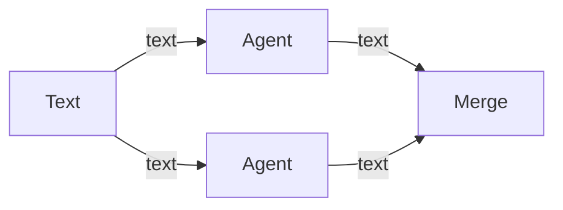

# Nodes

This is the guide to the canvas: what each node is for, how to wire it, and the JSON shape of a workflow. The connection rules are in [handles.md](handles.md). Each node has its own page.

These pages match the app as of Phase 8. You can build a graph, configure an agent, and run that one agent. A page says which phase adds the behavior that is still ahead.

| Node | Page | Takes | Produces |
| --- | --- | --- | --- |
| Text | [text-input.md](text-input.md) | nothing | text |
| File | [file-input.md](file-input.md) | nothing | file |
| Folder | [folder-input.md](folder-input.md) | nothing | folder |
| MCP | [mcp.md](mcp.md) | nothing | mcp |
| Agent | [agent.md](agent.md) | text, file, folder, mcp | text, diff |
| Planner | [planner.md](planner.md) | text | text |
| Approval | [approval.md](approval.md) | diff | diff |
| Merge | [merge.md](merge.md) | text, diff | text, diff |

## Using the canvas

1. Drag a node from the **Nodes** list onto the canvas. It lands on the snap grid, under the cursor.
2. Outputs sit on the right of a card. Inputs sit on the left. Drag from an output dot to an input dot.
3. The dots are colored by data type. A connection sticks when both ends are the same type. See [handles.md](handles.md).
4. A mismatched connection does not stay. A message at the top of the canvas quotes the validator.
5. Drag a card by its body to move it. Click a card to select it. The inspector on the right edits that node. On an agent, that is the label, model id, system prompt, task prompt, the `{{name}}` tokens in those prompts, the tool allow list, the tool deny list, and the workspace mode. Scroll to zoom, drag the empty background to pan. The minimap in the corner follows.
6. The first node of a type is labeled with the type name (`Text`, `Agent`). The next one is `Text 2`, `Agent 2`, and so on.
7. The API key UI is the **Cursor connection** disclosure under the canvas.

Agent cards show a status pill (`idle`, `running`, `completed`, `failed`, or `cancelled`), plus **Run** and **Cancel**. The run log under the canvas shows that agent's reply. The pill and the log are not stored in the workflow file.

## A small graph

One Text node feeding two Agents, then a Merge, is a valid diamond. The same shape is stored in `examples/valid-line.json`.



Text, File, Folder, and MCP are sources: they start a graph. Agent is the worker. Planner rewrites a brief into a plan. Approval is where a person checks a diff. Merge is where parallel branches meet again.

## Where this lives in the app

The palette and the validator both read the registry in `src/shared/node-registry.ts`. The document shape is `src/shared/workflow.ts`. Check a file with:

```powershell
npm run validate-workflow -- examples/valid-line.json
```

`ok` means the graph is valid. Anything else is the error a bad connection would show.
