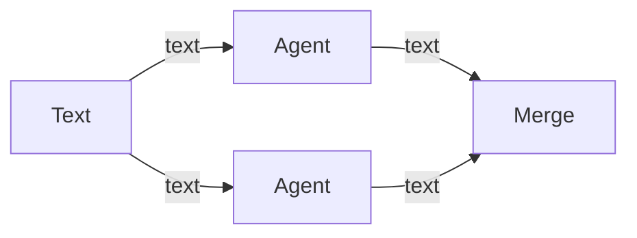

# Nodes

This is the guide to the canvas: what each node is for, how to wire it, and the JSON shape of a workflow. The connection rules are in [handles.md](handles.md). Each node has its own page.

These pages match the app as of Phase 15.5. You can build a graph, configure an agent, run that one agent, or press **Run** in the workflow toolbar to run the whole graph. **Cancel** stops one agent. **Cancel run** stops the graph. A running agent can be steered from the run log. If you quit mid-run, **Resume** continues it and leaves completed nodes completed. An **Approval** node pauses the run. The **Inbox** lists it until you approve, or reject with a note. When the agent changed files, the inbox shows a side-by-side diff and the right-hand side is what gets approved. Independent branches run together. Each agent gets a repo worktree, a managed folder, or a plain folder. A worktree that feeds an approval stays on disk. A page says which phase adds the behavior that is still ahead.

| Node | Page | Takes | Produces |
| --- | --- | --- | --- |
| Text | [text-input.md](text-input.md) | nothing | text |
| File | [file-input.md](file-input.md) | nothing | file |
| Folder | [folder-input.md](folder-input.md) | nothing | folder |
| MCP | [mcp.md](mcp.md) | nothing | mcp |
| Agent | [agent.md](agent.md) | text, file, folder, mcp, diff | text, diff |
| Planner | [planner.md](planner.md) | text | text |
| Approval | [approval.md](approval.md) | diff | diff |
| Merge | [merge.md](merge.md) | text, diff | text, diff |

## Using the canvas

1. Drag a node from the **Nodes** list onto the canvas. It lands on the snap grid, under the cursor.
2. Outputs sit on the right of a card. Inputs sit on the left. Drag from an output dot to an input dot.
3. The dots are colored by data type. A connection sticks when both ends are the same type. See [handles.md](handles.md).
4. A mismatched connection does not stay. A message at the top of the canvas quotes the validator.
5. Drag a card by its body to move it. Click a card to select it. The inspector on the right edits that node. On an agent, that is the label, model id, system prompt, task prompt, the `{{name}}` tokens in those prompts, the tool allow list, the tool deny list, guardrails, write paths, sandbox, auto-review, and the workspace mode. `repo` also asks for the workflow's git clone. `folder` asks for a folder path. Scroll to zoom, drag the empty background to pan. The minimap in the corner follows.
6. The first node of a type is labeled with the type name (`Text`, `Agent`). The next one is `Text 2`, `Agent 2`, and so on.
7. The API key UI is the **Cursor connection** disclosure under the canvas.
8. Every card has **Delete**. Click it to remove that one node and the wires attached to it. The other nodes stay, and the workflow stays. With the card selected, Delete and Backspace do the same thing when focus is on the canvas. They do nothing while the cursor is in a text field, including the inspector prompts, the write-paths box, the steering box, and the approval reason. **Delete** is disabled, and those keys do nothing, while that node is running or a workflow run is in progress.

Every card has **Delete**, which removes that node and its wires without deleting the workflow. Agent cards show a status pill (`idle`, `queued`, `running`, `waiting`, `completed`, `failed`, or `cancelled`), plus **Run** and **Cancel**. An Approval card shows the same pill. `waiting` means the inbox is asking for a decision. **Run** on the card starts that agent alone. **Cancel** on the card stops that agent even during a workflow run, and nodes still waiting on it do not start. **Run** in the toolbar starts every node, with `queued` until that node's turn. **Cancel run** stops the whole graph. While the selected agent is running, the run log has a **Steer** box. The log says whether that text was delivered or sent as a follow-up. If a run is unfinished when you reopen the app, **Resume** continues it. The run log under the canvas shows the selected agent's reply, the upstream handoff summaries, and the workspace path. **History** lists past runs for this workflow. Opening one shows that log again, a token total when the SDK reported usage, and either a dollar cost or **cost pending**. **Refresh cost** asks again. It does not turn a missing cost into `$0.00`. **Token budget** in the toolbar is optional. When the reported token total goes over that number, the run stops and the log says `Budget exceeded.` A missing token count does not count as zero and does not stop the run. Dollar cost is still shown when Cursor reports it. A missing cost stays `cost pending` and does not stop the run. The pill, the log, and that path are not stored in the workflow file. The run history is. A `repo` worktree and a `managed` folder are removed when that node finishes, unless an Approval follows that agent. That worktree stays so the diff can be reviewed and committed. Edges animate while a run moves across them and turn red when a node fails.

## A small graph

One Text node feeding two Agents, then a Merge, is a valid diamond. The same shape is stored in `examples/valid-line.json`.



Text, File, Folder, and MCP are sources: they start a graph. Agent is the worker. Planner rewrites a brief into a plan. Approval is where a person checks a diff. Merge is where parallel branches meet again.

## Where this lives in the app

The palette and the validator both read the registry in `src/shared/node-registry.ts`. The document shape is `src/shared/workflow.ts`. Check a file with:

```powershell
npm run validate-workflow -- examples/valid-line.json
```

`ok` means the graph is valid. Anything else is the error a bad connection would show.
