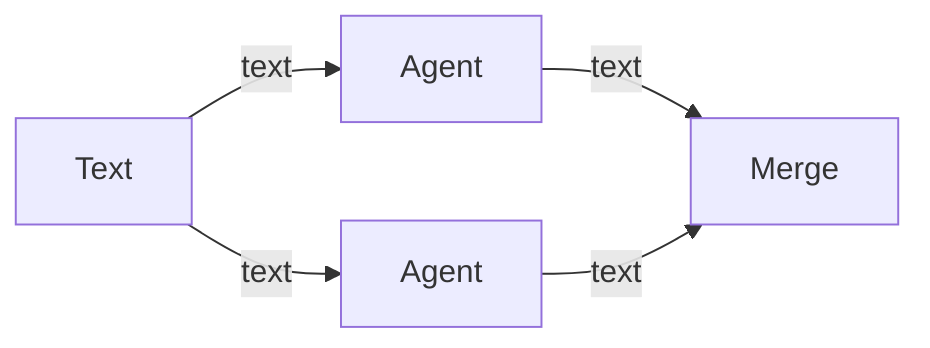

# Nodes

This is the guide to the canvas: what each node is for, how to wire it, and the JSON shape of a workflow. The connection rules are in [handles.md](handles.md). Each node has its own page.

These pages match the app as of Phase 21. You can build a graph, start one from a template, configure an agent, run that one agent, or press **Run** in the workflow toolbar to run the whole graph. **Export** writes a `.swarm` file. **Import** reads one back. The file holds the graph, the agent prompts, and the names of required env vars. Secret values stay on this PC. A Text node contributes the text you type. A File node contributes a path and an excerpt of at most 20 KB. A Folder node points an agent at a directory. An MCP node attaches a tool server. Header values stay on this PC. A workflow run gives every agent `update_task` and `inspect_board`. The **Board** panel under the canvas shows the tasks they post. A Planner splits its goal into at most 8 tasks and shows one worker row per task under the card. Those rows are not saved in the workflow. A Merge takes upstream repo branches, one at a time, into a target branch (default `main`). A conflict stops in the **Inbox** and is not resolved for you. **Cancel** stops one agent. **Cancel run** stops the graph. A running agent can be steered from the run log. If you quit mid-run, **Resume** continues it and leaves completed nodes completed. **History** can fork a finished run from an earlier checkpoint. An **Approval** node pauses the run. The **Inbox** lists it until you approve, or reject with a note. When the agent changed files, the inbox shows a side-by-side diff and the right-hand side is what gets approved. Independent branches run together. Each agent gets a repo worktree, a managed folder, or a plain folder. Agents in a single chain share one worktree. Parallel agents get their own. A workflow run leaves the worktree on disk. A card run removes it when that agent finishes, unless an approval follows it. A page says which phase adds the behavior that is still ahead.

| Node | Page | Takes | Produces |
| --- | --- | --- | --- |
| Text | [text-input.md](text-input.md) | nothing | text |
| File | [file-input.md](file-input.md) | nothing | file |
| Folder | [folder-input.md](folder-input.md) | nothing | folder |
| MCP | [mcp.md](mcp.md) | nothing | mcp |
| Agent | [agent.md](agent.md) | text, file, folder, mcp, diff | text, diff |
| Planner | [planner.md](planner.md) | text | text |
| Approval | [approval.md](approval.md) | diff | diff |
| Merge | [merge.md](merge.md) | text, diff | text, diff |

## Using the canvas

1. Drag a node from the **Nodes** list onto the canvas. It lands on the snap grid, under the cursor.
2. Outputs sit on the right of a card. Inputs sit on the left. Drag from an output dot to an input dot.
3. The dots are colored by data type. A connection sticks when both ends are the same type. See [handles.md](handles.md).
4. A mismatched connection does not stay. A message at the top of the canvas quotes the validator.
5. Drag a card by its body to move it. Click a card to select it. The inspector on the right edits that node. On an agent, that is the label, model id, system prompt, task prompt, the `{{name}}` tokens in those prompts, the tool allow list, the tool deny list, guardrails, write paths, sandbox, auto-review, and the workspace mode. On a planner, that is the label, the goal, the model id, and the workspace mode. On a merge, that is the label and the target branch (`main` when you leave it blank). `repo` also asks for the workflow's git clone. `folder` asks for a folder path. Scroll to zoom, drag the empty background to pan. The minimap in the corner follows.
6. The first node of a type is labeled with the type name (`Text`, `Agent`). The next one is `Text 2`, `Agent 2`, and so on.
7. The API key UI is the **Cursor connection** disclosure under the canvas.
8. Every card has **Delete**. Click it to remove that one node and the wires attached to it. The other nodes stay, and the workflow stays. With the card selected, Delete and Backspace do the same thing when focus is on the canvas. They do nothing while the cursor is in a text field, including the inspector prompts, the write-paths box, the steering box, and the approval reason. **Delete** is disabled, and those keys do nothing, while that node is running or a workflow run is in progress.
9. **New** opens a picker. **Blank** is an empty canvas. **QA**, **Architect**, **Coder**, **Reviewer**, **Product Owner**, **Project Manager**, and **Researcher** each place a **Brief** text node and one agent whose prompts name that role and the handoff contract.
10. **Export** saves the current workflow as a `.swarm` zip. **Import** adds another workflow from that file. If the file names an env var this PC does not have yet, Swarmy asks you to type it and stores it on this PC. The workflow file keeps the name only. **Required env vars** in the toolbar is that list of names. Leave it empty when the workflow needs none.

Every card has **Delete**, which removes that node and its wires without deleting the workflow. Agent cards show a status pill (`idle`, `queued`, `running`, `waiting`, `completed`, `failed`, or `cancelled`), plus **Run** and **Cancel**. A Planner card shows the same pill. While a planner run is going, the card lists one row per spawned worker. An Approval card shows the same pill. `waiting` means the inbox is asking for a decision. **Run** on the card starts that agent alone. **Cancel** on the card stops that agent even during a workflow run, and nodes still waiting on it do not start. **Run** in the toolbar starts every node, with `queued` until that node's turn. **Cancel run** stops the whole graph. While the selected agent is running, the run log has a **Steer** box. The log says whether that text was delivered or sent as a follow-up. If a run is unfinished when you reopen the app, **Resume** continues it. The run log under the canvas shows the selected agent's reply, the upstream handoff summaries, and the workspace path. **History** lists past runs for this workflow. Opening one shows that log again, a token total when the SDK reported usage, and either a dollar cost or **cost pending**. **Refresh cost** asks again. It does not turn a missing cost into `$0.00`. The same run shows a checkpoint timeline. **Fork** starts a new run at the checkpoint you selected and leaves the original run in the list. Nodes after that checkpoint return to `idle`, and **Resume** runs those later nodes. **Token budget** in the toolbar is optional. When the reported token total goes over that number, the run stops and the log says `Budget exceeded.` A missing token count does not count as zero and does not stop the run. Dollar cost is still shown when Cursor reports it. A missing cost stays `cost pending` and does not stop the run. The pill, the log, and that path are not stored in the workflow file. The run history is. A card **Run** removes a `repo` worktree or a `managed` folder when that agent finishes, unless an Approval follows it. A workflow run keeps the worktree. Agents wired in a single chain share it. Edges animate while a run moves across them and turn red when a node fails.

## A small graph

One Text node feeding two Agents, then a Merge, is a valid diamond. The same shape is stored in `examples/valid-line.json`.



Text, File, Folder, and MCP are sources: they start a graph. Agent is the worker. Planner splits a goal into tasks and starts one worker per task. Approval is where a person checks a diff. Merge is where parallel repo branches come back into one target branch.

## Where this lives in the app

The palette and the validator both read the registry in `src/shared/node-registry.ts`. The document shape is `src/shared/workflow.ts`. Check a file with:

```powershell
npm run validate-workflow -- examples/valid-line.json
```

`ok` means the graph is valid. Anything else is the error a bad connection would show.
