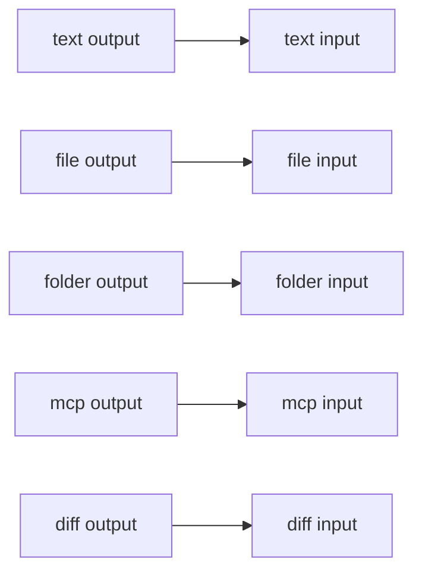

# Handles

An edge is valid only when the output and the input carry the same data type. The canvas colors match these types. This is decision D12. Later phases must keep this vocabulary.

Phase 15 does not change this table. A workflow budget and run history are not handles.

Phase 15.5 does not change this table. Removing a node also removes every edge whose source or target is that node. The other nodes stay.

Phase 16 does not change this table. Forking a run does not add or remove a handle.

Phase 17 does not change this table. The shared task board is not a handle. Agents reach it through `update_task` and `inspect_board`.

Phase 18 does not change this table. A planner still takes and produces `text`. The workers it spawns are rows under that card for the run. They are not nodes, and they are not handles.

Phase 19 does not change this table. A merge still takes and produces `text` and `diff`. The target branch is a field on the merge node, not a handle. Omitting it means `main`.

Phase 20 does not change this table. Text, file, folder, and MCP are still sources. A text node stores the text you type. A file node stores the dropped file's path. A folder node stores a folder path and, when wired to an agent, sets that agent's workspace to `folder` mode. An MCP node stores a stdio command or an HTTP url, plus `headerSecretId` when headers were saved. Header values are not in the workflow.

| Type | Color on the canvas | Meaning |
| --- | --- | --- |
| `text` | blue | A string: a brief, a reply, a plan |
| `file` | amber | One file |
| `folder` | green | A folder |
| `diff` | red | A set of file changes |
| `mcp` | violet | An MCP server an agent can call |



## Who has which handle

| Node | Inputs | Outputs |
| --- | --- | --- |
| [Text](text-input.md) | | `text` |
| [File](file-input.md) | | `file` |
| [Folder](folder-input.md) | | `folder` |
| [MCP](mcp.md) | | `mcp` |
| [Agent](agent.md) | `text`, `file`, `folder`, `mcp`, `diff` | `text`, `diff` |
| [Planner](planner.md) | `text` | `text` |
| [Approval](approval.md) | `diff` | `diff` |
| [Merge](merge.md) | `text`, `diff` | `text`, `diff` |

Handle id and data type are the same string today (`text`, `file`, `folder`, `diff`, `mcp`). An edge stores those ids, not the colors.

## What can connect

Read this as: the output on the left may land on any input in that row.

| Output | Can connect to |
| --- | --- |
| Text `text` | Agent `text`, Planner `text`, Merge `text` |
| File `file` | Agent `file` |
| Folder `folder` | Agent `folder` |
| MCP `mcp` | Agent `mcp` |
| Agent `text` | Agent `text`, Planner `text`, Merge `text` |
| Agent `diff` | Approval `diff`, Agent `diff`, Merge `diff` |
| Planner `text` | Agent `text`, Planner `text`, Merge `text` |
| Approval `diff` | Approval `diff`, Agent `diff`, Merge `diff` |
| Merge `text` | Agent `text`, Planner `text`, Merge `text` |
| Merge `diff` | Approval `diff`, Agent `diff`, Merge `diff` |

Several edges may land on the same input. The validator allows that.

A cycle is rejected before any agent starts. The error names every node on the path, for example `Cycle: alpha → beta → alpha`. Wiring a node's own output back into itself is a cycle.

When you press **Run** on the workflow, an edge animates while the source or the target is `running`. It turns red when either end is `failed`. **Cancel**, **Cancel run**, **Steer**, **Resume**, and the approval **Inbox** do not change which handles can connect. A text edge carries the upstream handoff into the next agent's prompt. That handoff is `summary`, `files`, and `blockers`. An approval `diff` edge pauses until you approve. The inbox can show the changed files side by side. Edits on the right-hand side are what get committed into the upstream worktree. A rejection sends the upstream agent around again with your note, up to 3 times, and leaves that worktree file as the agent wrote it.

A missing node, an unknown type, a handle the node does not have, or two nodes with the same id also fail. `examples/bad-handle.json` is an Agent `diff` output wired to an Agent `file` input. `examples/cycle.json` is a two-node loop.

## Workflow document

A workflow is one JSON object. Every node stores a `label`. An agent also stores its model, prompts, tool lists, guardrails, write paths, sandbox, auto-review, workspace mode, and folder path. Those fields are described on the [Agent](agent.md) page. `tools: []` is an empty allow list. Omitting `tools` means the default toolset. `repositoryPath` on the workflow is the git clone used when an agent runs in `repo` mode. Workspace mode is not a handle.

```json
{
  "id": "valid-line",
  "name": "Diamond: one brief, two agents in parallel, then a merge",
  "viewport": { "x": 0, "y": 0, "zoom": 1 },
  "nodes": [
    {
      "id": "brief",
      "type": "textInput",
      "position": { "x": 0, "y": 160 },
      "data": { "label": "Brief" }
    }
  ],
  "edges": [
    {
      "id": "brief-to-writer",
      "source": "brief",
      "sourceHandle": "text",
      "target": "writer",
      "targetHandle": "text"
    }
  ]
}
```

| Field | Rule |
| --- | --- |
| `id`, `name` | Non-empty strings |
| `viewport` | `x`, `y`, and a positive `zoom` |
| `nodes[].id` | Unique, non-empty |
| `nodes[].type` | A type from the table above |
| `nodes[].position` | `x` and `y` numbers, in canvas coordinates |
| `nodes[].data.label` | Non-empty string shown on the card |
| `repositoryPath` | Optional path of the git clone. A `repo` run requires it. Worktrees are created outside this clone |
| `nodes[].data` on an agent | Optional `modelId`, `systemPrompt`, `taskPrompt`, `tools`, `disallowedTools`, `workspaceMode` (`repo`, `managed`, or `folder`), and `folderPath`. Run status is not stored here |
| `nodes[].data` on a merge | `label`, and optional `targetBranch`. Omitting `targetBranch` means `main` |
| `nodes[].data` on text | `label`, and optional `text` |
| `nodes[].data` on a file | `label`, and optional `sourcePath`. The file bytes are not stored |
| `nodes[].data` on a folder | `label`, and optional `folderPath` |
| `nodes[].data` on MCP | `label`, `transport` (`stdio` or `http`, default `stdio`), optional `command`, `args`, `url`, and `headerSecretId`. Header values are not a field |
| `edges[].id` | Unique, non-empty |
| `edges[].source`, `target` | Node ids that exist |
| `edges[].sourceHandle` | An output id of the source node |
| `edges[].targetHandle` | An input id of the target node, same data type as the source handle |

The zod schemas are `workflowSchema`, `workflowNodeSchema`, and `workflowEdgeSchema` in `src/shared/workflow.ts`. `validateWorkflow` in `src/shared/validate-workflow.ts` adds the handle, cycle, and tier checks. An acyclic graph also produces parallel tiers: each node sits in the tier after its latest dependency.
