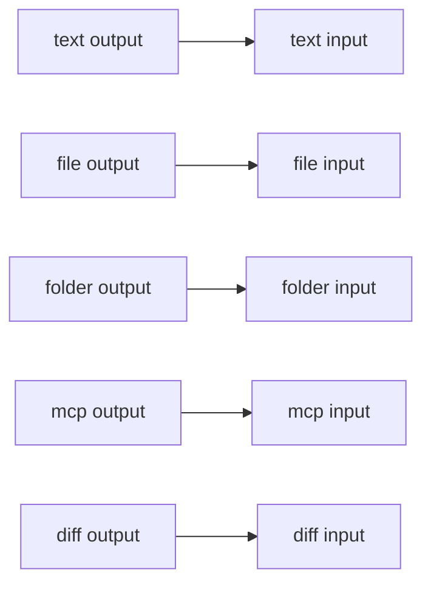

# Handles

An edge is valid only when the output and the input carry the same data type. The canvas colors match these types. This is decision D12. Later phases must keep this vocabulary.

| Type | Color on the canvas | Meaning |
| --- | --- | --- |
| `text` | blue | A string: a brief, a reply, a plan |
| `file` | amber | One file |
| `folder` | green | A folder |
| `diff` | red | A set of file changes |
| `mcp` | violet | An MCP server an agent can call |



## Who has which handle

| Node | Inputs | Outputs |
| --- | --- | --- |
| [Text](text-input.md) | | `text` |
| [File](file-input.md) | | `file` |
| [Folder](folder-input.md) | | `folder` |
| [MCP](mcp.md) | | `mcp` |
| [Agent](agent.md) | `text`, `file`, `folder`, `mcp` | `text`, `diff` |
| [Planner](planner.md) | `text` | `text` |
| [Approval](approval.md) | `diff` | `diff` |
| [Merge](merge.md) | `text`, `diff` | `text`, `diff` |

Handle id and data type are the same string today (`text`, `file`, `folder`, `diff`, `mcp`). An edge stores those ids, not the colors.

## What can connect

Read this as: the output on the left may land on any input in that row.

| Output | Can connect to |
| --- | --- |
| Text `text` | Agent `text`, Planner `text`, Merge `text` |
| File `file` | Agent `file` |
| Folder `folder` | Agent `folder` |
| MCP `mcp` | Agent `mcp` |
| Agent `text` | Agent `text`, Planner `text`, Merge `text` |
| Agent `diff` | Approval `diff`, Merge `diff` |
| Planner `text` | Agent `text`, Planner `text`, Merge `text` |
| Approval `diff` | Approval `diff`, Merge `diff` |
| Merge `text` | Agent `text`, Planner `text`, Merge `text` |
| Merge `diff` | Approval `diff`, Merge `diff` |

Several edges may land on the same input. The validator allows that.

A cycle is rejected. The error names every node on the path, for example `Cycle: alpha → beta → alpha`. Wiring a node's own output back into itself is a cycle.

A missing node, an unknown type, a handle the node does not have, or two nodes with the same id also fail. `examples/bad-handle.json` is an Agent `diff` output wired to an Agent `file` input. `examples/cycle.json` is a two-node loop.

## Workflow document

A workflow is one JSON object. Every node stores a `label`. An agent also stores its model, prompts, tool lists, and workspace mode. Those fields are described on the [Agent](agent.md) page. `tools: []` is an empty allow list. Omitting `tools` means the default toolset.

```json
{
  "id": "valid-line",
  "name": "Diamond: one brief, two agents in parallel, then a merge",
  "viewport": { "x": 0, "y": 0, "zoom": 1 },
  "nodes": [
    {
      "id": "brief",
      "type": "textInput",
      "position": { "x": 0, "y": 160 },
      "data": { "label": "Brief" }
    }
  ],
  "edges": [
    {
      "id": "brief-to-writer",
      "source": "brief",
      "sourceHandle": "text",
      "target": "writer",
      "targetHandle": "text"
    }
  ]
}
```

| Field | Rule |
| --- | --- |
| `id`, `name` | Non-empty strings |
| `viewport` | `x`, `y`, and a positive `zoom` |
| `nodes[].id` | Unique, non-empty |
| `nodes[].type` | A type from the table above |
| `nodes[].position` | `x` and `y` numbers, in canvas coordinates |
| `nodes[].data.label` | Non-empty string shown on the card |
| `nodes[].data` on an agent | Optional `modelId`, `systemPrompt`, `taskPrompt`, `tools`, `disallowedTools`, and `workspaceMode` (`repo`, `managed`, or `folder`) |
| `edges[].id` | Unique, non-empty |
| `edges[].source`, `target` | Node ids that exist |
| `edges[].sourceHandle` | An output id of the source node |
| `edges[].targetHandle` | An input id of the target node, same data type as the source handle |

The zod schemas are `workflowSchema`, `workflowNodeSchema`, and `workflowEdgeSchema` in `src/shared/workflow.ts`. `validateWorkflow` in `src/shared/validate-workflow.ts` adds the handle, cycle, and tier checks. An acyclic graph also produces parallel tiers: each node sits in the tier after its latest dependency.
